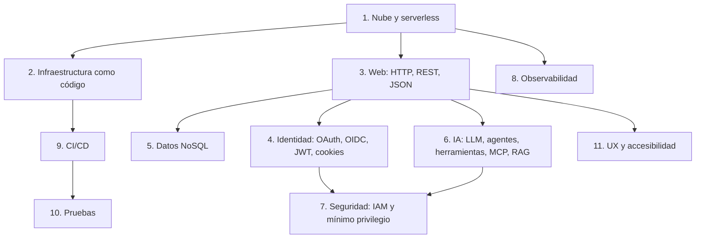
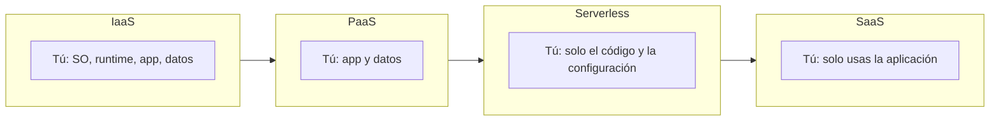
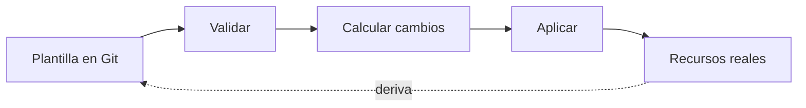
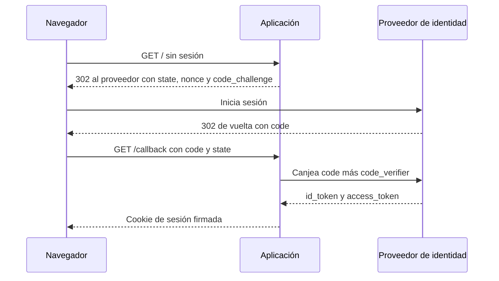
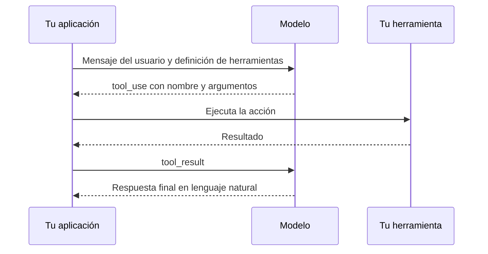
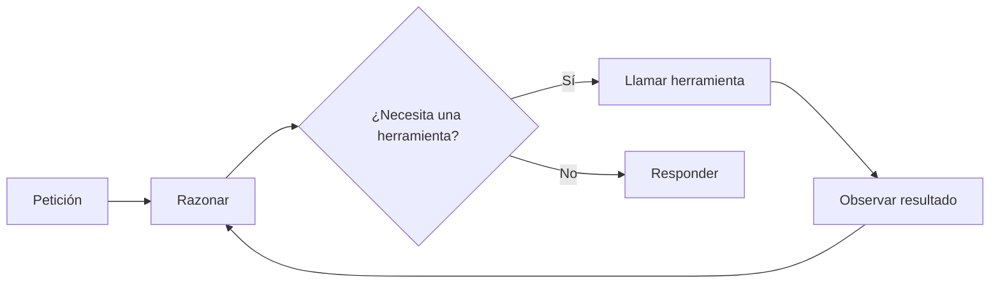
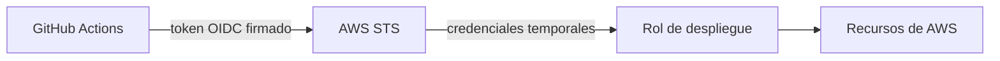
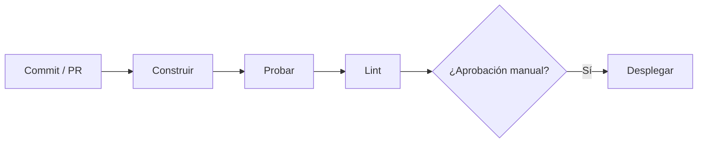

# 00 · Marco teórico general

Los demás documentos explican **cómo está hecho este sistema**. Este explica **qué es cada concepto y para qué se usa en
general**, con independencia del proyecto, y al final de cada sección enlaza con el lugar donde se aplica aquí.

Fuentes `MT1`–`MT14` en [11 §2](11-glosario-referencias.md#marco-teórico-general); ⚠️ = no verificado. Las citas literales
(traducidas) proceden de esas fuentes, consultadas el 3 oct 2026.

## 1. Computación en la nube y serverless

**Qué es.** NIST define la computación en la nube como «un modelo para habilitar acceso de red ubicuo, cómodo y bajo demanda a
un conjunto compartido de recursos informáticos configurables […] que pueden aprovisionarse y liberarse rápidamente con un
esfuerzo de gestión mínimo» [MT1]. Sus **cinco características esenciales** son: autoservicio bajo demanda, acceso amplio por
red, agrupación de recursos, elasticidad rápida y servicio medido [MT1].

**Modelos de servicio** [MT1]: *IaaS* (alquilas cómputo, red y almacenamiento), *PaaS* (despliegas tu código en una plataforma
gestionada) y *SaaS* (usas una aplicación ya hecha). **Modelos de despliegue** [MT1]: privada, comunitaria, pública e híbrida.

**Serverless.** AWS lo describe como construir y ejecutar aplicaciones y servicios **sin tener que gestionar la
infraestructura** [MT3]. «Sin servidor» no significa que no haya servidores, sino que **no los administras tú**: no los
aprovisionas, no los parcheas y normalmente **pagas por uso**.

> El orden Serverless entre PaaS y SaaS es una **simplificación didáctica** de este documento: NIST no clasifica «serverless»
> como modelo de servicio aparte (⚠️ no es una definición normativa).

**Cuándo conviene / no.** Encaja con tráfico irregular y equipos pequeños (no pagas capacidad ociosa). Tiene como contrapartida
límites de plataforma (tiempo máximo, tamaño, cuotas) y dependencia del proveedor.

**Aquí:** Lambda, DynamoDB, Cognito y AgentCore son servicios gestionados de pago por uso → [01](01-vision-arquitectura.md),
[03](03-servicios-aws.md), [10](10-operacion-costes.md).

## 2. Infraestructura como código (IaC)

**Qué es.** AWS la define como la práctica de **gestionar y aprovisionar infraestructura mediante código** en lugar de procesos
manuales [MT2]. Distingue el enfoque **declarativo** (describes el estado deseado y la herramienta decide los pasos) del
**imperativo** (describes los pasos) [MT2]. Beneficios citados: repetibilidad, coherencia entre entornos, control de versiones y
automatización [MT2].

**Conceptos clave.** *Plantilla* (el documento), *pila/stack* (instancia desplegada de una plantilla), *conjunto de cambios*
(vista previa de lo que cambiaría), *deriva* (la realidad se aparta de la plantilla por cambios manuales), *idempotencia*
(aplicar dos veces da el mismo resultado).

**Aquí:** una plantilla de CloudFormation con 14 recursos describe todo salvo el harness (tema pendiente) →
[03](03-servicios-aws.md), [08](08-cicd-despliegue.md), [09](09-decisiones-lecciones.md).

## 3. La web: HTTP, REST y JSON

**HTTP** es el protocolo de aplicación de la web: peticiones con **método**, **ruta**, **cabeceras** y **cuerpo**, y respuestas
con **código de estado**. RFC 9110 define dos propiedades de los métodos que importan al diseñar una API: **seguro** (no
cambia el estado del servidor, p. ej. `GET`) e **idempotente** (repetirlo tiene el mismo efecto que hacerlo una vez, p. ej.
`PUT`, `DELETE`) [MT4].

| Familia de códigos | Significado general |
|--------------------|---------------------|
| 2xx | Éxito |
| 3xx | Redirección |
| 4xx | Error del cliente (petición mal formada, sin autenticar `401`, sin permiso `403`) |
| 5xx | Error del servidor |

**REST** es un estilo arquitectónico basado en recursos con identificador (URL) manipulados mediante los métodos estándar de
HTTP y sin estado de sesión en el servidor entre peticiones ⚠️ (definición habitual de Fielding; no se contrastó aquí con la
tesis original). **JSON** es el formato de intercambio de datos de texto más común en APIs. **JSON Schema** describe y
valida la forma de un JSON; lo usaremos también para describir herramientas al modelo (§6).

**Política de mismo origen (SOP).** Un *origen* es la tupla **esquema + host + puerto**. La política «restringe cómo un
documento o script cargado desde un origen puede interactuar con un recurso de otro origen» [MT13]. Limita sobre todo la
**lectura** entre orígenes; **no** impide enviarlos: «las *escrituras* entre orígenes suelen permitirse, p. ej. enlaces,
redirecciones y envíos de formulario» [MT13]. Por eso existen defensas adicionales contra CSRF (§4).

**Aquí:** contrato de la API → [05](05-backend-api.md); cabeceras y CSRF → [04](04-autenticacion-seguridad.md).

## 4. Identidad: autenticación, OAuth 2.0, OIDC, JWT y cookies

**Autenticación vs autorización.** Autenticar es comprobar **quién** eres; autorizar es decidir **qué puedes hacer**. Mezclarlas
es una fuente clásica de fallos.

- **OAuth 2.0** (RFC 6749) delega **autorización**: una aplicación obtiene un *token* de acceso sin conocer la contraseña [MT-R3].
- **OpenID Connect (OIDC)** añade una capa de **autenticación** sobre OAuth: el `id_token` dice quién es el usuario [MT-R4].
- **PKCE** (RFC 7636) protege el flujo de código: el cliente prueba que quien canjea el código es quien lo pidió [MT-R2].
- **JWT** (RFC 7519) es «un medio compacto y seguro para URL de representar *claims* que se transfieren entre dos partes» [MT14].
  Claims registrados: `iss` (emisor), `sub` (sujeto), `aud` (destinatarios), `exp` (caducidad: no debe aceptarse a partir de
  ahí), `nbf`, `iat`, `jti` [MT14]. Un receptor correcto **valida emisor, audiencia y caducidad**, no solo que «parezca» un JWT.
- **Cookies de sesión.** Atributos que reducen riesgo: `HttpOnly` (el JS no la lee), `Secure` (solo HTTPS), `SameSite`
  (limita envío entre sitios) y el prefijo `__Host-` (fuerza `Secure`, ruta `/` y sin `Domain`) [MT-R5].
- **Firma HMAC** (RFC 2104): código de autenticación de mensajes con clave secreta; permite que el servidor reconozca que una
  cookie la emitió él sin guardar estado [MT-R6].
- **CSRF**: el navegador adjunta cookies automáticamente, así que otro sitio podría provocar acciones. Defensas: `SameSite`,
  cabeceras de *Fetch Metadata* (`Sec-Fetch-Site`), comprobar `Origin` y no cambiar estado con `GET` [MT-O3].

**Aquí:** Cognito + Lambda implementan este flujo → [04](04-autenticacion-seguridad.md).

## 5. Datos: bases NoSQL y DynamoDB

**NoSQL** agrupa bases que no usan el modelo relacional con SQL como interfaz principal; las de tipo *clave–valor/documento*
priorizan escala y latencia predecible a cambio de consultas menos flexibles.

**Componentes de DynamoDB** [MT9]: **tablas** (colección), **elementos** (filas), **atributos** (campos), **clave de partición**
(obligatoria; decide la distribución) y opcionalmente **clave de ordenación**; cada elemento se identifica por su clave primaria.

| Concepto general | Idea |
|------------------|------|
| Consistencia eventual vs fuerte | Una lectura puede devolver datos algo anteriores (eventual) o los últimos confirmados (fuerte, `ConsistentRead`) [MT-D1] |
| Escritura condicional | La escritura solo se aplica si se cumple una condición (evita pisar cambios) [MT-D2] |
| `Query` vs `Scan` | `Query` usa la clave y es eficiente; `Scan` recorre todo y está **paginado** [MT-D3] |
| Capacidad bajo demanda | Pagas por lectura/escritura, sin aprovisionar [MT-D5] |

**Aquí:** una tabla de incidencias, `Scan` paginado y consistente porque son pocos datos → [01](01-vision-arquitectura.md),
[03](03-servicios-aws.md).

## 6. Inteligencia artificial generativa: LLM, agentes, herramientas, MCP y RAG

### 6.1 Modelos de lenguaje (LLM)

Un LLM es una red neuronal entrenada para predecir el siguiente fragmento de texto (*token*). La arquitectura dominante es el
**Transformer**, que sustituye la recurrencia por **atención** [MT5]. Conceptos prácticos:

- **Token**: unidad en que el modelo trocea el texto; se factura y se limita por tokens (entrada y salida).
- **Ventana de contexto**: máximo de tokens que el modelo puede considerar de una vez (instrucciones + historial + resultados).
- **Sin estado**: el modelo no recuerda entre llamadas; el historial hay que reenviarlo (o gestionarlo con memoria, abajo).
- **No determinista**: el mismo prompt puede dar respuestas distintas; por eso se prueba el *comportamiento*, no el texto exacto.

### 6.2 Uso de herramientas (*tool use* / *function calling*)

Según Anthropic, el uso de herramientas permite al modelo llamar funciones que tú defines: «Claude decide cuándo llamar a una
herramienta según la petición del usuario y la descripción de la herramienta. Devuelve una llamada estructurada que tu
aplicación ejecuta» [MT11]. Las **herramientas de cliente** las ejecuta tu código; las **de servidor**, el proveedor [MT11].
Cada herramienta se define con **nombre, descripción y un esquema de entrada JSON** [MT11].

Idea central: **el modelo no ejecuta nada**; solo *pide* ejecutar. La aplicación decide si lo hace, con qué permisos y qué
devuelve. Por eso la seguridad de un agente depende de lo que tus herramientas permiten (§7).

> Nombres de campos (`tool_use`, `tool_result`, `input_schema`) son los de la API de Anthropic [MT11]. El harness de AgentCore
> usa su propio formato (`toolUse`, `toolResult`, `inlineFunctions`): ver [02](02-agentcore-harness.md).

### 6.3 Agente = modelo + herramientas + bucle

Un **agente** repite: *observar → razonar → actuar con una herramienta → observar el resultado*, hasta terminar. Es el patrón
**ReAct** (razonar y actuar de forma intercalada) [MT-R1]. El **bucle de agente** lo orquesta un marco (aquí, Strands dentro del
harness) [MT-S1].

**Riesgos propios** (OWASP): *inyección de prompt* (texto no confiable que altera las instrucciones) [MT-O1] y *agencia
excesiva* (el agente puede hacer más de lo necesario) [MT-O2]. Mitigación general: **herramientas mínimas, validación de
argumentos en el servidor y límite de vueltas**.

### 6.4 MCP (Model Context Protocol)

MCP es un **estándar abierto** para conectar aplicaciones de IA con sistemas externos (datos, herramientas, flujos); la
documentación lo compara con un «USB-C para la IA» [MT6]. Separa **cliente** (la aplicación de IA) de **servidor** (expone
herramientas y datos). *Este proyecto no usa MCP*: sus herramientas son *funciones en línea* del harness (ver [02](02-agentcore-harness.md));
se incluye porque es el estándar con el que se compara habitualmente.

### 6.5 RAG (generación aumentada por recuperación)

RAG combina un modelo con una **memoria no paramétrica**: se **recuperan** documentos relevantes y se pasan al modelo como
contexto antes de generar [MT7]. Sirve para dar conocimiento actualizado o privado sin reentrenar. *Aquí no hay RAG*: el agente
obtiene datos llamando a `listar_incidencias`.

### 6.6 Memoria de agente

Para conservar información **entre sesiones** se añade una memoria externa (p. ej. resúmenes o hechos extraídos). Beneficio:
continuidad. Riesgos: coste, **contaminación** de respuestas con datos viejos o de otro usuario si no se acota por identidad →
[02 §memoria](02-agentcore-harness.md).

## 7. Seguridad en la nube: IAM, mínimo privilegio y federación

**IAM** (Identity and Access Management) decide **quién (principal) puede hacer qué (acción) sobre qué (recurso)**. Buenas
prácticas de AWS [MT8]: usar **credenciales temporales** en lugar de claves de larga duración, aplicar **mínimo privilegio**,
exigir **MFA** y usar **límites de permisos** cuando proceda.

- **Federación**: confiar en un proveedor externo (aquí GitHub) en lugar de crear usuarios/claves propios.
- **Roles**: identidad **asumible** con permisos concretos; la *política de confianza* dice quién puede asumirla.
- **Defensa en profundidad**: varias capas (red, identidad, validación, límites) para que un fallo no sea definitivo.
- **Modelo de amenazas**: ejercicio sistemático para listar qué puede salir mal (p. ej. STRIDE) ⚠️ (no se contrastó con fuente
  primaria en esta revisión; ver uso real en [04](04-autenticacion-seguridad.md)).

**Aquí:** roles separados para función, harness y despliegue; sin claves en GitHub → [04 §7](04-autenticacion-seguridad.md#7-federación-oidc-de-github-con-aws), [08](08-cicd-despliegue.md).

## 8. Observabilidad

Es la capacidad de entender el estado interno de un sistema a partir de lo que emite. OpenTelemetry distingue tres señales
[MT10]: **logs** (eventos con marca de tiempo), **métricas** (medidas agregadas en el tiempo) y **trazas** (el recorrido de una
petición entre componentes). Sirven para detectar, diagnosticar y estimar costes.

**Aquí:** CloudWatch Logs y métricas, X-Ray parcial, CloudTrail para auditoría; *Transaction Search* sin activar →
[10](10-operacion-costes.md).

## 9. Integración y entrega continuas (CI/CD)

AWS: la **entrega continua** es «una práctica de desarrollo de software donde los cambios de código se preparan
automáticamente para un lanzamiento a producción»; cada cambio se construye, prueba y se envía a un entorno de pruebas, y
requiere **aprobación manual** para pasar a producción. En el **despliegue continuo**, «la puesta en producción ocurre
automáticamente, sin aprobación explícita» [MT12]. Beneficios citados: automatización, productividad, detección temprana de
errores y velocidad [MT12].

**Aquí:** el CI corre en cada PR; el despliegue es **manual** (`workflow_dispatch`), es decir, entrega continua con aprobación,
no despliegue continuo → [08](08-cicd-despliegue.md).

## 10. Pruebas de software

- **Pirámide de pruebas**: muchas unitarias, algunas de integración, pocas de interfaz [MT-T1].
- **Dobles de prueba**: *fake*, *stub*, *spy*… sustituyen dependencias costosas o no deterministas [MT-T2].
- **Prueba de humo**: comprobación rápida y superficial de que lo esencial funciona tras un despliegue.
- **Pruebas de extremo a extremo (e2e)**: recorren el sistema como un usuario (aquí con un navegador real).

**Aquí:** 103 pruebas y una prueba de humo contra AWS real → [07](07-pruebas-calidad.md).

## 11. Experiencia de usuario y accesibilidad

- **Heurísticas de usabilidad** de Nielsen: visibilidad del estado, coincidencia con el mundo real, control del usuario,
  consistencia, prevención de errores, reconocer antes que recordar, flexibilidad, diseño minimalista, ayuda a recuperarse de
  errores [MT-U1].
- **Ley de Hick**: más opciones → más tiempo de decisión [MT-U2]. **Ley de Fitts**: objetivos grandes y cercanos son más fáciles de
  pulsar [MT-U3]. **Revelado progresivo**: mostrar primero lo esencial [MT-U6].
- **WCAG 2.2** [MT-U4]: criterios de accesibilidad; p. ej. contraste mínimo de texto (1.4.3) y tamaño mínimo de objetivos
  (2.5.8 [MT-U5]).

**Aquí:** lista primero en móvil, botones de «camino feliz», botón flotante, contraste medido → [06](06-frontend-ux.md).

## 12. Mapa rápido: concepto → dónde se usa

| Concepto | Para qué sirve en general | En este proyecto |
|----------|---------------------------|------------------|
| Serverless | No administrar servidores | Lambda, DynamoDB, Cognito |
| IaC | Infraestructura repetible | CloudFormation |
| HTTP/REST/JSON | Comunicación cliente-servidor | API `/api/*` |
| OIDC + PKCE + JWT | Iniciar sesión de forma estándar | Cognito + callback |
| Cookie firmada | Mantener sesión sin estado | `__Host-` + HMAC |
| NoSQL | Escala y baja latencia | DynamoDB |
| LLM + tool use + bucle | Que el sistema decida y actúe | Harness de AgentCore |
| IAM / mínimo privilegio | Limitar el daño de un fallo | Roles separados |
| Observabilidad | Diagnosticar y medir | CloudWatch / CloudTrail |
| CI/CD | Entregar con calidad y repetibilidad | GitHub Actions |
| Pruebas | Detectar regresiones | pytest, moto, Playwright |
| UX / accesibilidad | Reducir carga cognitiva | Sistema de diseño propio |

> Los códigos `MT-R*`, `MT-O*`, `MT-D*`, `MT-S1`, `MT-T*`, `MT-U*` apuntan a fuentes ya listadas en [11](11-glosario-referencias.md)
> con el código sin el prefijo `MT-` (por ejemplo, `MT-R2` = `R2`).
