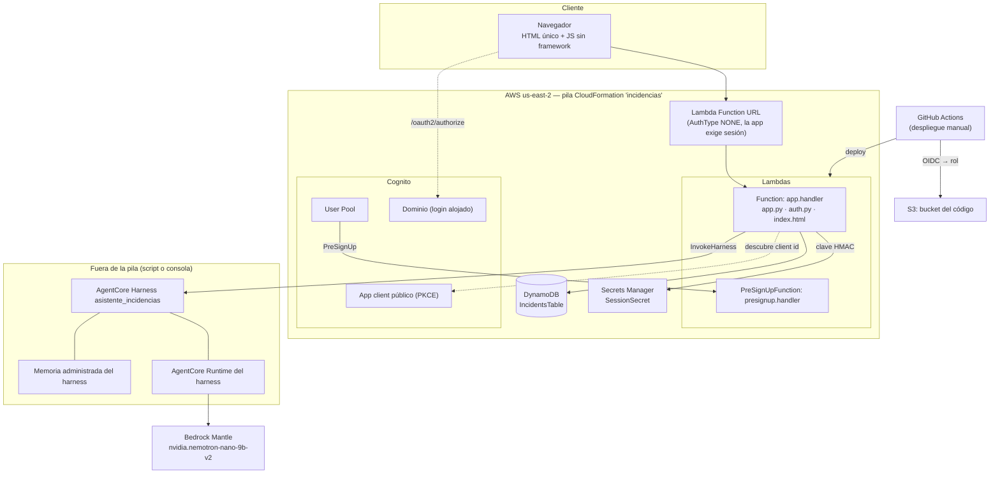
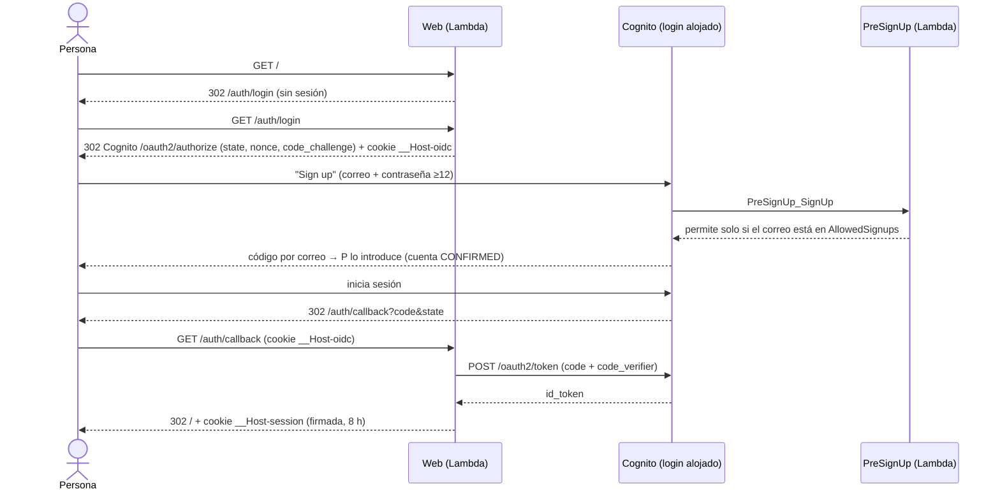

# 01 · Visión y arquitectura

## 1. Problema, objetivos y alcance

**Problema.** Registrar, clasificar y dar seguimiento a incidencias de TI exige tiempo y criterio: ¿es crítica?, ¿qué
hago primero?, ¿ya lo registró alguien? Un formulario clásico traslada toda esa carga cognitiva a la persona.

**Objetivo.** Un sistema donde la persona *dice qué pasa* y un **agente** hace el trabajo: crea la incidencia, la
clasifica, propone próximos pasos, prioriza y cambia estados, con una experiencia que minimice decisiones.

**Alcance actual** (lo que existe y está validado):

- Registro de incidencias (formulario guiado y por conversación), clasificación automática por el agente.
- Lista priorizada con acciones de un toque, filtro por día, aviso de duplicados y fecha de registro.
- Chat con el agente que consulta y modifica datos mediante herramientas.
- Autenticación (Cognito), registro propio acotado por lista de correos/dominios.
- Infraestructura como código, despliegue manual desde GitHub Actions con federación OIDC.

**Fuera de alcance (hoy):** multi-organización (todas las personas autenticadas ven todas las incidencias), asignación
a responsables, adjuntos, notificaciones, integración con herramientas externas (Jira, Teams), auditoría detallada.

## 2. Requisitos

### Funcionales

| ID | Requisito | Dónde se cumple |
|----|-----------|-----------------|
| RF1 | Registrar una incidencia con título y descripción opcional | `POST /api/incidents`, herramienta `crear_incidencia` |
| RF2 | Clasificar (severidad, categoría, resumen, ≤3 pasos) automáticamente | `clasificar_incidencia`, prompt `NEW_INCIDENT_PROMPT` |
| RF3 | Listar y filtrar (pendientes/resueltas/todas, por día) | `GET /api/incidents` + filtros en el cliente |
| RF4 | Cambiar estado (abierta → en curso → resuelta, reabrir) con deshacer | `PATCH /api/incidents/{id}`, `cambiar_estado` |
| RF5 | Conversar con el agente con contexto real y ver lo que hizo | `POST /api/chat`, hilo en la UI |
| RF6 | Evitar duplicados y saber cuándo se registró algo | Aviso de parecidas, fecha en tarjeta |
| RF7 | Proteger el acceso; registro solo para correos autorizados | `auth.py`, `presignup.py`, Cognito |

### No funcionales

| Atributo | Objetivo | Cómo |
|----------|----------|------|
| Coste | Pago por uso, sin costes fijos relevantes | Lambda, DynamoDB on-demand, Cognito, AgentCore, Bedrock |
| Seguridad | Fallo cerrado, mínimo privilegio, sin secretos en código | Ver [04](04-autenticacion-seguridad.md) |
| Simplicidad operativa | Sin servidores, sin build de frontend | Lambda + HTML único |
| Reproducibilidad | Todo desplegable desde el repo | CloudFormation + scripts + `uv.lock` |
| Testabilidad | Lógica probable sin AWS | Dobles de prueba (moto, agente simulado) |
| Usabilidad | Baja carga cognitiva, accesible, responsive | Ver [06](06-frontend-ux.md) |

## 3. Principios de diseño

1. **El agente actúa, no solo opina.** El valor de AgentCore está en el bucle *decidir → usar herramienta → observar*.
   Por eso el agente recibe herramientas reales y la aplicación ejecuta lo que pide.
2. **Una sola fuente de verdad: DynamoDB.** El agente tiene memoria, pero la memoria puede mentir. Cada pregunta del chat
   lleva adjunto el estado real y las herramientas devuelven datos reales.
3. **Todo lo que viene de un modelo es entrada no confiable.** Se valida como si viniera de internet (enumerados,
   longitudes, formato de id) y los errores vuelven al agente para que se corrija.
4. **Falla cerrada.** Sin Cognito configurado → 503. Sin sesión → login o 401. Lista de registro vacía → nadie se registra.
5. **Mínimo privilegio y alcance acotado.** Roles por función; el rol de despliegue solo toca recursos `incidencias-*`.
6. **Guardar primero, enriquecer después.** Al crear una incidencia se persiste antes de llamar al agente: si el modelo
   falla, no se pierde nada.
7. **Sin dependencias innecesarias en producción.** La Lambda solo vendoriza `boto3`; la autenticación OIDC está escrita
   con la biblioteca estándar.
8. **Reducir decisiones del usuario.** Acciones de camino feliz, valores por defecto, divulgación progresiva.

## 4. Vista de contexto



La pila CloudFormation contiene 14 recursos (tabla, 3 roles, 2 funciones, 2 permisos de Lambda para Cognito/URL, user
pool + dominio + cliente, secreto, URL de función). El **harness**, el **bucket de código** y el **rol de GitHub** se
crean **fuera** de la pila (ver [03](03-servicios-aws.md) y [08](08-cicd-despliegue.md)).

## 5. Componentes y responsabilidades

| Componente | Archivo | Responsabilidad |
|-----------|---------|-----------------|
| Aplicación | `src/app.py` | Enrutado HTTP, validación, herramientas del agente, bucle agente↔herramientas, acceso a DynamoDB |
| Autenticación | `src/auth.py` | Flujo OIDC con Cognito, cookies de sesión firmadas, CSRF por `Origin`, páginas de error |
| Control de registro | `src/presignup.py` | Disparador de Cognito: solo correos/dominios autorizados; exige verificar el correo |
| Interfaz | `src/index.html` | UI completa (HTML+CSS+JS) embebida en la Lambda |
| Infraestructura | `template.yaml` | Pila CloudFormation |
| Agente (alta/baja) | `scripts/harness.py` | Crea/actualiza/borra el harness (idempotente) |
| Entorno local | `scripts/local.py` | Servidor local con DynamoDB simulado (moto) y agente simulado |
| Empaquetado | `scripts/package.sh` | Construye `build/lambda.zip` con dependencias del lock |
| Rol de GitHub | `scripts/github-oidc/` | Proveedor OIDC + rol de despliegue + secreto `AWS_ROLE_ARN` |
| Pruebas | `tests/` | 103 pruebas: API, auth, registro, navegador |
| Pipelines | `.github/workflows/` | `ci`, `deploy` (manual), `destroy` (manual) |

## 6. Flujos de extremo a extremo

### 6.1 Primer acceso (registro propio + login)



### 6.2 Reporte guiado (formulario)

1. La persona elige una plantilla («Sistema caído»), opcionalmente el impacto, y pulsa **Reportar**.
2. El cliente advierte antes si ya existe algo **parecido** (no bloquea).
3. `POST /api/incidents` → la app **guarda** la incidencia como `abierta`/`sin_clasificar`.
4. La app llama al agente con `NEW_INCIDENT_PROMPT`: este invoca `clasificar_incidencia` y, si es crítica, `cambiar_estado`.
5. La app relee el registro y lo devuelve junto con las `actions` ejecutadas; la UI avisa en lenguaje llano y resalta la tarjeta.

### 6.3 Conversar y registrar («Registra que la impresora no imprime»)

1. `POST /api/chat` con el mensaje; la app **adjunta el estado real** de lo pendiente (`snapshot()`).
2. El agente decide llamar a `crear_incidencia` (el id lo genera el sistema) → la app ejecuta y devuelve el resultado.
3. El agente responde con texto; la UI añade el turno al hilo, lista los pasos (`✓ Registró la incidencia`) y resalta lo nuevo.

### 6.4 «Atender la más urgente» (camino feliz)

Instrucción fija al agente: `listar_incidencias` → `cambiar_estado(en_curso)` sobre la más urgente → informar sus
`proximos_pasos` guardados. Un solo toque en la UI; varias vueltas del bucle en el servidor.

## 7. Modelo de datos

Tabla `IncidentsTable` (DynamoDB, clave de partición `id` de tipo cadena, facturación bajo demanda, PITR activado).

| Atributo | Tipo | Descripción |
|----------|------|-------------|
| `id` | S | UUID v4 en hexadecimal (32 caracteres); lo genera el servidor |
| `title` | S | ≤ 200 caracteres |
| `description` | S | ≤ 2000 caracteres (`MAX_MESSAGE_CHARS`) |
| `status` | S | `abierta` · `en_curso` · `resuelta` |
| `created_at` | N | Epoch en segundos (UTC) |
| `severity` | S | `baja` · `media` · `alta` · `critica` · `sin_clasificar` |
| `category` | S | ≤ 60 caracteres |
| `summary` | S | ≤ 300 caracteres |
| `next_steps` | L de S | Hasta 3 elementos de ≤ 200 caracteres |

No hay índices secundarios: la lista se obtiene con `Scan` (válido para volúmenes pequeños; ver limitaciones en [10](10-operacion-costes.md)).

## 8. Parámetros y límites relevantes

| Parámetro | Valor | Origen |
|-----------|-------|--------|
| Vueltas máximas agente↔herramientas por petición | 6 | `MAX_STEPS` en `app.py` |
| Iteraciones máximas del harness por invocación | 10 | `maxIterations` en `harness.py` |
| Tiempo máximo del harness por invocación | 100 s | `timeoutSeconds` en `harness.py` |
| Timeout / memoria de la Lambda de la app | 240 s / 256 MB | `template.yaml` |
| Timeout / memoria de PreSignUp | 5 s / 128 MB | `template.yaml` |
| Sesión web | 8 h (`SESSION_HOURS`) | `auth.py` |
| Ticket de login (state/nonce/verifier) | 10 min | `LOGIN_TTL` |
| Mensaje de chat | 1–2000 caracteres | `MAX_CHARS` |
| `session_id` | 33–100 caracteres, empieza por letra o número, `[A-Za-z0-9_-]` | `SESSION_RE` (contrato de `InvokeHarness`) |
| Incidencias listadas al agente | 30 por llamada; 20 en el estado adjunto | `run_tool`, `snapshot` |
| Inactividad del runtime del harness / vida máxima | 900 s / 28 800 s | Configuración del harness |

## 9. Estructura del repositorio

```
.
├── src/                    # lo que se despliega en Lambda
│   ├── app.py              # API + agente
│   ├── auth.py             # OIDC + sesión
│   ├── presignup.py        # control de registro (Cognito trigger)
│   └── index.html          # interfaz
├── scripts/
│   ├── harness.py          # alta/baja del harness
│   ├── local.py            # servidor local + dobles
│   ├── package.sh          # construye build/lambda.zip
│   └── github-oidc/        # rol y proveedor OIDC de GitHub
├── tests/                  # 103 pruebas (pytest, moto, Playwright)
├── .github/workflows/      # ci · deploy (manual) · destroy (manual)
├── template.yaml           # CloudFormation
├── pyproject.toml · uv.lock
└── docs/                   # esta documentación
```
