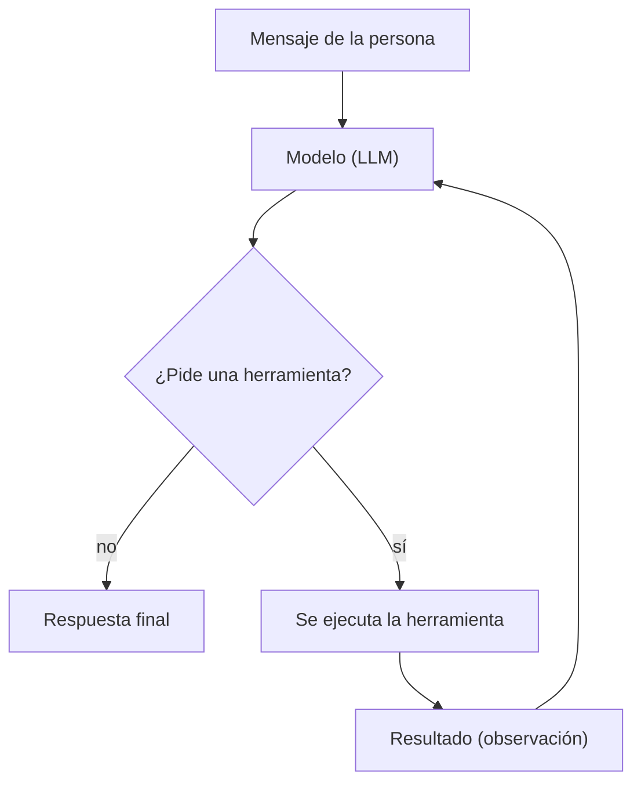
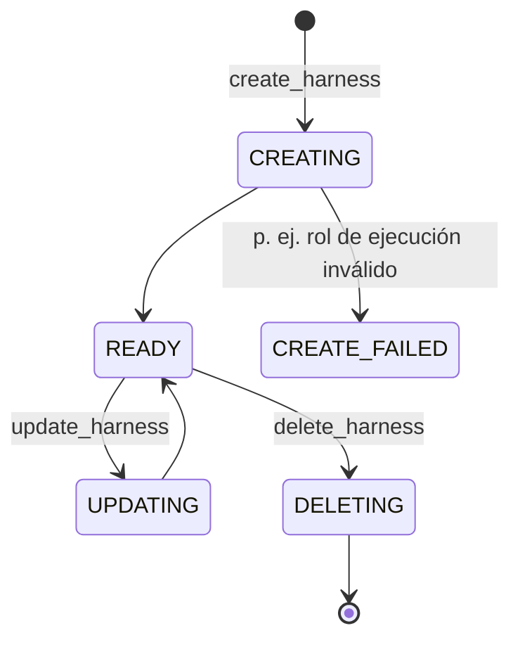
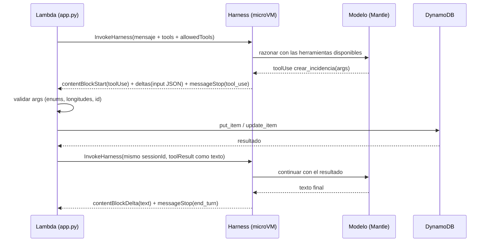
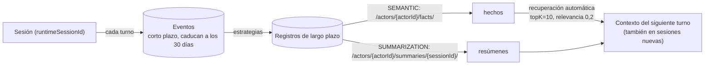

# 02 · El agente: Amazon Bedrock AgentCore Harness

> **Cómo leer este documento.** Las afirmaciones llevan su fuente entre corchetes `[ref]` (ver [11](11-glosario-referencias.md)).
> «**Verificado**» = comprobado por nosotros contra la cuenta real. «**Documentado**» = lo dice la documentación oficial.
> «⚠️» = no verificado o sin fuente: no lo trates como un hecho.

## 1. Marco teórico: qué es un agente

### 1.1 Del modelo de lenguaje al agente

Un modelo de lenguaje (LLM) por sí solo recibe texto y devuelve texto. Un **agente** es un modelo envuelto en un
**bucle** que le permite *actuar*: razona, decide llamar a una **herramienta**, recibe el resultado, vuelve a razonar y
repite hasta tener una respuesta final. La documentación de Strands Agents (el SDK de código abierto de AWS sobre el que
se construye el harness) lo resume así: «invocar el modelo, comprobar si quiere usar una herramienta, ejecutarla si es
así y volver a invocar el modelo con el resultado; se repite hasta que el modelo produce una respuesta final» [S1, A2].

Este patrón de *razonar y actuar* intercalados procede de la literatura sobre agentes (ReAct, Yao et al., 2022 [R1]) y es el
que implementan hoy los proveedores mediante **tool use / function calling**: el modelo no ejecuta nada; emite una
petición estructurada (nombre de la herramienta + argumentos JSON) y es el software que lo rodea quien la ejecuta.

### 1.2 Qué aporta un *harness* gestionado

Todo agente necesita una capa de orquestación (el bucle), y en producción además cómputo aislado, memoria, identidad,
observabilidad y límites. A ese conjunto la documentación lo llama *agent harness*: «convierte ese trabajo en
configuración: declaras qué hace tu agente (modelo, herramientas, instrucciones) y AgentCore se encarga del entorno,
cómputo, memoria, identidad, red y observabilidad» [A1]. Cada sesión corre en una **microVM aislada** respaldada por
AgentCore Runtime [A1, A8].

| | **AgentCore Runtime** | **AgentCore Harness** |
|---|---|---|
| Qué es | Alojamiento *serverless* para tu código de agente | El bucle de orquestación ya hecho (Strands Agents), configurado |
| El bucle lo escribes | Tú | AWS |
| Cambiar de modelo/herramienta | Código y despliegue | Cambio de configuración |
| Herramientas del lado del cliente | A medida | **A medida** (nuestro caso: las ejecuta la Lambda) |

Fuente: [A8] (tabla comparativa). Dato clave para el coste: **no hay cargo propio del harness**; se paga por las capacidades
subyacentes (Runtime, modelo, memoria, observabilidad…) [A1, A6].

### 1.3 El ecosistema AgentCore

La consola de AgentCore muestra estas áreas: *Harness, Runtime, Gateways, Memory, Policy, Identity, Payments, Browser,
Code interpreter, Observability, Evaluations, Optimizations*. **Este proyecto usa**: Harness (+ el Runtime que lo respalda
y su Memory administrada) y la Observability integrada. **No usa**: Gateway, Browser, Code Interpreter, Identity, Policy,
Evaluations.

## 2. Nuestro harness: anatomía

El harness `asistente_incidencias` se crea con `scripts/harness.py` mediante la API de control (`bedrock-agentcore-control`).

| Campo | Valor en nuestro harness | Notas |
|-------|--------------------------|-------|
| `executionRoleArn` | Rol `HarnessRole` de la pila | Ver [03](03-servicios-aws.md#iam) |
| `model` | `bedrockModelConfig`: `nvidia.nemotron-nano-9b-v2`, `apiFormat=chat_completions` | Endpoint **bedrock-mantle** [A3] |
| `systemPrompt` | Prompt en español que ordena *actuar*, no pedir ids, usar solo el «Estado actual» | Texto en `scripts/harness.py` |
| `tools` | *(vacío en el harness)*; se envían **en cada invocación** | Las define `app.py` (`TOOLS`) |
| `allowedTools` | Por defecto `*`; la app lo restringe en cada invocación a `@crear_incidencia`, … | Ver §5 |
| `memory` | **Memoria administrada** (por defecto al crear por API), estrategias `SEMANTIC` y `SUMMARIZATION`, eventos 30 días | **Verificado** (`get-memory`) |
| `truncation` | `sliding_window`, 150 mensajes | **Verificado** |
| `maxIterations` / `timeoutSeconds` | 10 / 100 | Por defecto del servicio: 75 / 3600 [A6] |
| Entorno | Runtime en red `PUBLIC`; inactividad 900 s; vida máxima 28 800 s | **Verificado**; coincide con los valores por defecto [A6] |
| Versión | Se incrementa en cada `UpdateHarness` (iba por la 5 al redactar esto) | [A7] |

> **Importante.** Un harness creado **por API** sin configuración de memoria recibe *memoria administrada* automáticamente;
> el CLI de AgentCore, en cambio, la desactiva por defecto [A5]. Eso explica que el harness de la consola (`harness_xz8he`)
> tenga `memory: disabled` y el nuestro no.

### 2.1 Ciclo de vida que gestiona `harness.py`

El script es **idempotente**: busca el harness por nombre (`list_harnesses`); si existe lo actualiza, si no lo crea, y
espera a `READY` (aborta ante cualquier estado que termine en `FAILED`). Los estados `CREATING`, `READY`,
`CREATE_FAILED` y `DELETING` se **observaron** durante el desarrollo; `UPDATING` se infiere de la documentación de
versiones/endpoints [A7] (⚠️ no capturado por nosotros).

## 3. InvokeHarness: la API de datos

`InvokeHarness` (cliente `bedrock-agentcore`) devuelve un **flujo de eventos tipados** [A4].

### 3.1 Petición

| Parámetro | Restricción documentada [A4] | Cómo lo usa la app |
|-----------|------------------------------|--------------------|
| `harnessArn` | `arn:…:harness/<nombre>-<10 caracteres>` | Se descubre por nombre con `list_harnesses` y se cachea |
| `runtimeSessionId` | **33–100 caracteres**, `[a-zA-Z0-9][a-zA-Z0-9-_]*` | UUID v4 con guiones (36); la web lo conserva |
| `actorId` | Cadena; aísla la memoria por actor | `sub` de Cognito (si hay sesión) |
| `messages` | Lista de mensajes `user`/`assistant` con `text`, `toolUse`, `toolResult`, `reasoningContent` | Mensaje de texto o `toolResult` |
| `tools` | Lista de herramientas; sobrescribe las del harness | `TOOLS` (4 funciones en línea) |
| `allowedTools` | 1–64 elementos, patrón `(\*|@?[^/]+(/[^/]+)?)` | `@nombre` por herramienta |
| `model`, `systemPrompt`, `maxIterations`, `maxTokens`, `timeoutSeconds`, `skills` | Sobrescritura por invocación | **No** se usan (ver §10) |
| `qualifier` | Nombre de *endpoint*; por defecto `DEFAULT` | No se usa |

> **Corrección aplicada gracias a la documentación.** La app aceptaba `session_id` de hasta **128** caracteres; AWS solo
> admite hasta **100**, así que los de 101–128 habrían fallado en AWS con `ValidationException` (→ 502 en la app). Ya está
> alineado (`SESSION_RE = ^[A-Za-z0-9][A-Za-z0-9_-]{32,99}$`) y cubierto por prueba.

### 3.2 Respuesta (flujo de eventos)

`messageStart` → (`contentBlockStart` → `contentBlockDelta`* → `contentBlockStop`)* → `messageStop{stopReason}` →
`metadata{usage, metrics}`; además `hookEvent` (hooks) y errores `internalServerException`, `validationException`,
`runtimeClientError` [A4]. Valores de `stopReason` en el modelo de servicio (**verificado** con boto3): `end_turn`,
`tool_use`, `tool_result`, `max_tokens`, `stop_sequence`, `content_filtered`, `malformed_model_output`,
`malformed_tool_use`, `interrupted`, `partial_turn`, `model_context_window_exceeded`, `max_iterations_exceeded`,
`max_output_tokens_exceeded`, `timeout_exceeded`, `hook_stopped`.

| Error HTTP [A4] | Significado | Qué ve el usuario |
|-----------------|-------------|-------------------|
| 400 `ValidationException` | Entrada inválida | 502 con la clase del error |
| 403 `AccessDeniedException` | Falta un permiso IAM | 502 |
| 404 `ResourceNotFoundException` | Harness inexistente | 502 |
| 424 `RuntimeClientError` | Error del runtime/modelo (p. ej. cuota, permisos del rol de ejecución) | 502 |
| 429 `ThrottlingException` | Demasiadas peticiones | 502 |
| 402 `ServiceQuotaExceededException` | Cuota agotada | 502 |

La app **solo expone la clase del error** al cliente (`{"error": "EventStreamError"}`) y registra el detalle en CloudWatch.

### 3.3 Permisos para invocar

Según la documentación, `InvokeHarness` exige **`bedrock-agentcore:InvokeHarness` y `bedrock-agentcore:InvokeAgentRuntime`
sobre el ARN del harness** [A9]. El `FunctionRole` los tiene acotados a `harness/<HarnessName>-*` (antes estaban en
`*`; ajustado y **verificado** con una invocación real). **No** se concede `InvokeAgentRuntimeCommand`, la API que ejecuta
comandos de shell directamente en la microVM sin pasar por el modelo [A2b, A9].

## 4. Funciones en línea (*inline functions*): el protocolo

Una *inline function* es «un esquema de herramienta que se ejecuta **en el cliente**, no en la VM del harness: el harness
se pausa cuando se llama, devuelve la llamada a tu código, que decide qué hacer y devuelve un resultado» [A2]. Es el
patrón para integraciones propias y aprobaciones humanas, y la única opción para operar sobre **nuestro DynamoDB** sin
exponerlo.

Reglas del protocolo [A2, A10]:

- El `toolResult` se envía en una **nueva** invocación con el **mismo `runtimeSessionId`**; el harness guarda en la sesión
  el `toolUse` autoritativo y la ejecución pendiente. Un resultado ausente, duplicado, obsoleto o repetido **no puede
  reanudar** la llamada.
- Si el último `messageStop` no es `tool_use`, no hay nada que ejecutar.
- Si la herramienta se pasó como *override* de la invocación, hay que volver a incluirla en la siguiente.
- El harness **rechaza** en servidor un `toolUse` en el último mensaje enviado por el cliente: nadie puede «nombrar» una
  herramienta y que se ejecute sin pasar por el modelo [A10].

**Cómo lo implementa `app.py`** (`invoke` + `ask`):

1. Acumula `contentBlockDelta.toolUse.input` (llega troceado) por cada `toolUseId`.
2. **Ignora** llamadas a herramientas que no son nuestras (defensa en profundidad; con `allowedTools` no deberían llegar).
3. Valida cada argumento (§ [05](05-backend-api.md)) y ejecuta; los errores **vuelven al agente** como `toolResult` de error
   con un mensaje accionable, para que se corrija.
4. Repite hasta `MAX_STEPS = 6` vueltas.
5. Devuelve la respuesta y la lista de `actions` (`tool`, `ok`) que la web muestra.

> **Hallazgo (verificado): `toolResult` solo en texto.** La documentación muestra el resultado como
> `content: [{"text": ...}]` [A2]. Al enviarlo como `{"json": ...}` el servicio reenviaba el eco con `text` **y** `json`
> a la vez y el analizador de boto3 fallaba («`HarnessToolResultBlockDelta must have one and only one member set`»). Por eso
> la app serializa el resultado a JSON y lo manda como texto.

> **Hallazgo (verificado): `inputSchema`.** El campo es «JSON Schema» directo [A11]. La primera versión lo envolvía en
> `{"json": {...}}` y también funcionaba (el servicio lo tolera), pero se alineó con la documentación y se comprobó que el
> comportamiento es idéntico.

## 5. Control de herramientas: `allowedTools`

Por defecto **todas** las herramientas están permitidas, incluidas las integradas **`shell`** (ejecuta bash) y
**`file_operations`** [A2]. Sus definiciones suman **≈ 900 tokens de entrada en cada petición al modelo** aunque no se
usen [A2]. Patrones documentados:

| Patrón | Ejemplo | Coincide con |
|--------|---------|--------------|
| `*` | `"*"` | Todas |
| Nombre simple | `"shell"` | Herramienta integrada por nombre |
| `@builtin` / `@builtin/nombre` | `"@builtin/shell"` | Integradas |
| `@servidor` / `@servidor/herramienta` | `"@git/git_status"` | Herramientas de un servidor MCP |

**Lo que la documentación no dice y descubrimos probando (verificado):** para **funciones en línea** hay que escribir
`@nombre` (p. ej. `@crear_incidencia`). Con el nombre suelto (`crear_incidencia`) el agente **deja de llamar a las
herramientas** (`stop=end_turn`, sin `toolUse`): esa fue una regresión real que costó un despliegue. Con `@nombres` el
agente puede usar las nuestras y **`shell` queda bloqueado** (probado pidiéndoselo expresamente).

Esto aplica el principio de **mínima funcionalidad** de OWASP LLM06 (*Excessive Agency*): «sustituir herramientas amplias
(shell, descarga de URL) por extensiones granulares» [O2], y ahorra ≈ 900 tokens por petición.

## 6. El modelo

### 6.1 Nemotron Nano 9B v2 por Bedrock Mantle

| Dato | Valor | Fuente |
|------|-------|--------|
| ID del modelo | `nvidia.nemotron-nano-9b-v2` | [A12] |
| Ventana de contexto / salida máxima | 128 K tokens / 8 K tokens | [A12] |
| Lanzamiento | 18 ago 2025 | [A12] |
| Ciclo de vida | *Active*; «**EOL no antes del 18 ago 2026**» (esa fecha **ya pasó**); periodo *legacy* de al menos 6 meses | [A12] ⚠️ riesgo |
| Disponibilidad en us-east-2 | Sí (in-region) | [A12] |
| APIs soportadas | Chat Completions, Invoke, Converse (no *Responses*) | [A12] |
| Endpoints | `bedrock-runtime` y `bedrock-mantle` | [A12] |
| *Tool calling* en `bedrock-mantle` | Del lado del cliente: sí; del lado del servidor: no | [A12] |
| Arquitectura | Híbrida Mamba-2 + MLP + atención; razona antes de responder | [N1] |
| Control del razonamiento | Tokens `/think` y `/no_think` en el *system prompt*; presupuesto de «pensamiento» configurable | [N1] |
| Precio publicado | «NVIDIA Nemotron Nano 2»: **$0,06 / 1 M tokens de entrada, $0,23 / 1 M de salida** (us-east-2) | [A13] ⚠️ la página no dice «9B» explícitamente |

**`bedrock-mantle` vs `bedrock-runtime`.** La documentación recomienda `bedrock-runtime` para aplicaciones nuevas y reserva
`bedrock-mantle` para cuando un modelo o capacidad no esté disponible allí [A14, A12]. En el harness, `apiFormat` decide el
endpoint: `converse_stream` → `bedrock-runtime`; `responses` y `chat_completions` → `bedrock-mantle` [A3]. **Cada endpoint
tiene sus propias cuotas de tokens por modelo** [A14].

**Nuestro hallazgo (verificado el 3 oct 2026):** con el mismo harness, `chat_completions` respondía en ≈ 4–5 s y llamaba a
las herramientas, mientras que `converse_stream` con Nemotron **no devolvió respuesta en 60 s** (error de lectura del
cliente). No determinamos la causa (⚠️ no la atribuimos a la cuota sin comprobarlo). Por eso **se mantiene Mantle +
`chat_completions`**. Es la misma ruta que usa el *playground* de la consola.

### 6.2 Por qué no Claude ni Nova (hechos de esta cuenta)

| Modelo | Resultado verificado | Lectura |
|--------|----------------------|---------|
| `global.anthropic.claude-sonnet-4-6` | `AccessDeniedException`: faltan `aws-marketplace:ViewSubscriptions/Subscribe`; falla **también con el usuario raíz** | Suscripción de Marketplace no completada en la cuenta |
| `us.amazon.nova-*` / `global.amazon.nova-2-lite` | `ThrottlingException: Too many tokens per day` | Cuota diaria de tokens agotada/nula **en ese endpoint** |

La causa de fondo de cada uno es de **cuenta**, no del código. Cuando se resuelvan, cambiar de modelo es **solo
configuración** (`MODEL_ID`/`API_FORMAT` en `harness.py` o un `model` por invocación).

### 6.3 El razonamiento visible (`<think>`)

Nemotron emite su cadena de razonamiento **antes** de la respuesta, separada por `</think>`. Con `chat_completions` ese
texto llega mezclado en `contentBlockDelta.text`. `app.py` conserva solo lo posterior al **último** `</think>`
(`rsplit("</think>", 1)[-1]`). Si el modelo no emite la marca, se devuelve el texto completo. El razonamiento consume
tokens de salida y latencia; la tarjeta del modelo documenta `/no_think` para desactivarlo [N1] (⚠️ **no probado** aquí:
es una optimización posible, con el coste de menos precisión en tareas difíciles).

### 6.4 Consumo observado

Una invocación trivial («Responde solo: hola») registró **`totalTokens = 7 622`** (verificado en `metadata.usage`). No se
desglosó entre definiciones de herramientas, *system prompt*, memoria recuperada y razonamiento (⚠️), pero es un orden de
magnitud importante para el [modelo de costes](10-operacion-costes.md).

## 7. Memoria

### 7.1 Teoría

Un LLM no recuerda nada entre llamadas; la «memoria» es contexto que el sistema vuelve a inyectar. AgentCore Memory ofrece
dos niveles [A5]:

- **Corto plazo:** eventos crudos (mensajes, llamadas a herramientas) **dentro de una sesión**. Da continuidad entre turnos:
  con el mismo `runtimeSessionId` el agente «carga el historial almacenado antes de razonar».
- **Largo plazo:** conocimiento extraído por **estrategias** (`SEMANTIC`, `SUMMARIZATION`, `USER_PREFERENCE`, `EPISODIC`) y
  recuperable por búsqueda semántica **en sesiones posteriores**.

Los eventos se acotan por **`actorId` + `sessionId`**, así que cada actor tiene memoria aislada [A5].

### 7.2 Lo que ocurrió: contaminación entre sesiones

Nuestra memoria tiene `SEMANTIC` y `SUMMARIZATION` (**verificado**). Al conversar sobre incidencias, la estrategia semántica
extrae «hechos» y la recuperación automática («`topK=10`, `relevanceScore=0.2` por defecto» [A5]) los **inyecta en sesiones
nuevas**. Resultado observado: el agente afirmó que existía una incidencia («Errores HTTP 500 en llamadas al agente») que
**no estaba en la base**. La fuente de verdad de este sistema es DynamoDB, no lo que el agente «recuerda».

**Mitigaciones aplicadas:**

1. `snapshot()` adjunta a **cada** mensaje del chat el estado real de lo pendiente, marcado como «única fuente de verdad».
2. El *system prompt* prohíbe usar incidencias recordadas de conversaciones anteriores.
3. `actorId` = `sub` de Cognito: la memoria a largo plazo queda aislada por usuario (necesario en cuanto haya más de uno).
4. Las herramientas devuelven datos reales (`listar_incidencias`) y el agente debe contar desde ellas.

**Alternativas (no aplicadas; decisión pendiente):**

| Opción | Efecto | Riesgo |
|--------|--------|--------|
| Quitar `SEMANTIC` (dejar solo `SUMMARIZATION`) | Elimina los «hechos» persistentes | Cambia la versión del harness; menos personalización |
| `memory: disabled` | Sin coste de memoria ni contaminación | La documentación indica que la continuidad entre turnos **depende de la memoria** [A5] ⚠️ no probado cuánto se pierde |
| Memoria propia (BYO) con estrategias a medida | Control total | Más recursos que operar |

### 7.3 Coste de la memoria

La memoria administrada **tiene coste propio** y «para evitar cargos persistentes hay que desactivarla al crear el
harness» [A5, A6]. Detalle y la **subida de tarifas de corto plazo prevista el 6 oct 2026** en [10](10-operacion-costes.md).

## 8. Prompts: cómo se guía a un modelo pequeño

Un modelo de 9 B parámetros sigue peor las instrucciones que uno grande. Las técnicas usadas, y por qué:

| Técnica | Dónde | Motivo |
|---------|-------|--------|
| **Acción antes que conversación** («llama de inmediato a `crear_incidencia`… NUNCA pidas un id») | *System prompt* | El agente pedía ids y datos que no necesita |
| **Nombrar la herramienta en la orden** | Botón «Atender la más urgente» | Sin ello clasificaba en vez de pasar a `en_curso` |
| **Estado real adjunto** | `snapshot()` en cada pregunta | Evita alucinar cantidades y recuerdos |
| **Errores que enseñan** | `run_tool` | «id inválido: usa exactamente un id de 32 caracteres hexadecimales tal como lo devuelve `listar_incidencias`» |
| **Enumerados en el esquema** | `severidad`, `estado` | Reduce valores inventados; se revalida en servidor |
| **Datos útiles en el resultado** | `proximos_pasos`, `categoria`, `registrada` | El agente puede informar sin inventar |
| **Límites duros** | `MAX_STEPS`, `maxIterations`, `timeoutSeconds` | Un bucle desbocado cuesta dinero |

## 9. Fiabilidad: fallos observados y qué se hizo

| Síntoma real | Causa | Mitigación |
|--------------|-------|-----------|
| Pedía «el ID de la nueva incidencia» | No existía herramienta para crear | `crear_incidencia`; id generado por el servidor |
| Describía los pasos en lugar de ejecutarlos | `allowedTools` con nombres sueltos bloqueaba las herramientas | Formato `@nombre` (verificado) |
| Llamaba a `shell` | Herramienta integrada permitida por defecto | `allowedTools` + ignorar herramientas ajenas |
| «4 críticas» (había 3) | Memoria semántica entre sesiones | Estado adjunto + prompt + `actorId` |
| Reintentos por argumentos mal formados | Modelo pequeño | Errores accionables; los reintentos se muestran como «↻ (reintentó)» |
| Clasificaba además de lo pedido | Modelo pequeño | No se corrige del todo; es ruido conocido |

Un modelo mayor mejoraría esto; hoy está bloqueado por la cuenta (§6.2).

## 10. Versiones y *endpoints*: despliegue y reversión del agente

Cada `UpdateHarness` crea una **versión inmutable** y el *endpoint* `DEFAULT` apunta **automáticamente a la última**
[A7]. Se pueden crear *endpoints* con nombre fijados a una versión (p. ej. `production`) y revertir apuntándolos a una
anterior [A7].

**Consecuencia para este proyecto:** `app.py` invoca sin `qualifier` (→ `DEFAULT`), así que **cada `harness.py up` pone en
producción el cambio al instante**. Un flujo más seguro (no implementado): crear un *endpoint* `production`, pasar
`qualifier` desde la app y promover versiones tras probarlas. Los permisos para endpoints exigen además el ARN
`…/harness-endpoint/<nombre>` [A9].

## 11. Hooks y aprobación humana (no implementado)

Los **lifecycle hooks** envían un evento a Lambda, SNS o EventBridge en `before_invocation`, `before_tool_call`,
`after_tool_call`, `after_invocation`; una Lambda puede **denegar** (`before_tool_call` salta la herramienta;
`after_tool_call` detiene la invocación) [A15]. También se ejecutan para funciones en línea, pero el aviso es explícito:
`after_tool_call` «no atestigua que el cliente realizó la acción»; hay que autenticar al llamador [A15].

Es el mecanismo natural para una **aprobación humana** de acciones de alto impacto (OWASP LLM06 recomienda *human-in-the-loop*
[O2]). Hoy el agente puede cambiar estados **sin confirmación**; mitigación actual: la web permite **deshacer**.

## 12. Seguridad del agente

La documentación fija un reparto de responsabilidades [A10]:

- **AWS**: aislamiento de microVM, parcheo, validación de la **estructura** de la petición.
- **Nosotros**: autorización de quien invoca, **validación de la entrada y prevención de inyección de prompts**, validación de
  la configuración de modelo (`additionalParams`, `apiBase`, `modelId`), fuentes de *skills*, mapeo sesión→usuario.

Cómo se cumple:

| Riesgo [A10, O1, O2] | Estado |
|----------------------|--------|
| Quien pasa la autenticación alcanza **todas** las herramientas del harness | Solo se exponen 4 funciones; sin `shell`; `InvokeAgentRuntimeCommand` no concedido |
| La configuración de modelo (`model`, `additionalParams`) puede redirigir peticiones | La app **nunca** reenvía configuración del cliente: usa la del harness |
| `skills` sobrescribibles por llamada | No se usan ni se aceptan del cliente |
| **LLM01 Inyección de prompts** (el texto de una incidencia llega al modelo) | **Riesgo abierto.** Acotado por herramientas limitadas, validación estricta y *undo*; sin aprobación humana |
| **LLM06 Agencia excesiva** | Funcionalidad mínima ✓; permisos mínimos ✓; **autonomía**: sin aprobación ✗; **ejecución en el contexto del usuario** ✗ (las herramientas actúan con el rol de la app y todas las personas ven todo) |
| Datos entre usuarios | Memoria aislada por `actorId`; **la tabla de incidencias es compartida** |

## 13. ¿Por qué el harness no está en CloudFormation?

Existe el recurso **`AWS::BedrockAgentCore::Harness`** en CloudFormation (propiedades: `HarnessName`, `ExecutionRoleArn`,
`Model`, `SystemPrompt`, `Tools`, `AllowedTools`, `Memory`, `Hooks`, `Truncation`, `MaxIterations`, `TimeoutSeconds`,
`Environment`…; atributos `Arn`, `HarnessId`, `Status`, `Version`…; cambiar `HarnessName` exige **reemplazo**) [A16].

El proyecto empezó gestionando el harness con la API (`scripts/harness.py`) y **no se migró**. No fue una decisión
fundada en una limitación: es **deuda técnica identificada**. Migrarlo permitiría una pila autocontenida (sin el paso
`harness.py up` en el despliegue), versionado atómico con el resto y reversión por CloudFormation. Requeriría
`!GetAtt HarnessRole.Arn` como rol de ejecución y comprobar el comportamiento de actualización de la memoria
administrada (⚠️ no evaluado).

## 14. Cuotas relevantes

| Límite | Valor | Ajustable | Fuente |
|--------|-------|-----------|--------|
| Sesiones activas por cuenta (us-east-2) | 2 500 | Sí | [A17] |
| Creación de sesiones nuevas | 25 por segundo | Sí | [A17] |
| Tiempo máximo de una petición síncrona | 15 min | No | [A17] |
| Streaming: duración máxima | 60 min | No | [A17] |
| Hardware por sesión | 2 vCPU / 8 GB | No | [A17] |
| Almacenamiento de sesión | 1 GB | No | [A17] |
| Inactividad / vida máxima de la sesión | 15 min / 8 h | Sí (por parámetro) | [A17] |

El harness hereda las cuotas de Runtime [A17]. Con la carga de este sistema ninguna es un límite práctico; la que sí
importa es la **cuota de tokens por día/minuto del modelo** (§6.2).

## 15. Qué no está verificado

- Que desactivar la memoria rompa (y cuánto) la continuidad entre turnos de una misma sesión.
- La causa del tiempo de espera con `converse_stream` + Nemotron.
- El desglose de los ≈ 7,6 K tokens de una petición mínima.
- El comportamiento de `/no_think` con este harness.
- Si «NVIDIA Nemotron Nano 2» de la tabla de precios es exactamente el 9B v2.
- Qué ocurre con el modelo tras la fecha de «EOL no antes de» (18 ago 2026): sigue *Active* a 3 oct 2026.
