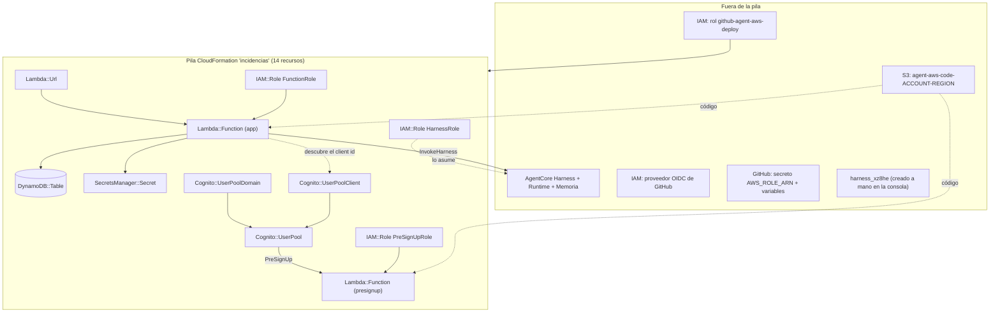
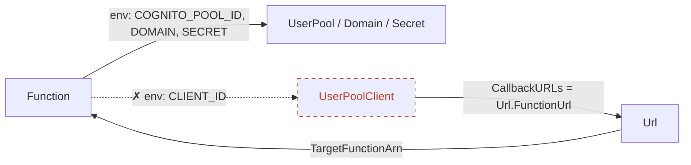

# 03 · Servicios de AWS

Cada sección responde a cuatro preguntas: **qué es**, **por qué se eligió**, **cómo está configurado exactamente** y **qué
límites/costes tiene**. Las fuentes `[ref]` están en [11](11-glosario-referencias.md); «**Verificado**» = comprobado en la cuenta
real; ⚠️ = no verificado.

**Cuenta y región:** `024962187207`, **us-east-2 (Ohio)**. El código no la escribe en ningún sitio: la toma de la sesión de
AWS, de los parámetros de CloudFormation o de `aws sts get-caller-identity`.

## 0. Mapa de recursos

| Recurso | Dentro de la pila | Cómo se crea |
|---------|:---:|--------------|
| Lambda `Function`, `PreSignUpFunction`, URL y permisos | ✅ | CloudFormation |
| DynamoDB `IncidentsTable` | ✅ | CloudFormation |
| Cognito: pool, dominio, cliente | ✅ | CloudFormation |
| Secrets Manager `SessionSecret` | ✅ | CloudFormation |
| Roles `HarnessRole`, `FunctionRole`, `PreSignUpRole` | ✅ | CloudFormation |
| **AgentCore Harness** + Runtime + Memoria | ❌ | `scripts/harness.py` (ver [02 §13](02-agentcore-harness.md#13-por-qué-el-harness-no-está-en-cloudformation)) |
| **Bucket S3 del código** | ❌ | `aws s3 mb` (workflow o a mano) |
| **Proveedor OIDC + rol de despliegue de GitHub** | ❌ | `scripts/github-oidc/setup.sh` (lo ejecuta una persona) |
| `harness_xz8he` | ❌ | Consola; **sin uso por la app** (de las pruebas iniciales) |

## 1. AWS Lambda y Function URL

**Qué es.** Cómputo *serverless*: se sube código y AWS lo ejecuta bajo demanda. Una **Function URL** es un endpoint HTTPS
dedicado de la función, con formato `https://<url-id>.lambda-url.<region>.on.aws` que **no cambia** mientras no se borre [L1].

**Por qué.** Es la forma más simple de servir una web + API sin servidor: un solo recurso, sin API Gateway, sin coste fijo.
Una Function URL es solo accesible por **internet pública** (no admite PrivateLink) [L1], y no ofrece autorizadores JWT: de ahí
que la autenticación esté **dentro de la app** (ver [04](04-autenticacion-seguridad.md)).

**Configuración exacta:**

| Parámetro | `Function` (app) | `PreSignUpFunction` |
|-----------|------------------|---------------------|
| Runtime | `python3.12` (valor del parámetro `LambdaRuntime`, ver abajo) | igual |
| Manejador | `app.handler` | `presignup.handler` |
| Timeout / memoria | 240 s / 256 MB | 5 s / 128 MB |
| Código | `s3://agent-aws-code-…/lambda-<sha>.zip` (≈ 16,7 MB) | **el mismo zip** |
| `AuthType` de la URL | `NONE` (la app exige sesión) | — |
| Variables | `HARNESS_NAME`, `TABLE_NAME`, `COGNITO_POOL_ID`, `COGNITO_DOMAIN`, `SESSION_SECRET_ARN` | `ALLOWED_SIGNUPS` |

- **`AuthType: NONE` necesita dos permisos**: `lambda:InvokeFunctionUrl` (`UrlPermission`) **y** `lambda:InvokeFunction` con la
  condición `InvokedViaFunctionUrl` (`InvokePermission`): la documentación exige ambos para invocar una URL [L2]. Por eso la
  plantilla tiene dos `AWS::Lambda::Permission`.
- **Evento de entrada** (*payload format 2.0*, mismo esquema que API Gateway HTTP) [L2]: `rawPath`, `cookies` (**lista** de
  `"nombre=valor"`), `headers` en minúsculas, `queryStringParameters`, `requestContext.http.method` y
  `requestContext.domainName`. Esto último es lo que usa `auth.py` para construir el *redirect URI* **sin confiar en el
  cliente**.
- **Respuesta:** `statusCode`, `headers`, `body` y **`cookies` (lista)**; Lambda las convierte en cabeceras `set-cookie` y la
  documentación indica **no** poner `set-cookie` a mano [L2]. Es lo que hace `auth.py`.
- **Interruptor de emergencia** [L1]: poner **concurrencia reservada = 0** rechaza todo el tráfico de la URL con `429`;
  borrar la configuración la reactiva. Además, la tasa máxima de la URL es **10 × la concurrencia reservada**.
  (No está configurado; es un recurso de operación, ver [10](10-operacion-costes.md).)
- **Runtimes.** Lambda soporta `python3.12` (deprecación **31 oct 2028**), `python3.13` y `python3.14` (**30 jun 2029**);
  `python3.15` está en *preview* y no debe usarse en producción [L3]. El CI construye con el Python del *runner* (3.12) y deduce
  el identificador del runtime de él (`build/runtime.txt`); producción pasó de 3.13 a **3.12** tras el primer despliegue del CI
  (compatible: las dependencias son Python puro).
- **Dependencias vendorizadas.** La documentación recomienda incluir siempre el SDK en el paquete para controlar versiones y
  compatibilidad [L3]. Aquí además es **obligatorio**: `InvokeHarness`/`CreateHarness` solo existen en boto3 recientes (se usa
  `boto3 1.43.108`).
- **Cuotas relevantes** [L5]: timeout máximo **900 s** (usamos 240); memoria 128–10 240 MB; **carga útil síncrona 6 MB** en
  petición y respuesta; variables de entorno 4 KB en total; paquete `.zip` 50 MB comprimido / 250 MB descomprimido (el nuestro:
  15,9 MiB / ≈ 22,9 MB); concurrencia por defecto 1 000, **con cuotas reducidas en las cuentas nuevas** (AWS las sube según el uso).
- **Precio** [L4]: **$0,20 por millón de peticiones** y **$0,0000166667 por GB-segundo** (x86, primer tramo); capa gratuita
  mensual de **1 M de peticiones y 400 000 GB-s**. La página de precios consultada no menciona un cargo extra por Function URL
  (⚠️ no lo afirma; en la práctica no se ha observado).

**Ciclo de vida de una petición (efectos de diseño):** el entorno de ejecución se reutiliza entre invocaciones, así que
`app.py` crea los clientes de boto3, lee `index.html` y cachea el ARN del harness, la clave de sesión y el client id **a nivel
de módulo** (una vez por entorno en frío). El primer acceso tras inactividad paga ese arranque.

## 2. Amazon DynamoDB

**Qué es.** Base de datos clave-valor/documento gestionada. **Por qué:** sin servidores, sin capacidad que dimensionar y coste
cero sin uso en modo bajo demanda.

**Configuración:** una tabla `IncidentsTable`, clave de partición `id` (S), `BillingMode: PAY_PER_REQUEST`, **PITR** activado.
(Esquema de atributos en [01 §7](01-vision-arquitectura.md#7-modelo-de-datos).)

**Semántica que importa** [D1, D2]:

- Las cuatro operaciones CRUD (`PutItem`, `GetItem`, `UpdateItem`, `DeleteItem`) son **atómicas**.
- `UpdateItem` hace *upsert* si la clave no existe; por eso las actualizaciones llevan
  `ConditionExpression="attribute_exists(id)"` y una clave inexistente da `ConditionalCheckFailedException`
  (→ 404 en la API, error accionable para el agente).
- `ReturnValues="ALL_NEW"` devuelve el elemento tras actualizar (se usa para responder sin releer).
- **Lecturas:** por defecto son **eventualmente consistentes**; `ConsistentRead=True` pide la más reciente y cuesta el doble
  [D1, D2, D4]. La app usa lectura fuerte en `list_incidents()` y en el `get_item` posterior al agente.
- **`Scan`** devuelve como mucho **1 MB por página** y hay que paginar con `LastEvaluatedKey`; la documentación lo califica de
  «menos eficiente» y recomienda `Query` cuando sea posible [D3]. **Corrección aplicada:** la primera versión leía solo la
  primera página (truncado silencioso con muchos datos); ahora pagina, con prueba de 700 elementos de 2 KB.
- El tamaño máximo de un elemento es **400 KB** [D1].
- **Concurrencia:** *last-write-wins*. No hay control de versiones optimista (no hay atributo `version`): dos personas (o el
  agente y una persona) que cambian el estado a la vez, gana la última escritura. Aceptable con este volumen (⚠️ riesgo
  conocido).
- `DescribeTable` muestra `ItemCount`/`TableSizeBytes` con **retraso** (se actualizan aproximadamente cada seis horas): en
  pruebas aparecía `0` con 7 incidencias reales. No usarlo para contar.

**Precios** (us-east-1; ⚠️ us-east-2 no consultado, suele coincidir) [D5]: **$0,625 por millón de unidades de escritura**,
**$0,125 por millón de unidades de lectura** (4 KB eventual = 0,5 RRU; fuerte = 1 RRU; escritura = 1 WRU por KB), almacenamiento
**$0,25/GB-mes** (25 GB gratis), **PITR $0,20 × GB-mes**. Con esta carga: céntimos.

**Límite de diseño:** `Scan` + ordenar en memoria funciona para **miles** de incidencias, no millones. Para más habría que
añadir un índice secundario global (estado/fecha) y `Query`.

## 3. Amazon Cognito

**Qué es.** Servicio de identidad: *user pools* (directorio de usuarios + emisión de tokens OIDC). **Por qué** (frente a Entra ID
o Google): se pidió **solo AWS**; Cognito vive en la cuenta, no requiere cuentas externas y no tiene coste fijo.

**Configuración verificada (`describe-user-pool`):**

| Ajuste | Valor |
|--------|-------|
| Plan (*feature plan*) | `ESSENTIALS` (el predeterminado) [C1, C3] |
| Atributo de usuario | correo (`UsernameAttributes: [email]`), verificado automáticamente con código |
| Registro propio | Activado (`AllowAdminCreateUserOnly: false`), **filtrado** por el disparador pre-registro |
| Contraseña | mín. 12; mayúscula, minúscula y número; temporal válida 7 días |
| MFA | `OFF` (**sin MFA**) |
| Envío de correo | `COGNITO_DEFAULT` |
| Protección contra borrado | `INACTIVE` (por eso `destroy` puede borrar la pila) |
| Login alojado | **Clásico** (*hosted UI*, versión 1): es el valor por defecto si no se indica `ManagedLoginVersion` [C2] |
| Dominio | `incidencias-<cuenta>.auth.us-east-2.amazoncognito.com` |
| Cliente `incidencias-web` | **Público** (sin secreto), flujo `code`, *scopes* `openid email profile`, revocación de tokens activa, refresco 30 días |

**Correo por defecto:** remitente `no-reply@verificationemail.com` y **límite de 50 mensajes al día por cuenta** (se reinicia a
las 09:00 UTC); es para desarrollo/pruebas y la documentación recomienda **Amazon SES** para producción [C4]. Con
registro propio, cada alta y cada «olvidé mi contraseña» gasta uno de esos 50.

**Disparador *Pre sign-up*** [C5]: Cognito lo invoca **antes** de crear un usuario nuevo: en el registro propio (`SignUp`), en
el primer inicio con un IdP externo y en `AdminCreateUser`. Para **rechazar** basta lanzar una excepción (el mensaje llega al
usuario). `autoConfirmUser/autoVerifyEmail/autoVerifyPhone` se **ignoran** si lo dispara `AdminCreateUser`. Nuestra función
(`presignup.py`) rechaza todo lo que no sea `PreSignUp_SignUp` con correo autorizado, deja pasar `PreSignUp_AdminCreateUser`
y **fuerza** `autoConfirmUser=False`/`autoVerifyEmail=False` para que el correo se verifique con código.

**Endpoint de tokens** (`/oauth2/token`) [C6]: acepta `grant_type=authorization_code` con **`client_id`** obligatorio para
clientes públicos y `code_verifier` si se envió `code_challenge`; devuelve `id_token`, `access_token` y `refresh_token`. Es
accesible desde navegador (`Access-Control-Allow-Origin: *`). **Nuestra app no usa el `access_token` ni el `refresh_token`**:
solo valida el `id_token` y crea su propia sesión (8 h).

**Cierre de sesión** (`/logout`) [C7]: requiere `client_id` y un `logout_uri` **registrado** como URL de cierre del cliente
(`…/auth/signed-out`); solo admite `GET` y cierra la sesión **de Cognito** (la cookie de Cognito), por eso hay que pasar por él
o «volver a entrar» sería automático.

**Precio** [C3]: plan *Essentials* **$0,015 por usuario activo mensual (MAU)** con **10 000 MAU gratis** (la capa gratuita no
caduca a los 12 meses). La misma página indica que el correo/SMS se facturan aparte por SES/SNS; con `COGNITO_DEFAULT` no se
usa SES (⚠️ la política de cobro del correo por defecto no está explícita en la página consultada).

## 4. AWS Secrets Manager

**Qué es.** Almacén de secretos cifrado. **Para qué aquí:** guarda la **clave HMAC** que firma la cookie de sesión. Se **genera
sola** (`GenerateSecretString`: 48 caracteres sin signos de puntuación, en la clave `session_key` del JSON), de modo que
**nadie la conoce ni la ve en el repositorio ni en la plantilla**.

- La Lambda la lee una vez por entorno en frío (`GetSecretValue`) y la cachea.
- **Precio** [SM1]: **$0,40 por secreto al mes** y **$0,05 por 10 000 llamadas a la API**: es el **único coste fijo** del sistema.
- Rotarla invalida todas las sesiones abiertas (ver runbook en [10](10-operacion-costes.md)).

## 5. IAM: roles y confianza

| Rol | Quién lo asume | Confianza | Permisos |
|-----|----------------|-----------|----------|
| `FunctionRole` | Lambda `Function` | `lambda.amazonaws.com` | Logs básicos (política gestionada); `InvokeHarness`+`InvokeAgentRuntime` **solo sobre `harness/<nombre>-*`**; `ListHarnesses`; DynamoDB `Scan/GetItem/PutItem/UpdateItem` **solo en la tabla**; `GetSecretValue` **solo en el secreto**; `cognito-idp:ListUserPoolClients` **solo en el pool** |
| `PreSignUpRole` | Lambda `PreSignUpFunction` | `lambda.amazonaws.com` | Solo logs básicos |
| `HarnessRole` | El servicio AgentCore | `bedrock-agentcore.amazonaws.com` con `aws:SourceAccount` y `aws:SourceArn = …:bedrock-agentcore:<región>:<cuenta>:*` | Invocar modelos; `bedrock-mantle:CreateInference`; logs/métricas/X-Ray; ECR del harness; identidad de *workload*; memoria del harness |
| `github-agent-aws-deploy` | GitHub Actions (OIDC) | Ver [04 §7](04-autenticacion-seguridad.md#7-federación-oidc-de-github-con-aws) | CloudFormation sobre `incidencias*`; roles `incidencias-*`; Lambda; DynamoDB; Cognito; Secrets Manager; AgentCore; bucket del código |

**Condiciones contra el *confused deputy*.** `HarnessRole` solo lo puede asumir AgentCore **actuando por orden de recursos de
esta cuenta** (`aws:SourceAccount`, `aws:SourceArn`). El ARN de origen es `…:*` y no `harness/*` porque AgentCore valida el rol
con un ARN distinto (el *runtime*); con `harness/*` la creación del harness fallaba con «Role validation failed» (**verificado**).

**La política del `HarnessRole`** es un **subconjunto** de la que genera la consola (`AmazonBedrockAgentCoreHarnessExecutionPolicy`)
y de la política de ejemplo de la documentación [A9]; se omiten navegador, intérprete de código, EFS y S3 Files. Hizo falta
añadir **permisos de memoria** porque los harness creados por API traen memoria administrada (síntoma real: `AccessDeniedException`
en `ListEvents` dentro de `InvokeHarness`).

**El rol de despliegue** no tiene administrador. Tiene una **denegación explícita** de `iam:AttachRolePolicy` salvo
`AWSLambdaBasicExecutionRole`. Riesgo residual: un rol que puede crear roles `incidencias-*` con políticas en línea es, en la
práctica, «administrador de este proyecto» (ver [04](04-autenticacion-seguridad.md)).

## 6. AWS CloudFormation

**Qué es.** Infraestructura como código: una plantilla declara recursos y CloudFormation calcula y aplica los cambios.

**Parámetros** (`template.yaml`):

| Parámetro | Defecto | Uso |
|-----------|---------|-----|
| `LambdaRuntime` | *(obligatorio)* | Identificador del runtime; lo deduce el CI del Python que construyó el zip |
| `HarnessName` | `asistente_incidencias` | Nombre del harness (permisos de invocación y de memoria) |
| `CodeBucket`, `CodeKey` | *(obligatorios)* | Dónde está el zip |
| `AllowedSignups` | `""` | Correos/dominios que pueden registrarse; **vacío = nadie** |

**Salidas:** `HarnessRoleArn`, `WebUrl`, `UserPoolId`.

### 6.1 El ciclo de dependencias que se evitó

CloudFormation deduce el orden de creación de las referencias `Ref`/`GetAtt`. El cliente de Cognito necesita la URL de la
función (para registrar `…/auth/callback`), y la función necesitaría el *client id* del cliente para configurarse: **ciclo**.

Si `Function` dependiera del cliente, habría el ciclo `Function → Client → Url → Function`. **Solución:** la función **no**
recibe el *client id*; lo **descubre en ejecución** con `cognito-idp:ListUserPoolClients` (por nombre `incidencias-web`) y lo
cachea (`auth.client_id()`). Es un diseño derivado del grafo de dependencias de la plantilla (⚠️ no es una cita de la
documentación; el comportamiento de `Ref/GetAtt` como dependencia implícita es el estándar de CloudFormation).

Otros detalles: `Url.FunctionUrl` **termina en `/`** (por eso `${Url.FunctionUrl}auth/callback`, sin barra extra);
`GetAtt UserPool.Arn` limita el permiso de `ListUserPoolClients` al pool.

### 6.2 Cómo se despliega y qué pasa si falla

`aws cloudformation deploy` crea un *change set* y lo ejecuta; si falla, **revierte** al estado anterior (la pila queda
intacta, lo comprobamos con el rol mal configurado). `validate-template` detecta errores de sintaxis antes. Cambiar
`HarnessName` en un recurso `AWS::BedrockAgentCore::Harness` exigiría reemplazo [A16] (no aplica: el harness no está en la pila).

## 7. Amazon S3 (código)

Bucket `agent-aws-code-<cuenta>-<región>` con un zip por despliegue (`lambda-<sha>.zip` desde el CI; `lambda-v<N>.zip`
en los despliegues manuales). **No está en la pila** (CloudFormation lo necesita *antes* de crearla). Hoy tiene **20 objetos,
≈ 319 MiB**, **sin regla de ciclo de vida**: crece 16 MB por despliegue (⚠️ coste menor pero acumulativo; ver [10](10-operacion-costes.md)).

## 8. Observabilidad en AWS

| Qué | Dónde | Estado |
|-----|-------|--------|
| Logs de la app y de PreSignUp | CloudWatch Logs `/aws/lambda/incidencias-Function-…` | **Sin retención configurada** (no caducan nunca) — verificado |
| Logs del *runtime* del harness | `/aws/bedrock-agentcore/runtimes/harness_asistente_incidencias-…-DEFAULT` | Sin retención; estaba vacío al medir |
| Trazas/métricas/registros de AgentCore | Panel *GenAI observability* de CloudWatch | Cada invocación genera trazas **sin configurar nada**, pero hay que **activar *Transaction Search* en CloudWatch (una vez por cuenta)** para verlas [A6]. **Verificado:** el destino de segmentos de X-Ray es `XRay` (no `CloudWatchLogs`) → ⚠️ Transaction Search **no** parece activado |
| Auditoría de operaciones | CloudTrail | Las operaciones del harness aparecen como recurso `AWS::BedrockAgentCore::Runtime`, con eventos `CreateHarness…` (gestión) e `InvokeAgentRuntime` (datos) [A6] |
| Métricas de Mantle | CloudWatch, espacio de nombres `AWS/BedrockMantle` (peticiones, tokens, errores de cliente) | [M1] |

La app **no registra datos personales ni tokens**: solo la clase de las excepciones y mensajes genéricos.

## 9. Amazon Bedrock Mantle

**Qué es.** Endpoint de Bedrock compatible con las APIs de OpenAI (*Chat Completions*, *Responses*) y de Anthropic
(*Messages*), sobre el motor de inferencia distribuido de AWS «Mantle» [M1, A14]. Base:
`https://bedrock-mantle.<región>.api.aws/v1`. Admite clave de API de Bedrock o credenciales de AWS; en el harness se usa el
**rol de ejecución** (`bedrock-mantle:CreateInference` + `CallWithBearerToken`). *Chat Completions* es «sin estado»: el cliente
gestiona el historial [M1] (aquí lo hace el harness con su memoria).

## 10. AWS STS y la federación OIDC

GitHub Actions obtiene credenciales temporales de AWS **sin claves de larga vida**: presenta un token OIDC firmado por
GitHub y AWS lo cambia por una sesión del rol (`sts:AssumeRoleWithWebIdentity`). Detalle, formato del identificador de
sujeto y su historia en [04 §7](04-autenticacion-seguridad.md#7-federación-oidc-de-github-con-aws).
