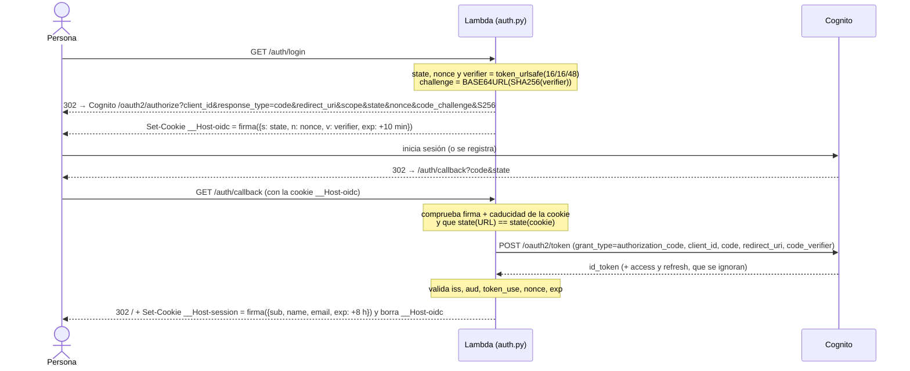
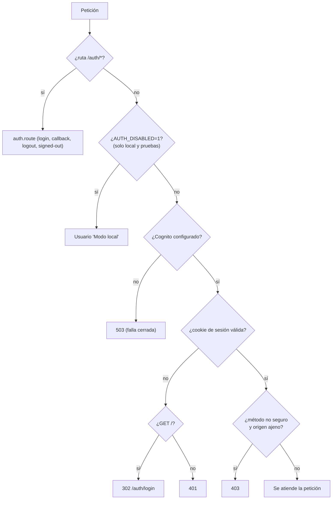
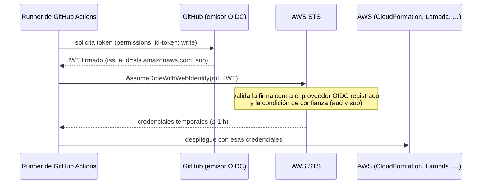

# 04 · Autenticación y seguridad

Fuentes `[ref]` en [11](11-glosario-referencias.md). «**Verificado**» = comprobado en la cuenta real; ⚠️ = no verificado.

## 1. Marco teórico

### 1.1 OAuth 2.0 y OpenID Connect

- **OAuth 2.0** (RFC 6749) es un marco de *autorización delegada*: una aplicación (el **cliente**) obtiene permiso para actuar
  en nombre de alguien sin conocer su contraseña, mediante un **servidor de autorización** que emite *tokens*.
- **OpenID Connect (OIDC)** es una capa de **autenticación** sobre OAuth 2.0: además de un *access token*, el servidor emite un
  **ID token** (un JWT, RFC 7519) que afirma *quién es* la persona y *cuándo y para quién* se emitió.
- Aquí: **cliente** = nuestra Lambda; **servidor de autorización / proveedor de identidad** = Amazon Cognito (login alojado);
  **persona** = quien usa la web.

### 1.2 Flujo de código de autorización + PKCE

El *authorization code flow* evita que los tokens pasen por la barra de direcciones: el navegador solo recibe un **código de un
solo uso** que el servidor de la app canjea por tokens en una conexión directa (*back-channel*). **PKCE** (RFC 7636) protege el
código frente a su interceptación: el cliente inventa un secreto aleatorio (`code_verifier`), envía su *hash* SHA-256
(`code_challenge`, método `S256`) al iniciar y revela el secreto al canjear; quien robe el código no puede canjearlo
[R2]. Requisitos del verificador: **43–128 caracteres** de `[A-Za-z0-9-._~]`, y «si el cliente puede usar `S256`, **debe**
usarlo» [R2].

Las mejores prácticas vigentes (**RFC 9700**, BCP 240, 2025) dicen que los clientes **públicos deben usar PKCE**, que el
servidor debe comparar el *redirect URI* **por cadena exacta**, y que los clientes **deben prevenir CSRF** con valores `state`
de un solo uso «ligados de forma segura al agente de usuario» [R3]. **Todo eso se cumple** (cliente público + PKCE `S256`;
URL de retorno registrada exacta en el cliente; `state` ligado a una cookie).

### 1.3 `state` y `nonce`

Según OIDC Core §3.1.2.1 [R4]:

- **`state`**: valor opaco que mantiene el estado entre petición y *callback*; típicamente se usa para mitigar CSRF «ligándolo
  criptográficamente a una cookie del navegador».
- **`nonce`**: valor que asocia la sesión del cliente con el ID token y **mitiga ataques de repetición**; pasa sin cambios de
  la petición al token.

## 2. El flujo en este sistema



| Pieza | Valor | Por qué |
|-------|-------|---------|
| `redirect_uri` | `https://<domainName de la petición>/auth/callback` | Lo fija AWS (`requestContext.domainName`), **no** el cliente; debe coincidir **exactamente** con la URL registrada en Cognito |
| Ticket de login | Cookie firmada con `state`, `nonce`, `verifier`, caducidad **10 min** | Liga la petición al navegador que la inició (anti *login-CSRF*); sin estado en servidor |
| Cliente | Público, `GenerateSecret: false` | No hay secreto que guardar ni filtrar; la seguridad la da PKCE |
| Descubrimiento del client id | `ListUserPoolClients` por nombre, cacheado | Rompe un ciclo de CloudFormation ([03 §6.1](03-servicios-aws.md#61-el-ciclo-de-dependencias-que-se-evitó)) |

Si Cognito no está configurado → `503` («Autenticación no configurada»). Sin sesión: `/` redirige a `/auth/login` y la API
responde `401`. **Falla cerrada.**



## 3. Validación del `id_token`

OIDC Core §3.1.3.7 [R4] exige validar, entre otras cosas: emisor (`iss`) idéntico al esperado, `aud` que contenga nuestro
`client_id`, que la hora actual sea anterior a `exp`, y —si se envió `nonce`— que el claim `nonce` coincida. Y añade esta
frase, que **justifica una decisión de diseño**:

> «Si el ID Token se recibe mediante comunicación directa entre el Cliente y el Token Endpoint, la validación del servidor TLS
> **PUEDE** usarse para validar al emisor **en lugar de comprobar la firma del token**.» [R4]

`auth.py` recibe el token **directamente del endpoint de tokens por HTTPS**, con el código ligado al verificador PKCE, así que
**no verifica la firma** (no descarga claves JWKS ni usa librerías de criptografía). Lo que **sí** valida:

| Comprobación | Valor esperado |
|--------------|----------------|
| `iss` | `https://cognito-idp.<región>.amazonaws.com/<poolId>` |
| `aud` | `client_id` de nuestro cliente |
| `token_use` | `id` (específico de Cognito; descarta un access token) |
| `nonce` | El del ticket de login (comparación en tiempo constante) |
| `exp` | Posterior a la hora actual |

**No** se comprueba `iat` (OIDC lo ofrece para limitar cuánto hay que recordar los `nonce`; aquí el ticket caduca a los 10
min). **Límite de la decisión:** si algún día el token llegara por otro camino (p. ej. `response_type=id_token`, flujo
implícito) habría que verificar la firma. El flujo implícito **no** está habilitado en el cliente.

## 4. La sesión

**Cookie `__Host-session`** con `Max-Age=28800` (8 h, configurable con `SESSION_HOURS`), `Path=/`, `HttpOnly`, `Secure`,
`SameSite=Lax`.

- **Prefijo `__Host-`**: el navegador solo la acepta si lleva `Secure`, `Path=/` y **sin `Domain`**, lo que la ata a ese host
  exacto e impide que un subdominio la fije o sobrescriba [R5]. Además impide que se guarde por HTTP.
- **`HttpOnly`**: el JavaScript de la página no puede leerla (verificado en producción: no aparece en `document.cookie`), lo que
  limita el robo por XSS.
- **`SameSite=Lax`**: se envía en navegación de nivel superior pero no en subpeticiones entre sitios [R5]; es una **defensa en
  profundidad**, no la defensa primaria de CSRF [O3].
- **Firma HMAC-SHA256** [R6] con la clave de Secrets Manager: `token = base64url(json) + "." + base64url(hmac)`; la verificación
  usa comparación en **tiempo constante** (ver nota abajo) y comprueba `exp`. Cualquier cookie ilegible o manipulada equivale a
  «sin sesión».
- **Sin estado en servidor** (no hay tabla de sesiones): barato y simple.

> **Nota sobre la comparación en tiempo constante.** `hmac.compare_digest` evita ataques de temporización, pero con `str` **solo
> admite ASCII** y lanza `TypeError` con otros caracteres [P1]. El parámetro `state` viene de la URL (lo controla quien llama), así
> que la primera versión se rompía con un `state` como `estado-ñ` (error 500, **reproducido**). `auth._same` compara sobre bytes y
> ahora cualquier valor hostil es un simple rechazo (probado con Unicode, emojis, 5 000 caracteres, NUL, HTML).

**Limitación importante (⚠️ riesgo residual):** al ser *stateless*, **«Salir» borra la cookie del navegador pero no invalida la
sesión en el servidor**: una cookie copiada antes de salir **sigue siendo válida hasta que caduque (8 h)**. Para revocación real
habría que guardar sesiones (p. ej. en DynamoDB) o rotar la clave (cierra **todas** las sesiones).

## 5. CSRF, orígenes y cabeceras

### 5.1 Capas contra CSRF

OWASP indica que la defensa **primaria** son los *tokens* sincronizados/doble cookie o **Fetch Metadata**, y que `SameSite` es
«útil como defensa en profundidad pero no sustituye una defensa CSRF adecuada»; recomienda verificar `Origin`, rechazar métodos
no seguros con `Sec-Fetch-Site: cross-site` y **no usar GET para operaciones que cambian estado** [O3].

| Capa | Implementación | Probada |
|------|----------------|:-------:|
| Cookie `SameSite=Lax` | En ambas cookies | ✅ (flags) |
| **Fetch Metadata** | En métodos no seguros solo se admite `Sec-Fetch-Site` = `same-origin` o `none`; `same-site` **también se rechaza** (en `*.on.aws` «mismo sitio» podría ser otro inquilino) | ✅ |
| **`Origin`** | Si viene, su host debe ser el de la función | ✅ |
| **Sin GET que cambie estado** | `/auth/logout` pasó de GET a **POST** (si no, otra web podría cerrarte la sesión con un enlace o imagen) | ✅ |
| `state` + `nonce` + PKCE | *Login-CSRF* y repetición | ✅ |

Las lecturas (`GET`) no se bloquean por Fetch Metadata: son seguras y el navegador impide que otra web lea la respuesta.

### 5.2 Cabeceras de seguridad (en **todas** las respuestas)

Valores recomendados por OWASP [O4]; verificados en producción:

| Cabecera | Valor | Para qué |
|----------|-------|----------|
| `X-Content-Type-Options` | `nosniff` | Evita que el navegador reinterprete tipos MIME |
| `X-Frame-Options` | `DENY` | Anti *clickjacking* (el moderno es `frame-ancestors`) |
| `Content-Security-Policy` | `frame-ancestors 'none'; base-uri 'none'; form-action 'self'` | Solo directivas **que no rompen** el script/estilo en línea |
| `Referrer-Policy` | `strict-origin-when-cross-origin` | Limita lo que se filtra al navegar |
| `Strict-Transport-Security` | `max-age=63072000; includeSubDomains` | Fuerza HTTPS (sin `preload`: no se pide) |
| `Cross-Origin-Opener-Policy` | `same-origin` | Aísla el contexto de navegación |
| `Cache-Control` | `no-store` | No cachear respuestas con datos de usuario |

**Pendiente (⚠️):** una **CSP completa** (`script-src`/`style-src`). La web usa `<script>` y `<style>` en línea y atributos
`style=""`; endurecerla exigiría *nonces* por respuesta y retirar los estilos en atributo.

### 5.3 XSS

La web **nunca usa `innerHTML`** con datos: construye el DOM con `createElement` + `textContent` (`el()`), por lo que un
título como `` se muestra como texto (prueba e2e con comprobación de que `window.pwn` queda sin definir).

## 6. Modelo de amenazas (STRIDE) y seguridad del agente

| Amenaza | Escenario | Mitigación | Residual |
|---------|-----------|------------|----------|
| **S**poofing | Entrar como otra persona | Cognito + verificación de correo; cookie firmada | Cookie robada válida hasta 8 h; **sin MFA** |
| **T**ampering | Alterar la cookie o el ticket | HMAC-SHA256 + `exp`; comparación en tiempo constante | Clave comprometida ⇒ rotarla |
| **T**ampering | `id_token` falso en el callback | Llega por TLS directo; se valida emisor, audiencia, `token_use`, nonce, caducidad; PKCE | — |
| **R**epudiation | «Yo no cambié ese estado» | — | **No hay registro de auditoría** de quién hizo qué (solo logs de Lambda y CloudTrail de AWS) |
| **I**nformation disclosure | Fuga de tokens/errores | Errores genéricos; sin tokens en logs; cookie `HttpOnly` | **Todas las personas autenticadas ven todas las incidencias** |
| **D**enial of service | Inundar la URL pública o gastar tokens | Sin sesión no se llega al agente; `MAX_STEPS`, `maxIterations`, `timeoutSeconds` | **Sin WAF ni límite por usuario**; cuota de tokens del modelo; interruptor: concurrencia reservada 0 |
| **E**levation | Inyección de prompt desde un título/descripción | Herramientas mínimas, validación estricta, sin `shell`, *undo* | **Sin aprobación humana**; el agente actúa con el rol de la app |
| **E**levation | IDOR (leer/modificar por id) | Ids de 128 bits no enumerables | Cualquier usuario autenticado puede actuar sobre cualquier id |

Para el detalle de **seguridad del agente** (reparto de responsabilidades de AgentCore, OWASP LLM01/LLM06, `allowedTools`,
herramientas de cliente) ver [02 §12](02-agentcore-harness.md#12-seguridad-del-agente).

<a id="7-federación-oidc-de-github-con-aws"></a>
## 7. Federación OIDC de GitHub con AWS

**Idea.** En lugar de guardar claves de AWS en GitHub, el *runner* pide a GitHub un **token OIDC** firmado y AWS lo cambia por
credenciales temporales del rol (`sts:AssumeRoleWithWebIdentity`). No hay secretos de larga vida; el único valor en GitHub
(`AWS_ROLE_ARN`) es un identificador, no una credencial.



### 7.1 El identificador de sujeto (`sub`): un cambio reciente que rompió el primer intento

Históricamente el `sub` era `repo:<propietario>/<repo>:ref:refs/heads/<rama>`. GitHub introdujo el **formato inmutable**
`repo:<propietario>@<id_propietario>/<repo>@<id_repo>:ref:refs/heads/<rama>`: usa un `@` porque no puede aparecer en nombres de
usuario o de repositorio. **Los repositorios creados después del 15 de julio de 2026 lo usan por defecto**; los anteriores
conservan el formato antiguo salvo que lo activen [G1, G2]. Este repositorio es posterior, y se comprueba con
`gh api repos/<propietario>/<repo>/actions/oidc/customization/sub` (devuelve `use_immutable_subject` y `sub_claim_prefix`).

**Qué pasó (verificado):** la primera política de confianza usaba el formato antiguo y el despliegue falló con
`Not authorized to perform sts:AssumeRoleWithWebIdentity`. AWS **hizo lo correcto**: rechazó un sujeto que no coincidía. Se
actualizó `trust.json` al formato inmutable (`repo:Keniding@115328041/agent-aws@1402643825:ref:refs/heads/…`) y funcionó.
Bonus de seguridad: el formato inmutable no se puede suplantar renombrando el repositorio.

### 7.2 La política de confianza

```json
{ "Effect": "Allow",
  "Principal": {"Federated": "arn:aws:iam::<cuenta>:oidc-provider/token.actions.githubusercontent.com"},
  "Action": "sts:AssumeRoleWithWebIdentity",
  "Condition": { "StringEquals": {
      "token.actions.githubusercontent.com:aud": "sts.amazonaws.com",
      "token.actions.githubusercontent.com:sub": [
        "repo:Keniding@115328041/agent-aws@1402643825:ref:refs/heads/main",
        "repo:Keniding@115328041/agent-aws@1402643825:ref:refs/heads/ccr-1c850516-ik6b8p" ] } } }
```

Solo puede asumirlo ese repositorio y solo desde esas dos ramas (la segunda debería retirarse al fusionar). La política de
permisos acota el rol a recursos `incidencias*` y **deniega** adjuntar políticas gestionadas distintas de la básica de
Lambda. Verificado con el simulador de IAM: **permite** lo necesario (crear la pila, actualizar la Lambda, crear/pasar roles
`incidencias-*`, tabla, bucket, harness, pool, secreto) y **deniega** crear usuarios, tocar roles ajenos, borrar otras funciones,
leer otros buckets, lanzar máquinas y modificar su propio rol.

> **Riesgo residual.** Un rol que puede crear roles `incidencias-*` con políticas en línea y pasarlos a una Lambda puede, en
> la práctica, **escalar privilegios dentro del proyecto**. Mitigación: quién puede asumirlo (dos ramas de un repositorio) y
> que el despliegue es **manual**. Hardening posible: un *permissions boundary* sobre los roles creados.

## 8. Riesgos residuales y hoja de ruta

| # | Riesgo / carencia | Impacto | Estado | Recomendación |
|---|-------------------|---------|--------|---------------|
| 1 | **Sin MFA** (`MfaConfiguration: OFF`) | Una contraseña robada basta | Abierto | Activar MFA opcional/obligatorio (TOTP/email) |
| 2 | **Sin aprobación humana** de acciones del agente | Una inyección de prompt puede cambiar estados | Mitigado parcialmente (*undo*, herramientas mínimas) | *Lifecycle hook* `before_tool_call` con Lambda o confirmación en la UI |
| 3 | **Todos ven todo** (sin propietarios ni organizaciones) | Fuga entre usuarios cuando haya más de uno | Abierto | Atributo `owner`/`org` + filtro en `list_incidents` y herramientas; herramientas «en el contexto del usuario» (OWASP LLM06) |
| 4 | **Sesión no revocable** (8 h) | Cookie robada sigue válida | Abierto | Sesiones en servidor o rotación de clave; reducir `SESSION_HOURS` |
| 5 | **Sin WAF / límites por usuario** | Gasto de tokens/abuso | Abierto | AWS WAF en CloudFront; *throttling* por usuario; concurrencia reservada |
| 6 | **CSP completa pendiente** | XSS tendría más margen | Abierto | *Nonces* y retirar `style=""` |
| 7 | **Sin auditoría** de cambios | No hay «quién cambió qué» | Abierto | Registrar `actor`, `acción`, `antes/después` (tabla o CloudTrail Lake) |
| 8 | **Correo por defecto de Cognito** (50/día) | Se agota con pocas altas | Aceptado hoy | Configurar Amazon SES |
| 9 | **Clave de sesión sin rotación programada** | Compromiso prolongado | Abierto | Rotar periódicamente (invalida sesiones) |
| 10 | **Rol de despliegue potente** | Escalada dentro del proyecto | Mitigado (2 ramas, manual) | *Permissions boundary*; retirar la rama de trabajo |
| 11 | **Memoria a largo plazo del agente** puede contaminar respuestas | Datos falsos | Mitigado (estado real adjunto) | Quitar la estrategia `SEMANTIC` o desactivar memoria |
| 12 | **Modelo sin soporte garantizado** (EOL «no antes de» 18 ago 2026) | Interrupción | Vigilar | Plan de migración a otro modelo; probar `bedrock-runtime` |
