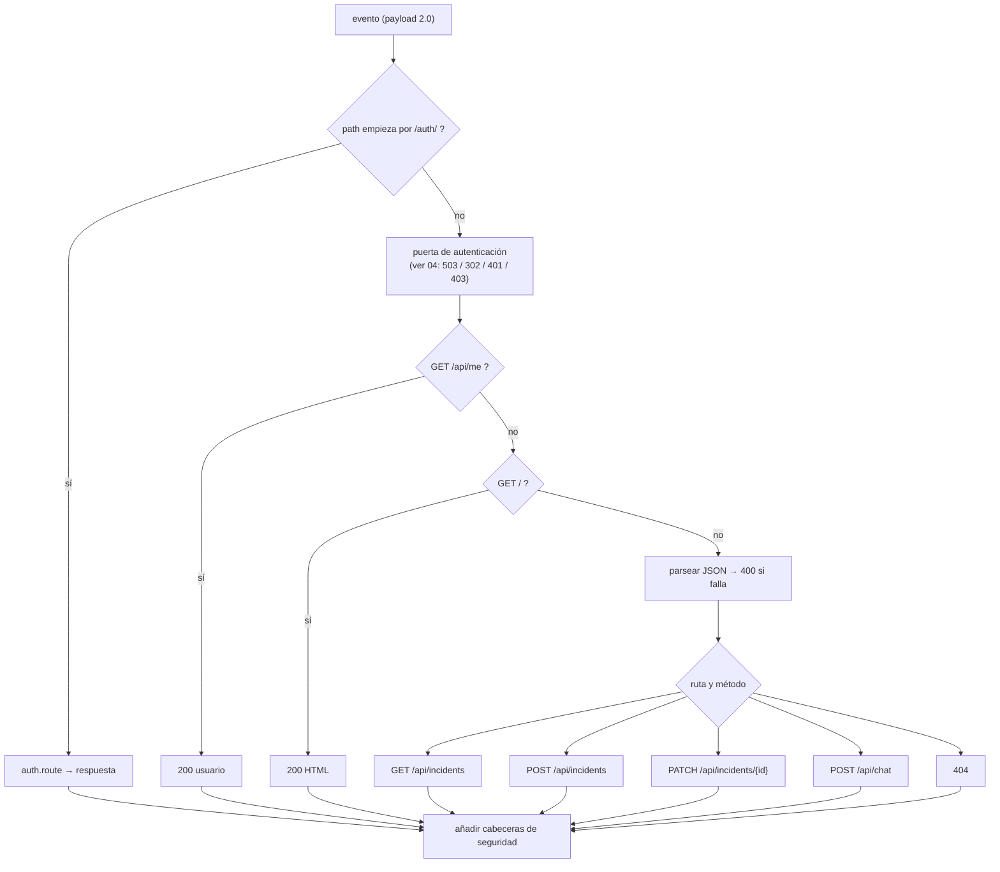
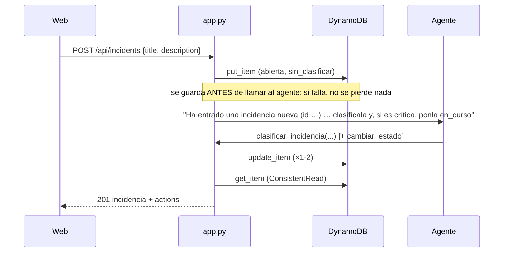
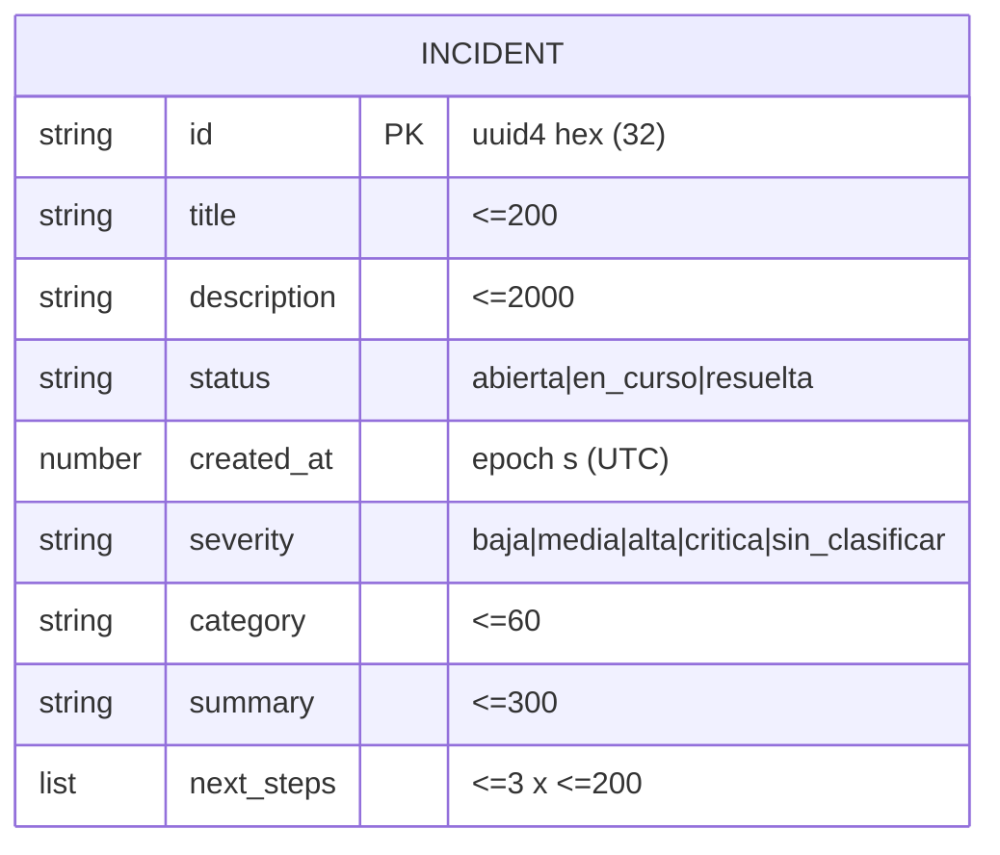
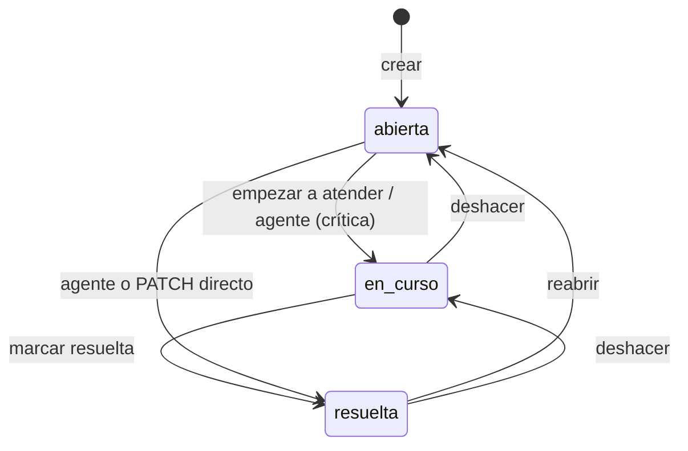

# 05 · Backend y API

Todo el backend vive en **dos módulos Python sin dependencias propias** (solo `boto3` vendorizado): `src/app.py` (API, agente,
datos) y `src/auth.py` (identidad). Un tercero, `src/presignup.py`, es el disparador de Cognito. Fuentes `[ref]` en
[11](11-glosario-referencias.md).

## 1. Contrato HTTP

Todas las rutas (salvo `/auth/*`) exigen **sesión**. Las respuestas JSON llevan `content-type: application/json`; todas llevan las
[cabeceras de seguridad](04-autenticacion-seguridad.md#52-cabeceras-de-seguridad-en-todas-las-respuestas).

| Método y ruta | Cuerpo | Respuestas | Qué hace |
|---------------|--------|------------|----------|
| `GET /` | — | `200` HTML · `302` → `/auth/login` | La web |
| `GET /api/me` | — | `200 {name, email, local}` | Quién ha entrado |
| `GET /api/incidents` | — | `200 [incidencia…]` (más recientes primero) | Lista **completa** (paginada internamente) |
| `POST /api/incidents` | `{title, description?}` | `201 incidencia (+ actions)` · `400` | Guarda y pide al agente que la clasifique |
| `PATCH /api/incidents/{id}` | `{status}` | `200 incidencia` · `400` · `404` | Cambia el estado |
| `POST /api/chat` | `{message, session_id?}` | `200 {session_id, reply, actions}` · `400` · `502 {error}` | Habla con el agente |
| `GET /auth/login` · `/auth/callback` · `/auth/signed-out` | — | `302` / `200` / `403` | Flujo OIDC ([04](04-autenticacion-seguridad.md)) |
| `POST /auth/logout` | — | `200 {url}` + borra la cookie | Cierra sesión |
| *(otra)* | — | `404 {error: "no encontrado"}` | |

Códigos transversales: **`401`** sin sesión · **`403`** origen no permitido (Fetch Metadata/`Origin`) · **`405`** método no
permitido en `/auth/*` · **`503`** Cognito no configurado.

### 1.1 Validación de entrada

| Campo | Regla | Comportamiento |
|-------|-------|----------------|
| `title` | 1–200 caracteres tras `strip()` | Vacío → `400 {"error":"falta el título"}`; **más de 200 se recorta en silencio** |
| `description` | ≤ 2 000 (`MAX_MESSAGE_CHARS`) | Se recorta en silencio |
| `status` | `abierta` · `en_curso` · `resuelta` | Otro → `400` |
| `{id}` | 32 caracteres hexadecimales (`/api/incidents/([0-9a-f]{32})`) | Si no encaja la ruta, `404` |
| `message` | 1–2 000 | Fuera de rango → `400 {"error":"el mensaje debe tener 1..2000 caracteres"}` (no se recorta) |
| `session_id` | 33–100, `^[A-Za-z0-9][A-Za-z0-9_-]{32,99}$` | Inválido → `400`; ausente → UUID nuevo |
| Cuerpo | JSON | No parseable → `400 {"error":"JSON inválido"}` |

> Los números llegan de DynamoDB como `Decimal`; se serializan con `json.dumps(..., default=int)` (todos los numéricos del
> modelo son enteros: `created_at`).

### 1.2 Forma de una incidencia

```json
{ "id": "6f1c…32 hex", "title": "Pasarela de pagos caída", "description": "…", "status": "en_curso",
  "created_at": 1791009884, "severity": "critica", "category": "Pagos",
  "summary": "…", "next_steps": ["…", "…"], "actions": [{"tool": "clasificar_incidencia", "ok": true}] }
```
(`actions` solo aparece en la respuesta del `POST`; no se guarda.)

## 2. Orden de decisión del `handler`



`handler()` es una envoltura: llama a `_handle()` y **añade las cabeceras de seguridad a toda respuesta** (lo que fije la
propia respuesta, p. ej. `content-type`, prevalece).

## 3. Herramientas del agente

Las define `app.TOOLS` como `inline_function` con **JSON Schema directo** ([02 §4](02-agentcore-harness.md#4-funciones-en-línea-inline-functions-el-protocolo)).
Toda entrada viene de un modelo y se trata como **no confiable**.

| Herramienta | Parámetros (`*` obligatorio) | Validación en servidor | Devuelve |
|-------------|------------------------------|------------------------|----------|
| `crear_incidencia` | `titulo*`, `descripcion`, `severidad`, `categoria`, `resumen`, `proximos_pasos[]` | título no vacío (≤200); `severidad` ∈ enum o ausente; categoría ≤60; resumen ≤300; ≤3 pasos de ≤200; **el id lo genera el servidor** | `_short(item)` |
| `listar_incidencias` | `estado` (enum) | Sin filtro → las no resueltas; máx. **30** | `{incidencias:[_short…]}` |
| `clasificar_incidencia` | `id*`, `severidad*`, `categoria*`, `resumen*`, `proximos_pasos[]` | `id` = 32 hex; `severidad` ∈ enum; recortes como arriba; el elemento debe existir | `_short(item)` |
| `cambiar_estado` | `id*`, `estado*` | `id` = 32 hex; `estado` ∈ enum; el elemento debe existir | `_short(item)` |

`_short` expone: `id`, `titulo`, `severidad`, `estado`, `resumen`, `categoria`, `proximos_pasos`, `registrada` (UTC,
`AAAA-MM-DD HH:MM UTC`). Los **errores** vuelven al agente como `toolResult` con `status: "error"` y un texto que enseña
(«id inválido: usa exactamente un id de 32 caracteres hexadecimales tal como lo devuelve `listar_incidencias`…»). La web los
muestra como «↻ … (reintentó)».

**Concurrencia.** Las actualizaciones usan `ConditionExpression="attribute_exists(id)"` (no hacen *upsert* accidental). No hay
control de versiones: *last-write-wins* ([03 §2](03-servicios-aws.md#dynamodb)).

## 4. El bucle del agente (`ask`)

```text
ask(session_id, texto, actor):
    mensajes = [usuario: texto]
    repetir hasta MAX_STEPS (6):
        respuesta, llamadas, motivo = invoke(session_id, mensajes, actor)
        si motivo != "tool_use" o no hay llamadas: salir
        resultados = []
        para cada llamada:
            probar:  args = JSON(llamada.input); salida = run_tool(llamada.name, args); estado = "success"
            capturar cualquier Exception:  salida = {"error": str(e)}; estado = "error"
            acciones += {tool, ok}
            resultados += toolResult(id, estado, [texto: JSON(salida)])
        mensajes = [usuario: resultados]
    devolver respuesta, acciones
```

Detalles: `invoke` pasa `allowedTools=["@" + nombre …]` y `actorId` solo si hay usuario; ignora herramientas ajenas; acumula
el JSON de entrada troceado; y descarta el razonamiento previo a `</think>`. Al agotar `MAX_STEPS` devuelve la **última**
respuesta de texto (puede ser vacía; la web muestra «Hecho.»).

### 4.1 Estado real adjunto (`snapshot`)

Cada mensaje de `/api/chat` se envía como `mensaje + "\n\n" + snapshot()`: «[Estado actual de las incidencias pendientes (N).
Es la única fuente de verdad: ignora cualquier incidencia que recuerdes…]» + hasta **20** filas
`id · severidad · estado · título · registrada <fecha>` (+ «y N más»). Ver el porqué en [02 §7](02-agentcore-harness.md#7-memoria).
Coste: ≈ 60–70 caracteres por fila en cada mensaje.

### 4.2 Alta con clasificación automática (`create_incident`)



Si el agente falla (cuota, permisos, timeout), el `except` registra `triage failed: <repr>` y devuelve la incidencia **sin
clasificar** con `201`; la web avisa de que quedó registrada pero sin clasificar y se puede pedir desde la tarjeta.

## 5. Modelo de datos y estados





El sistema **no impone** un orden de transiciones: cualquier estado válido puede asignarse en cualquier momento (los estados
son un enumerado, no una máquina de estados con reglas). El diagrama refleja los caminos que la **interfaz** ofrece.

## 6. Manejo de errores

| Situación | Respuesta | Qué se registra |
|-----------|-----------|-----------------|
| Fallo del agente en `/api/chat` | `502 {"error": "<Clase>"}` | `chat failed: <repr>` |
| Fallo del agente en el alta | `201` sin clasificar | `triage failed: <repr>` |
| Fallo del intercambio de tokens OIDC | `403` genérico | `auth exchange failed: <Clase>` (nunca el cuerpo ni el token) |
| Entrada inválida | `400` con mensaje en español | — |
| Id inexistente en `PATCH` | `404 {"error":"no existe"}` | — |
| Id inexistente en herramienta | `toolResult` error («la incidencia no existe») | — |

Principio: **al cliente solo la clase del error**; el detalle, en CloudWatch.

## 7. Entorno local y dobles de prueba

`uv run scripts/local.py [puerto]` levanta la **Lambda real** detrás de un servidor HTTP mínimo, con **DynamoDB simulado (moto)**
y un **agente simulado** (`FakeRuntime`) que habla el mismo protocolo (`FakeStream`, `FakeToolStream`), con `AUTH_DISABLED=1`.
Sin AWS ni red. Detalle en [07](07-pruebas-calidad.md).

## 8. Limitaciones conocidas

- **Sin paginación en la API**: `GET /api/incidents` devuelve todo (la lectura interna sí pagina); con miles de incidencias la
  respuesta crece.
- **Sin idempotencia** en `POST /api/incidents`: reintentar crea otra (la web avisa de duplicados, no los impide).
- **Sin propietarios**: todas las incidencias son de todas las personas autenticadas.
- **Recorte silencioso** de título/descripción.
- **`Scan` + orden en memoria** ([03 §2](03-servicios-aws.md#dynamodb)).
- **Zona horaria**: el servidor trabaja en UTC; la web convierte a la hora local del navegador.
