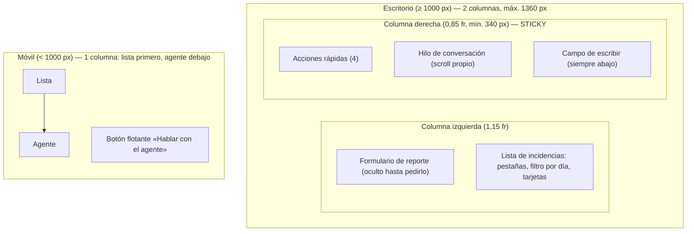
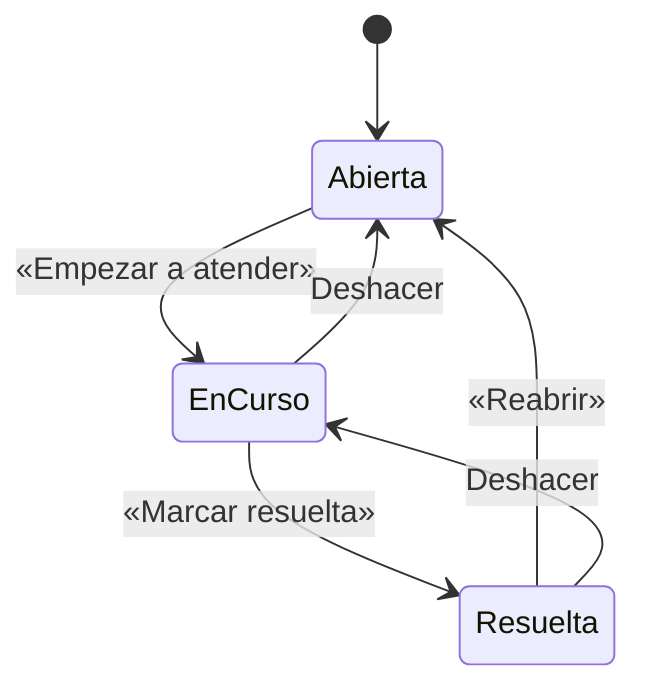
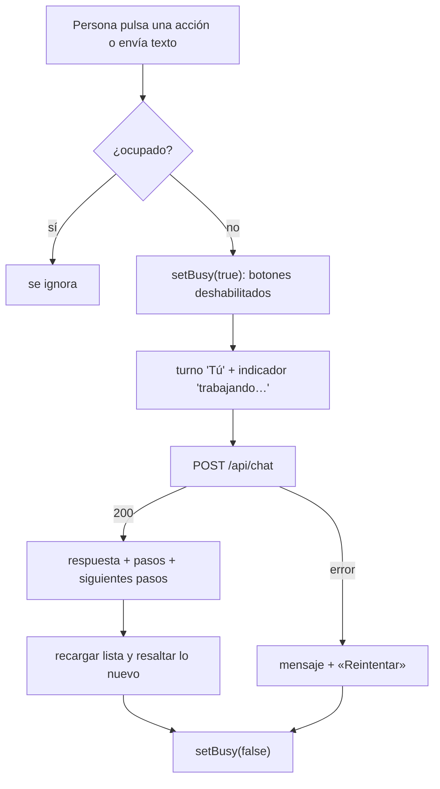

# 06 · Frontend y experiencia de uso

La interfaz es **un único archivo** (`src/index.html`, 410 líneas, ≈ 31 KB): HTML + CSS + JavaScript sin frameworks ni paso de
*build*, embebido en la Lambda y servido por `GET /`. Fuentes `[ref]` en [11](11-glosario-referencias.md); ⚠️ = no verificado.

## 1. Fundamento teórico

### 1.1 Reducir la carga cognitiva

El objetivo de producto fue «**evitar carga cognitiva y ofrecer botones de camino feliz directos al agente**». Los principios que
lo sustentan y su aplicación:

| Principio | Enunciado (fuente) | Dónde se aplica |
|-----------|--------------------|-----------------|
| **Ley de Hick** | «El tiempo que se tarda en decidir aumenta con el número y la complejidad de las opciones» [U2]. Pautas: minimizar opciones críticas, dividir tareas complejas, **destacar la opción recomendada** | 4 acciones de inicio (la principal, destacada); reporte en **2 pasos**; solo «Pendientes» por defecto; **un** botón principal por tarjeta |
| **Ley de Fitts** | «El tiempo para alcanzar un objetivo depende de la distancia y del tamaño del objetivo» [U3]: objetivos grandes, con espacio y en zonas alcanzables | Botones de ≥ 40 px; botón flotante abajo a la derecha en móvil (zona del pulgar) |
| **Visibilidad del estado del sistema** | «Mantener informado al usuario… con retroalimentación adecuada en un tiempo razonable» [U1] | Indicador «El agente está trabajando…», pasos ejecutados («✓ Registró la incidencia»), avisos de resultado |
| **Control y libertad del usuario** | Una «salida de emergencia» para acciones por error [U1] | **Deshacer** tras cada cambio de estado; botón *Cancelar* en el reporte |
| **Prevención de errores** | «Los mejores diseños previenen los problemas» [U1] | Aviso de duplicados al escribir; plantillas de problemas; estado deshabilitado mientras el agente trabaja |
| **Reconocimiento antes que recuerdo** | «Minimizar la carga de memoria: hacer visibles elementos, acciones y opciones» [U1] | Botones con las acciones posibles; fecha de registro visible; «Sugerida // atender primero» |
| **Diseño estético y minimalista** | «Sin información irrelevante o poco necesaria» [U1] | Descripciones plegadas; resueltas ocultas por defecto; acciones compactas al conversar |
| **Ayudar a reconocer y recuperarse de errores** | Lenguaje claro, sin códigos, sugerir solución [U1] | Mensajes en español de negocio; «Reintentar»; el servidor no expone trazas |
| **Divulgación progresiva** | «Aplaza las funciones avanzadas o poco usadas a una pantalla secundaria, haciendo las aplicaciones más fáciles de aprender y menos propensas a errores» [U6]; mejora aprendizaje, eficiencia y tasa de errores | «Ver descripción», «Añadir detalle (opcional)» |

### 1.2 Accesibilidad (WCAG 2.2)

Criterios del W3C que se han aplicado y comprobado [U4, U5]: **1.4.3 Contraste (mínimo)** AA (≥ 4,5:1 en texto normal),
**2.4.7 Foco visible** AA, **2.5.8 Tamaño del objetivo (mínimo)** AA (≥ 24 × 24 px CSS salvo excepciones),
**1.4.10 Reflow** AA (sin scroll en dos dimensiones a 320 px), **4.1.3 Mensajes de estado** AA, **2.1.1 Teclado** A,
**2.3.3 Animación por interacción** AAA (se respeta `prefers-reduced-motion`). Detalle y mediciones en §8.

## 2. Sistema de diseño «Humanismo Editorial»

Sistema propio del proyecto (origen: instrucciones de diseño de la persona usuaria). Reglas:

- **Papel sin blanquear, tinta, terracota como *campo*** (bloque de color), tipografía editorial, **sin sombras**, tarjetas de
  **esquinas rectas** (`border-radius: 0`) y controles con `2px`, retícula milimétrica de fondo, rótulos en mayúsculas con `//`.
  *(Desviación consciente: los «chips» y el botón flotante son píldoras de `999px`, introducidos en el rediseño de UX;
  las pruebas fijan `0px` en tarjetas y `2px` en `#go`, no en los chips.)*
- **Tipografías** (Google Fonts, con *fallback* local): **EB Garamond** (titulares, serif), **Hanken Grotesk** (interfaz),
  **JetBrains Mono** (pasos del agente y listas). ⚠️ Dependencia externa: sin red cae al *fallback*; las pruebas bloquean Google
  Fonts a propósito.

### 2.1 Tokens

| Pigmento | Valor | Uso |
|----------|-------|-----|
| Terracotta base | `#cc5a3f` | Campo de la cabecera |
| Terracotta profundo | `#b54832` | Acento (botones, etiqueta crítica) |
| Hueso (papel) | `#f5f2eb` | Fondo (tema Papel) |
| Pergamino | `#faf6f0` | Tarjetas |
| Cipré | `#244038` | Texto atenuado, reglas |
| Ámbar | `#e5ac44` | Severidad alta |
| Carbón | `#191919` | Tinta |
| Bruma marina | `#bdd2cb` | Severidad media |
| Musgo | `#7d8d78` | Severidad baja |

Espaciado: `4 · 8 · 16 · 32 · 64` px; retícula de fondo `19` px. Tokens **semánticos** (`--surface`, `--ink`, `--accent`,
`--rule`, `--focus`, `--status-*`…) cambian con el tema; el resto del CSS solo usa los semánticos.

### 2.2 Temas

| Tema | Cómo se activa | Particularidades |
|------|----------------|------------------|
| **Auto** (por defecto) | `data-theme="auto"` | Sigue `prefers-color-scheme: dark` y `prefers-contrast: more` |
| **Papel** | Botón | Claro |
| **Tinta** | Botón | Oscuro (`#171b19`), acento `#e27a5f` |
| **Alto contraste** | Botón | Reglas de `#191919`, acento `#8a3320`, cabecera `#b54832` |

La elección se guarda en `localStorage` (`theme`).

## 3. Distribución

- **Cabecera de una franja** (marca · usuario · «Salir» · tema como control segmentado).
- **Panel del agente fijo** (`position: sticky`): su altura es `100vh − 60px − 32px` para que **el campo de escribir nunca quede
  fuera de la pantalla** (defecto real detectado por una prueba: antes medía `100vh` y el campo quedaba oculto al inicio).
- **Puntos de corte:** 1000 px (una columna, panel no fijo, hilo máx. 55 vh) y 560 px (acciones en una columna, lema oculto).
- **Botón flotante** (solo ≤ 1000 px): aparece cuando el agente **no está a la vista** (`IntersectionObserver`), baja hasta el
  panel y enfoca el campo; sube lo justo cuando hay un aviso (`--toast-h` medido en JS) para no taparlo. Se llama «Hablar con el
  agente» para no confundirse con «Preguntar al agente» de cada tarjeta.

## 4. Componentes

| Componente | Comportamiento |
|------------|----------------|
| **Acciones rápidas** (*tiles*) | «Atender la más urgente» (principal), «¿Qué atiendo primero?», «Resumen del día» y «Reportar un problema». Las tres primeras envían una instrucción fija al agente; la cuarta abre el formulario. Al conversar se compactan (sin descripción) |
| **Hilo** | Turnos «Tú» (bloque oscuro a la derecha) y «Agente» (barra terracota + pasos). Autodesplazamiento al final; `aria-live="polite"` |
| **Siguientes pasos** | Tras cada respuesta: «Atender la siguiente», «Resumen del día», «Nueva conversación» (siempre **un** bloque, al final) |
| **Reporte guiado** | 1) plantillas («Sistema caído», «Va muy lento», «No puedo entrar», «Da error») + texto libre; 2) impacto opcional (Solo a mí / A mi equipo / A todos los clientes) → se antepone «Impacto: …» a la descripción; detalle plegado |
| **Aviso de parecidas** | Al escribir el título muestra incidencias similares con estado y antigüedad y un botón «Verla»; **no bloquea** |
| **Tarjeta** | Severidad · categoría · estado, título, **«Registrada el 3 oct 2026, 03:15 · hace 6 min»**, resumen, pasos (monoespaciado), «Ver descripción», **botón principal según estado** + «Preguntar al agente» (respuesta **dentro** de la tarjeta) |
| **Filtros** | Pestañas Pendientes/Resueltas/Todas con contador; campo «Registradas el» (día local); «Todas las fechas» |
| **Aviso (*toast*)** | `role="status"`, 7 s, con **Deshacer** en cambios de estado |

## 5. Estado en el cliente

| Clave `localStorage` | Contenido | Nota |
|----------------------|-----------|------|
| `theme` | `auto`/`light`/`dark`/`contrast` | Persistente |
| `sid` | `session_id` del agente | Mantiene la continuidad de la conversación |
| `thread` | Últimos **20** turnos `{q, reply, actions}` | Se restaura al recargar |
| `who` | Correo de la última persona que usó el navegador | Si cambia, se **borran** `sid` y `thread` (no mezclar personas) |
| `v` | Versión del esquema (`3`) | Si no coincide, se descartan `sid` y `thread` |

**¿Para qué `v`?** El historial guardado y la memoria de sesión del agente condicionan su comportamiento; tras cambiar las
herramientas, un hilo antiguo hacía que el agente siguiera pidiendo ids. Subir la versión descarta conversaciones obsoletas.
Todo acceso a `localStorage` va en `try/catch` y la web funciona sin él.

Variables en memoria: `items`, `filter`, `day`, `busy`, `thread` y `inline` (nodos de respuesta por tarjeta, para que el
re-render no los pierda).

## 6. Algoritmos del cliente

- **Prioridad:** `critica < alta < media < baja < sin clasificar`; a igualdad, la más reciente primero. La primera de
  «Pendientes» (sin filtro de día) se marca «Sugerida».
- **Antigüedad (`ago`)**: «hace un momento» (< 90 s), «hace N min», «hace N h», «ayer», «hace N días».
- **Filtro por día:** compara `toLocaleDateString('en-CA')` (AAAA-MM-DD **en hora local**) con el valor del campo.
- **Parecidas:** normaliza (minúsculas, sin diacríticos con `normalize('NFD')`), separa en palabras de > 2 letras sin *stopwords*
  y exige **≥ 2 palabras en común y ≥ 60 %** de solape sobre la frase más corta; muestra hasta 2. Es heurístico: no detecta
  sinónimos (⚠️).

## 7. Seguridad del frontend

- **Nunca `innerHTML`** con datos: todo con `createElement` + `textContent` (prueba e2e contra ``).
- Todas las llamadas son **del mismo origen** (`fetch` relativo); ante `401` redirige a `/` (→ login).
- «Salir» es un **POST** (no un enlace).
- Sin secretos, sin tokens en el navegador (la sesión es una cookie `HttpOnly`).

## 8. Accesibilidad: inventario y mediciones

**Presente:** `lang="es"`; etiquetas `<label for>` en campos; `aria-label` descriptivo en botones de tarjeta («Marcar resuelta:
<título>»); `role="status"`/`aria-live="polite"` en hilo, lista y avisos; `role="group"`/`radiogroup` con nombre; navegación por
teclado (todo son `button`/`input`/`details`); `:focus-visible` con contorno de 2 px; `prefers-reduced-motion` desactiva la
animación del indicador; la gravedad **no depende solo del color** (lleva texto).

**Contraste medido** (cálculo WCAG 2.x; umbral AA = 4,5:1 texto normal, 3:1 texto grande) — *mediciones propias*:

| Combinación | Ratio | Resultado |
|-------------|------:|-----------|
| Tinta sobre papel (Papel) | 15,73 | ✅ |
| Texto atenuado `#244038` sobre pergamino | 10,46 | ✅ |
| Acento `#b54832` sobre pergamino («Sugerida») | 4,95 | ✅ |
| Botón primario (hueso sobre `#b54832`) | 4,77 | ✅ |
| Etiqueta crítica / alta / media / baja | 4,77 / 8,64 / 11,09 / 4,98 | ✅ |
| **Cabecera: negro sobre `#cc5a3f`** (texto pequeño) | **5,10** | ✅ (tras la corrección) |
| Cabecera, alto contraste: hueso sobre `#b54832` | 4,77 | ✅ |
| Título 32 px hueso sobre `#cc5a3f` | 3,68 | ✅ solo por ser texto **grande** (≥ 3:1) |
| Tinta: texto, atenuado, botón, acento | 15,56 · 9,59 · 6,01 · 5,20 | ✅ |

> **Defecto encontrado y corregido.** El texto pequeño de la cabecera (lema, usuario, «Tema») era carbón o hueso sobre terracota:
> **4,27:1 y 3,68:1**, por debajo de 4,5:1 (WCAG 1.4.3). Ahora es negro (5,10:1), y hueso en el tema de alto contraste donde el
> fondo es más oscuro. Lo fija una prueba que **mide el contraste real en el navegador** en los tres temas.

**Tamaño de objetivos (2.5.8, mínimo 24 × 24 px [U5]):** botones ≥ 40 px de alto; chips 36 px; botones de la cabecera 32 px; botón
flotante 48 px. ✅

**Reflow (1.4.10):** se comprueba que **no hay scroll horizontal a 375 px** (⚠️ no a 320 px, que es el umbral del criterio).

**Carencias conocidas (⚠️):** no hay *skip link* («saltar al contenido»); no se ha probado con lector de pantalla real
(NVDA/VoiceOver); el desplazamiento automático del hilo no anuncia el contenido nuevo más allá del `aria-live`; el
indicador de «trabajando» es un texto, sin barra de progreso con valor.

## 9. Rendimiento

Un único documento sin *build* (31 KB) + 3 familias de Google Fonts. La lista se obtiene con **una** petición y el resto del
filtrado/ordenado es local. La latencia dominante es la del agente: ≈ 15 s al clasificar una incidencia nueva y ≈ 30 s en
«Atender la más urgente» con el modelo actual (varias vueltas de herramientas).

## 10. Pruebas relevantes

31 pruebas de navegador (Chromium, Playwright) cubren: estado vacío, reporte guiado con deshacer, botón principal por estado,
«Atender la más urgente», preguntar desde una tarjeta, hilo persistente, escape de HTML, tres temas, reglas de diseño,
móvil sin scroll horizontal, fecha visible, filtro por día, aviso de duplicados, descarte de conversaciones antiguas, dos
columnas y cabecera compacta, panel fijo y sin desbordar, orden en móvil, botón flotante (aparece, enfoca, se retira, sube con
el aviso), «Salir» por POST y **contraste medido**. Ver [07](07-pruebas-calidad.md).

## 11. Límites y mejoras posibles

Español fijo (sin i18n); sin modo sin conexión; sin pruebas de regresión visual automáticas (las capturas se revisaron a
mano); dependencia de Google Fonts; CSP completa pendiente (obliga a retirar estilos y scripts en línea); la similitud de
duplicados es léxica.
