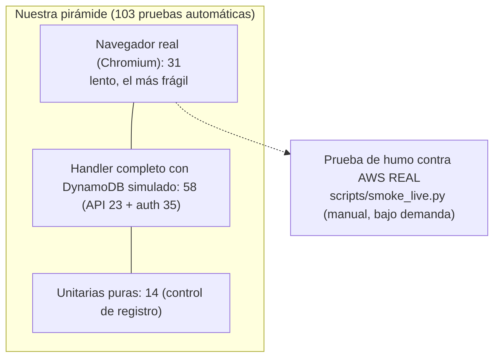

# 07 · Pruebas y calidad

Fuentes `[ref]` en [11](11-glosario-referencias.md); ⚠️ = no verificado.

## 1. Teoría aplicada

### 1.1 La pirámide de pruebas

Fowler resume la pirámide: «escribe **muchas pruebas pequeñas y rápidas** (unitarias); **algunas más gruesas** y **muy pocas de
alto nivel**» [T1]. Las de interfaz son «notoriamente inestables y fallan por motivos imprevisibles», y el consejo es «**empujar
las pruebas lo más abajo posible** de la pirámide» [T1].



Honestidad sobre las proporciones: las pruebas de navegador son **≈ 30 %** del total, más de lo que aconseja la pirámide; se
aceptó porque la interfaz **es** el producto y concentra la mayor parte de los defectos reales encontrados (panel que se
salía de la pantalla, botón flotante que tapaba el aviso, contraste, orden en móvil). Casi toda la lógica de negocio está en
las pruebas de API, que son rápidas.

### 1.2 Dobles de prueba

Terminología de Fowler [T2]: **fake** («implementación que funciona pero con un atajo que no sirve para producción»),
**stub** («respuestas enlatadas»), **spy** («stub que además registra cómo lo llamaron»). Aquí:

| Doble | Tipo | Sustituye a | Dónde |
|-------|------|-------------|-------|
| `moto` (`mock_aws`) | **Fake** (DynamoDB en memoria con la misma API) | DynamoDB real | `scripts/local.py::build_app` |
| `FakeRuntime` | **Fake** del harness: pide herramientas y luego responde, con el **mismo protocolo** | `bedrock-agentcore` | `scripts/local.py` |
| `FakeStream`, `FakeToolStream` | **Stubs** de flujos de eventos | Respuesta de `InvokeHarness` | `scripts/local.py` |
| Clases `Spy`, `Boom`, `Junk`, `Bad`, `Foreign`, `Loop` | **Spies/stubs** con comportamiento a medida | El agente en casos concretos | `tests/test_app.py` |
| `monkeypatch` de `auth._exchange`, `_secret_cache`, `_client_id_cache`… | **Stubs** | Cognito (red) y Secrets Manager | `tests/test_auth.py` |

Ventaja del `FakeRuntime`: reproduce el **bucle real** (llamada a herramienta → resultado → respuesta final), así que las
pruebas ejercitan `invoke`/`ask`/`run_tool` completos y no solo funciones sueltas.

## 2. Herramientas y versiones

| Herramienta | Versión (lock) | Uso |
|-------------|----------------|-----|
| `pytest` | 9.1.1 | Ejecutor |
| `moto[dynamodb]` | 5.2.3 | DynamoDB simulado |
| `playwright` | 1.63.0 | Navegador (Chromium) |
| `ruff` | 0.16.10 | Lint |
| `uv` | — | Entorno reproducible desde `uv.lock` |

Comandos: `uv sync`, `uv run pytest`, `uv run ruff check .`, `uv run playwright install chromium` (una vez).
El **CI** ejecuta lint, el `pytest` completo (incluidos los e2e) y el empaquetado, en **Python 3.12**; en local se ha
probado también con **3.14**.

## 3. Suites (103 pruebas)

| Archivo | Nº | Qué cubre |
|---------|---:|-----------|
| `tests/test_app.py` | 23 | Contrato de la API, validación, **bucle del agente** (herramientas, errores devueltos al agente, límite de vueltas, herramientas ajenas ignoradas), `allowedTools` en formato `@nombre`, JSON Schema directo, `crear_incidencia`, snapshot y `actorId`, **contrato del `session_id` (33–100)**, fecha de registro, **paginación del Scan con 700 elementos** y lecturas consistentes |
| `tests/test_auth.py` | 35 | Flujo OIDC completo con Cognito simulado (**PKCE verificado**), rechazo de `aud`/`iss`/`token_use`/`nonce`/`exp` falsos, `state` incorrecto o hostil (Unicode, emojis, 5 000 caracteres, NUL, HTML), cookies manipuladas/caducadas/de otra clave, **Fetch Metadata y Origin**, **logout por POST**, **cabeceras de seguridad en todas las respuestas**, falla cerrada sin configuración |
| `tests/test_presignup.py` | 14 | Lista de correos/dominios, mayúsculas, dominios parecidos (`@evilcorp.com`), `a@evil.com@corp.com`, lista vacía, `AdminCreateUser`, proveedores externos |
| `tests/e2e/test_web.py` | 31 | Recorridos de usuario en Chromium (ver [06 §10](06-frontend-ux.md#10-pruebas-relevantes)) |

Aislamiento: cada prueba de API crea su propia app + tabla simulada; las e2e **vacían la tabla** antes de cada prueba (antes
dependían del orden). `conftest.py` fija `AUTH_DISABLED=1` **antes** de que nadie importe `auth` (si no, el resultado dependía del
orden de importación).

### 3.1 Qué defectos encontraron las pruebas (valor real)

| Defecto | Cómo salió |
|---------|------------|
| Panel del agente más alto que la pantalla (campo de escribir oculto) | `test_conversation_scrolls_inside_the_panel…` |
| Botón flotante pisando el aviso en móvil | `test_floating_button_moves_up_when_a_notice_is_shown` |
| Contraste insuficiente del texto pequeño de la cabecera (y que en «alto contraste» el negro **tampoco** servía) | `test_small_header_text_meets_wcag_aa_contrast[…]` |
| Orden de ejecución de las pruebas e2e / importación de `auth` | Fallos intermitentes → aislamiento |
| El agente simulado no entendía «caído» | Pruebas de «registrar» |
| `session_id` de 101–128 caracteres aceptado | Lectura de la documentación → `test_session_id_follows_the_invokeharness_contract` |
| `state` no ASCII → 500 | Lectura de la documentación de `hmac.compare_digest` → prueba de entradas hostiles |
| `Scan` truncado a una página | Documentación de DynamoDB → prueba de 700 elementos |

## 4. Lo que las pruebas automáticas **no** cubren

- **Servicios reales:** ninguna prueba automática llama a Bedrock, AgentCore, Cognito, Secrets Manager ni DynamoDB reales.
  Los dobles reproducen el **contrato** que conocemos; si AWS lo cambia, las pruebas seguirán en verde (⚠️).
- **IAM:** las políticas se validaron con `validate-template` y el **simulador de IAM** a mano; no hay prueba automática de que
  el rol permita/deniegue lo esperado.
- **CloudFormation:** solo `validate-template`; el despliegue real se probó a mano y desde GitHub Actions una vez.
- **Calidad del modelo:** el agente simulado es determinista; el real no. El comportamiento de Nemotron (errores, razonamiento,
  ruido) **no** se prueba automáticamente.
- **Rendimiento y carga**, **accesibilidad automatizada** (no se usa `axe`; el contraste sí se mide), **regresión visual**,
  **mutación**, y **cobertura de código** (no se mide: ⚠️ no hay un porcentaje fiable que citar).
- **Navegadores:** solo Chromium; no Firefox ni Safari.

## 5. Prueba de humo contra AWS real: `scripts/smoke_live.py`

Cubre el hueco anterior de forma **manual y bajo demanda** (no corre en el CI: necesita credenciales y toca la cuenta):

```
uv run --with "botocore[crt]" scripts/smoke_live.py [--stack incidencias] [--region us-east-2] [--ask "..."]
```

1. Lee `WebUrl` y `UserPoolId` de la pila.
2. **Sin sesión:** `/` → 302 a `/auth/login`; `/api/*` → 401; `GET /auth/logout` → 405; `POST /auth/logout` cross-site → 403;
   cabeceras `nosniff`, `X-Frame-Options`, CSP, HSTS.
3. **Crea un usuario temporal** (sin enviar correo: `--message-action SUPPRESS` + contraseña permanente aleatoria que no se
   muestra).
4. **Con un navegador:** login real en Cognito, `/api/me`, flags de la cookie, que el JS no la lea, `GET /api/incidents`,
   **una pregunta real al agente** (solo consulta), «Salir» y comprobación de 401.
5. **Borra el usuario** (en `finally`, aunque algo falle). Sale con código 1 si algo falla.

Última ejecución (3 oct 2026): **19 comprobaciones, todas correctas** (el agente respondió con `listar_incidencias`). En esa
misma respuesta aparecieron fragmentos corruptos («חדא negotiate»): ruido del modelo pequeño que ninguna prueba detecta (⚠️).

> Pasos que **no** hace (a propósito): crear/modificar incidencias reales (el agente puede cambiar estados; se usó solo una
> consulta de lectura) y probar el flujo de registro propio con correo real (necesita leer un correo).

## 6. Lint y estilo

`ruff check .` (también en CI). `pyproject.toml` solo fija `line-length = 100` y `src`; **no define `select`**, así que se
aplica el **conjunto de reglas por defecto de ruff 0.16.10**, que es mucho más amplio que el histórico (E/F). Verificado con
`ruff check --show-settings`: familias `F`, `B`, `UP`, `RUF`, `SIM`, `PL*`, `FURB`, `C`, `PYI`, `YTT`… (la ruta de
configuración que usa es la `pyproject.toml` del repositorio). Consecuencia práctica: **subir la versión de ruff puede
añadir avisos nuevos** (`uv.lock` la fija). Nota: el CI falló una vez por avisos en código nuevo, no por una subida de versión. Comentarios y mensajes de usuario en español;
identificadores técnicos en inglés/español según el dominio (`crear_incidencia` es lo que ve el modelo).

## 7. Cómo añadir una prueba

- **Lógica de la API/agente** → `tests/test_app.py` con el fixture `app` (Lambda real + moto + `FakeRuntime`); para un
  comportamiento del agente a medida, una clase con `invoke_harness(self, harnessArn, runtimeSessionId, messages, tools=None,
  allowedTools=None, **kw)` que devuelva `{"stream": local.FakeStream(...)}` o `FakeToolStream(...)`.
- **Autenticación** → `tests/test_auth.py` con el fixture `secured` (activa `auth`, fija Cognito y evita la red).
- **Interfaz** → `tests/e2e/test_web.py` con el fixture `page` (servidor local + tabla vacía); `mk(page, titulo, status=None)`
  crea datos por API. Recuerda que `inner_text()` devuelve los rótulos **en mayúsculas** (CSS `text-transform`): compara en
  minúsculas.
