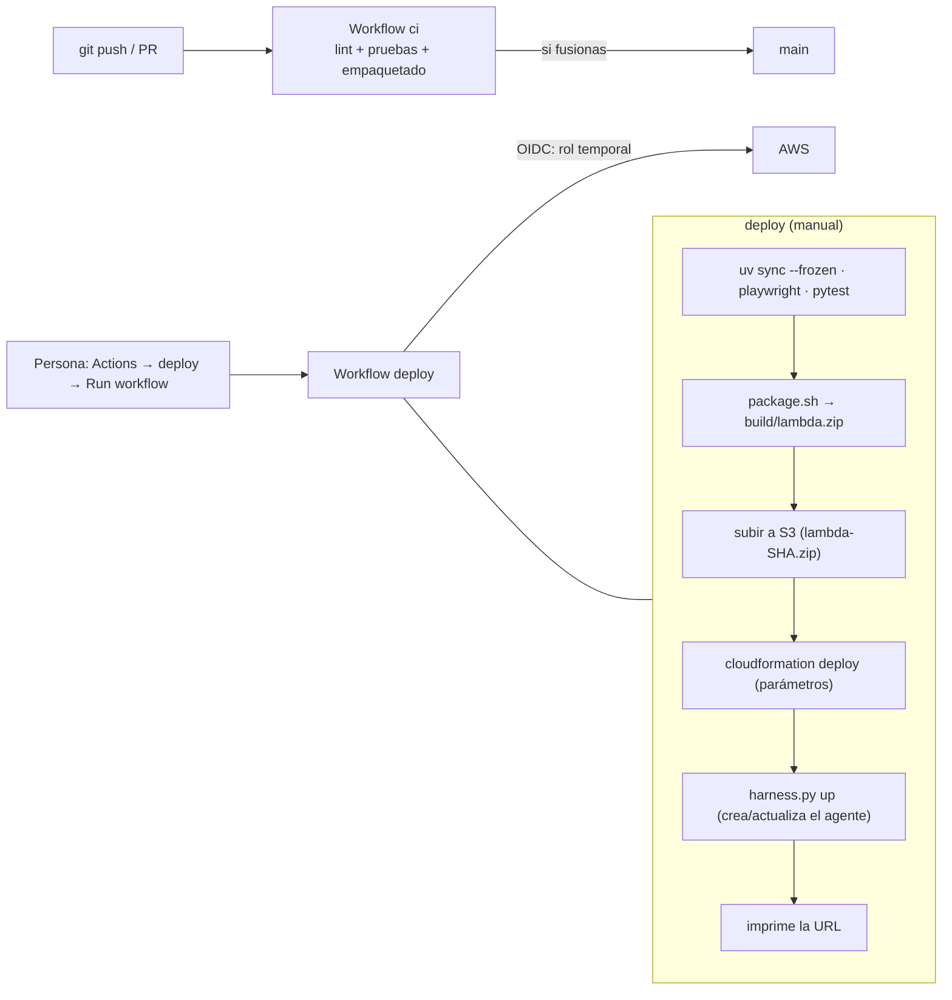

# 08 · CI/CD y despliegue

Fuentes `[ref]` en [11](11-glosario-referencias.md); ⚠️ = no verificado.

## 1. Visión del pipeline



| Workflow | Disparo | Qué hace |
|----------|---------|----------|
| `ci.yml` | `pull_request` y `push` a **cualquier rama salvo `main`** | `uv sync --frozen` → `ruff check .` → instala Chromium → `pytest -q` (unitarias + e2e) → `package.sh`. **Sin credenciales de AWS** |
| `deploy.yml` | **Solo manual** (`workflow_dispatch`) | Pruebas + empaquetado + subida a S3 + `cloudformation deploy` + `harness.py up`. Con credenciales por OIDC |
| `destroy.yml` | Solo manual | `harness.py down` + `delete-stack` y espera |

> **Por qué el despliegue es manual.** Hasta fusionar el PR, el `deploy.yml` antiguo se disparaba al hacer push a `main` y habría
> tocado producción sin decisión explícita. Ahora solo se ejecuta cuando alguien lo lanza. Para volver a automatizarlo, añadir
> `push: {branches: [main]}` (comentado en el propio archivo) **cuando** `AWS_ROLE_ARN`, `AWS_REGION` y `ALLOWED_SIGNUPS`
> estén configurados (lo están).

**`workflow_dispatch` y la rama por defecto.** «Este evento solo dispara una ejecución si el archivo del workflow existe en la
**rama por defecto**» [W1]; con `gh workflow run deploy.yml --ref <rama>` se ejecuta contra otra rama. Hoy la rama por defecto es
`ccr-1c850516-ik6b8p` (donde existe `deploy.yml`); `main` se creó desde el primer commit y recibirá el workflow al fusionar el PR.

## 2. `uv` y el *lock*

`uv` gestiona entorno y dependencias desde `pyproject.toml` + `uv.lock`.

- `uv sync --frozen` instala **exactamente** lo del lock y falla si no encaja con `pyproject.toml`/Python.
- `uv run --frozen …` ejecuta sin tocar el lock. **Importante:** sin `--frozen`, `uv run` puede **reescribir `uv.lock`** (ocurrió
  al principio y ensució el repositorio).
- `uv export --no-dev --no-hashes --no-emit-project` genera `requirements.txt` solo con dependencias de **producción** (así
  `boto3-stubs`, `moto`, `playwright`, `pytest` y `ruff` **no** viajan en el zip).

### 2.1 La lección de `requires-python` (el error que rompió el CI)

> «Cuando `requires-python` no está definido, **se usa el intérprete como valor de reserva para la versión mínima de Python al
> bloquear**» — es decir, `uv lock`/`uv run` dependen del Python actual si no se declara explícitamente [P2].

Qué pasó: `pyproject.toml` no declaraba `requires-python`; al regenerar el lock con Python **3.14.2** (el de la máquina local), el lock
quedó con `requires-python = ">=3.14"` y el CI (runner con **3.12.3**) falló en `uv sync --frozen` con *«The current Python version
(3.12.3) is not compatible with the locked Python requirement: `>=3.14`»*. **Solución:** declarar `requires-python = ">=3.11"`
**explícitamente**, de modo que el lock no dependa de quién lo regenere. Verificado con Python 3.12 (como el CI) y 3.14.

Se aprovechó para mover `boto3-stubs` (autocompletado de tipos) al **grupo `dev`**: no debe ir en el zip de Lambda.

## 3. Empaquetado (`scripts/package.sh`)

1. `uv export` (producción, sin hashes) → `build/requirements.txt`.
2. `uv pip install --target build/pkg -r …` instala **boto3 y sus dependencias** dentro del paquete (vendorizado).
3. Copia `app.py`, `auth.py`, `presignup.py`, `index.html` a `build/pkg/`.
4. Crea `build/lambda.zip` (≈ **16,7 MB**) y deduce el identificador del runtime (`python3.12`) en `build/runtime.txt`.

Por qué se vendoriza `boto3`: `InvokeHarness`/`CreateHarness` solo existen en versiones recientes y el SDK incluido en Lambda puede
ser más antiguo; además AWS recomienda empaquetar el SDK para controlar versiones [L3]. Límites de Lambda [L5]: paquete `.zip` de **50 MB comprimido** por API/SDK (más grande, por S3) y **250 MB descomprimido**
(incluidas capas). Nuestro paquete mide **15,9 MiB comprimido y ≈ 22,9 MB descomprimido (2 657 archivos)**: margen amplio.

> **Windows.** En Git Bash de Windows no hay `python3`, así que el despliegue manual usó PowerShell
> (`Compress-Archive -Path build\pkg\* -DestinationPath build\lambda.zip`) con los mismos pasos. El CI (Linux) usa `package.sh`.

## 4. Autenticación del pipeline con AWS

Sin claves de larga vida: **federación OIDC**. Detalle, política de confianza, el cambio de formato del identificador de
sujeto y su historia en [04 §7](04-autenticacion-seguridad.md#7-federación-oidc-de-github-con-aws). La documentación de GitHub
exige en el workflow `permissions: id-token: write` (solo permite *pedir* el token, no modifica recursos) y `contents: read`,
y recomienda limitar la condición `…:sub` en la confianza [W2].

**Configuración necesaria** (ya hecha):

| Elemento | Tipo | Valor |
|----------|------|-------|
| `AWS_ROLE_ARN` | Secreto de Actions | `arn:aws:iam::<cuenta>:role/github-agent-aws-deploy` |
| `AWS_REGION` | Variable | `us-east-2` |
| `ALLOWED_SIGNUPS` | Variable | Correos/dominios que pueden registrarse (**si falta, el registro propio queda cerrado**) |
| `MODEL_ID` | Variable (opcional) | Si se omite, `harness.py` usa `nvidia.nemotron-nano-9b-v2` |

Se crean con `bash scripts/github-oidc/setup.sh` (proveedor OIDC + rol + política + secreto) y `gh variable set`. El script es
**idempotente** y debe lanzarlo una persona con permisos de IAM.

**Acciones fijadas por etiqueta, no por SHA** (`actions/checkout@v7.0.1`, `astral-sh/setup-uv@v10.2.0`,
`aws-actions/configure-aws-credentials@v6.3.0`). ⚠️ Fijar por *commit SHA* es más resistente a ataques a la cadena de suministro.

## 5. Despliegue

### 5.1 Desde GitHub

Actions → **deploy** → *Run workflow* (rama), o `gh workflow run deploy.yml --ref <rama>`. Pasos de `deploy.yml`:

| Paso | Detalle |
|------|---------|
| Credenciales | `configure-aws-credentials` con `AWS_ROLE_ARN` y `AWS_REGION` |
| Puerta de calidad | `uv sync --frozen`, Chromium, `pytest -q` (si falla, **no** se despliega) |
| Empaquetado | `package.sh` |
| Subida | Crea el bucket si no existe; sube `lambda-${GITHUB_SHA}.zip` |
| Pila | `cloudformation deploy` con `LambdaRuntime=$(cat build/runtime.txt)`, `HarnessName`, `CodeBucket`, `CodeKey`, `AllowedSignups=${{ vars.ALLOWED_SIGNUPS }}` |
| Agente | Lee `HarnessRoleArn` de las salidas y ejecuta `harness.py up` (crea/actualiza y espera a `READY`) |
| URL | Imprime `WebUrl` |

**Validado:** una ejecución manual el 3 oct 2026 terminó **en verde en todos los pasos**; tras ella, la pila quedó en
`UPDATE_COMPLETE` con `LambdaRuntime=python3.12` y `AllowedSignups` conservado, el harness en `READY` (versión 5) y la web
protegida. ⚠️ El workflow `destroy.yml` **no** se ha ejecutado.

### 5.2 Manual con la CLI (lo que se usó durante el desarrollo)

```bash
B=agent-aws-code-<cuenta>-us-east-2
aws s3 cp build/lambda.zip s3://$B/lambda-v<N>.zip
aws cloudformation deploy --stack-name incidencias --template-file template.yaml --capabilities CAPABILITY_IAM \
  --no-fail-on-empty-changeset --parameter-overrides LambdaRuntime=python3.12 HarnessName=asistente_incidencias \
  CodeBucket=$B CodeKey=lambda-v<N>.zip AllowedSignups=<correo-o-dominio>
# si cambió el prompt o el modelo del agente:
HARNESS_NAME=asistente_incidencias HARNESS_ROLE_ARN=<arn> uv run --frozen --with "botocore[crt]" scripts/harness.py up
```

Trampas ya conocidas:

- **Pasa siempre `AllowedSignups`**: CloudFormation usa el valor por defecto (`""`) si no lo indicas, y **cierra el registro**.
- **`aws login` y boto3:** las credenciales de `aws login` requieren `botocore[crt]` (`uv run --with "botocore[crt]"`).
- **Git Bash** convierte rutas `/aws/...` en rutas de Windows: usar `MSYS_NO_PATHCONV=1` en comandos de CloudWatch Logs.
- `harness.py down` seguido de `up` inmediato falla (`ConflictException … while it is DELETING`): esperar a que desaparezca.

## 6. Reversión y recuperación

| Qué | Cómo |
|-----|------|
| **Pila (infraestructura)** | CloudFormation **revierte solo** si un despliegue falla (verificado con un rol mal definido). Para volver a una versión anterior de la plantilla, desplegar la versión previa |
| **Código de Lambda** | Redesplegar apuntando a un zip anterior del bucket (`CodeKey`); quedan todos los zips (sin ciclo de vida) |
| **Agente (prompt/modelo/herramientas)** | Cada `UpdateHarness` crea una versión inmutable; se puede volver apuntando un *endpoint* a una versión anterior [A7]. **Hoy la app usa `DEFAULT`** (sigue siempre a la última), así que revertir implica `harness.py up` con la configuración anterior (⚠️ o crear endpoints con nombre, ver [02 §10](02-agentcore-harness.md#10-versiones-y-endpoints-despliegue-y-reversión-del-agente)) |
| **Datos** | DynamoDB con **PITR** (restauración a un instante, genera una tabla nueva) |
| **Clave de sesión comprometida** | Rotar el secreto (cierra todas las sesiones) |
| **Todo** | `destroy.yml` o `aws cloudformation delete-stack` + `harness.py down` (el harness borra en cascada su memoria administrada por defecto [A5]). El bucket de código no está en la pila y hay que vaciarlo/borrarlo aparte |

## 7. Ramas, PR y qué falta

- Rama de trabajo `ccr-1c850516-ik6b8p` (por defecto en GitHub); `main` se creó desde el **primer commit** del repositorio para
  poder abrir el **PR #1** (`main` ← rama de trabajo). El CI de ambos (`push` y `pull_request`) está en verde.
- **Al fusionar:** (1) cambiar la rama por defecto a `main` si se desea; (2) **quitar la rama de trabajo de `trust.json`**
  y ejecutar `setup.sh` otra vez; (3) revisar que `deploy.yml` esté en `main`.
- ⚠️ Mientras tanto, `main` contiene el `deploy.yml` **antiguo** (con disparo por push): ningún push a `main` ocurre hasta la
  fusión, pero conviene no tocarla antes.

## 8. Ejecución local

`uv sync` · `uv run scripts/local.py` → `http://127.0.0.1:8000` con DynamoDB simulado y agente simulado, **sin AWS ni
autenticación**. `uv run pytest` para toda la suite.

## 9. Problemas de CI/CD ya vividos

| Síntoma | Causa | Solución |
|---------|-------|----------|
| `uv sync --frozen`: «Python 3.12.3 no es compatible con `>=3.14`» | `requires-python` sin declarar; el lock se regeneró con 3.14 | Declararlo (`>=3.11`) y relockear |
| `Not authorized to perform sts:AssumeRoleWithWebIdentity` | Confianza con el `sub` antiguo; el repo usa el **inmutable** | `trust.json` con `repo:<owner>@<id>/<repo>@<id>:ref:…` |
| `aws iam create-role … file://trust.json: No such file` | Comando lanzado desde otra carpeta | Script `setup.sh` con rutas relativas a su carpeta |
| `setup.sh`: «Unable to load paramfile file:///tmp/…» | `mktemp` de Git Bash crea `/tmp`, que el `aws` de Windows no ve | Carpeta temporal relativa (`.rendered`) |
| CI rojo por 7 avisos de `ruff` | Código nuevo sin pasar el lint | Corregidos; el lint se ejecuta en CI |
| `uv.lock` modificado sin querer | `uv run` sin `--frozen` | `--frozen` siempre |
| Comandos pegados desde la terminal fallaban | Caracteres de la interfaz (`│`) copiados | Scripts en el repo en lugar de comandos pegados |
| Cierre de sesión de Cognito saltado | Faltaba pasar por `/logout` de Cognito | `POST /auth/logout` devuelve la URL de Cognito |
