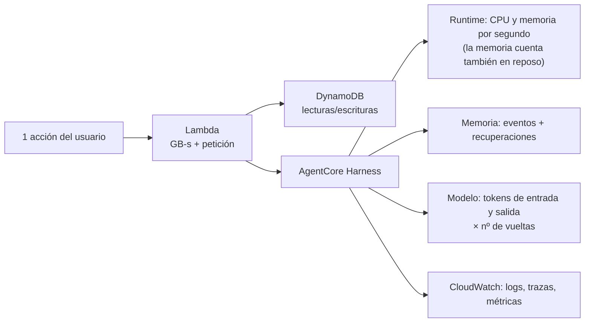
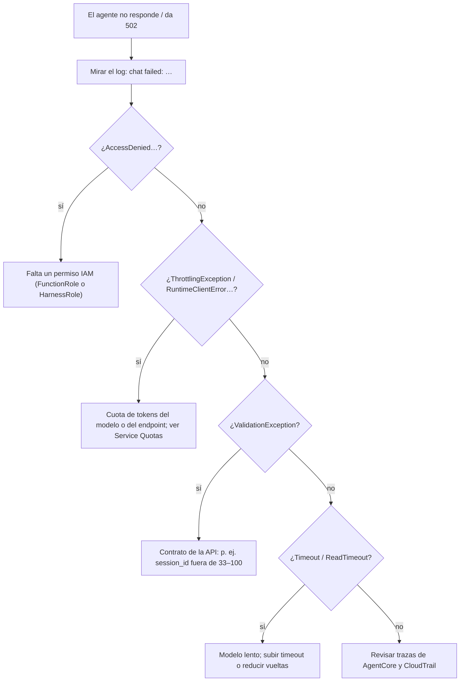

# 10 · Operación y costes

Fuentes `[ref]` en [11](11-glosario-referencias.md). Los **precios** son los publicados en las fuentes citadas en el momento de
redactar (**3 oct 2026**) y cambian. Todo cálculo de esta página es **ilustrativo** y declara sus supuestos; ⚠️ = dato no
verificado.

## 1. Resumen de costes

| Tipo | Concepto | Importe |
|------|----------|---------|
| **Fijo** | Secrets Manager: 1 secreto | **$0,40 / mes** (+ $0,05 por 10 000 llamadas, despreciable con caché) [SM1] |
| Por uso | Lambda, DynamoDB, Cognito, Bedrock (modelo), AgentCore (Runtime, Memoria), CloudWatch | Ver §2 |
| Sin cargo | **El harness en sí** (no hay tarifa propia) [A1, A6]; Function URL (⚠️ la página de precios no la menciona) | — |

**Medición real (3 oct 2026):** Cost Explorer mostraba solo Amazon S3 (≈ $0,000012 acumulados el 1–2 oct). Es **normal que no
aparezca aún el uso de hoy**: los datos de Cost Explorer tardan hasta ~24 h (⚠️ plazo habitual, no verificado en esta cuenta).
**No hay, por tanto, un coste medido del agente**; el cálculo de abajo es una estimación. Para medirlo: revisar Cost Explorer
agrupando por servicio y por *etiqueta* (los *tags* del harness se propagan a su Runtime y su memoria [A6]) dentro de 1–2 días.

## 2. Modelo de costes por interacción



| Servicio | Tarifa publicada | Fuente |
|----------|------------------|--------|
| **Lambda** | $0,20 / M peticiones; $0,0000166667 / GB-s (x86); gratis al mes: 1 M peticiones y 400 000 GB-s | [L4] |
| **DynamoDB** (bajo demanda, us-east-1) | $0,625 / M escrituras (1 KB); $0,125 / M lecturas (4 KB; consistente = 1 RRU, eventual = 0,5); almacenamiento $0,25/GB-mes (25 GB gratis); PITR $0,20/GB-mes | [D5] |
| **Cognito** (*Essentials*) | $0,015 / MAU, **10 000 MAU gratis** | [C3] |
| **Bedrock — modelo** («Nemotron Nano 2», us-east-2) | **$0,06 / M tokens de entrada; $0,23 / M de salida** (⚠️ la tabla no dice «9B» explícitamente) | [A13] |
| **AgentCore Runtime** | Por **segundo** de consumo real: microVM v1 **$0,0895/vCPU-h** y **$0,00945/GB-h**; v2 **$0,1276/vCPU-h** y **$0,0169/GB-h** (⚠️ no sabemos si nuestro harness usa v1 o v2). La CPU **no** se cobra durante la espera de E/S del modelo/herramientas; la memoria sí mientras la sesión vive | [A6, AP1] |
| **AgentCore Memory** | Corto plazo: hasta el **5 oct 2026** $0,25 / 1 000 eventos; **desde el 6 oct 2026**: $1,00/GB ingerido + $0,20/GB recuperado + $0,10/GB-mes. Largo plazo (integrado): $0,75 / 1 000 registros-mes y **$0,50 / 1 000 recuperaciones** | [AP1] |
| **Secrets Manager** | $0,40 / secreto-mes; $0,05 / 10 000 llamadas | [SM1] |
| **CloudWatch** | «Según la tarifa de CloudWatch» (ingestión, almacenamiento, consultas) | [AP1] |

### 2.1 Cálculo ilustrativo por 1 000 acciones

Supuestos **explícitos** (no medidos): una acción que usa herramientas hace **3 llamadas al modelo** de ≈ 8 000 tokens cada una
(**8 000 se tomó de la invocación mínima medida: 7 622 tokens totales** con «hola»), 90 % de entrada y 10 % de salida; Lambda 256 MB
durante 30 s; ≈ 10 lecturas consistentes de 4 KB; 4 eventos de memoria de ≈ 2 KB; 2 recuperaciones de memoria por llamada al modelo.

| Concepto | Cuenta | ≈ por 1 000 acciones |
|----------|--------|---------------------:|
| Modelo | 3 × (7 200 tok × $0,06/M + 800 tok × $0,23/M) = 3 × $0,000616 | **$1,85** |
| Lambda | 0,25 GB × 30 s = 7,5 GB-s × $0,0000166667 + petición | **$0,13** (cubierto por la capa gratuita) |
| DynamoDB | 10 000 RRU × $0,125/M + escrituras | **$0,002** |
| Memoria — recuperaciones | 6 recuperaciones × $0,0005 | **$3,00** ⚠️ si se cobra una por estrategia y por llamada |
| Memoria — eventos (hasta 5 oct) | 4 000 eventos × $0,25/1 000 | **$1,00** → desde el 6 oct, por GB: **≈ $0,008** (4 000 eventos × 2 KB = 8 MB × $1/GB) |
| Runtime — CPU | 30 s a 1 vCPU = 30 vCPU-s / 3 600 × $0,0895 | **$0,75** (peor caso, CPU 100 % constante) |
| Runtime — memoria | 2 GB × (30 s + 900 s de inactividad) / 3 600 × $0,00945 | **$4,88** (peor caso, **1 sesión por acción**) |
| **Total (orden de magnitud)** | | **≈ $2 (solo modelo) – $12 por 1 000 acciones**; $11,6 con todo lo anterior (≈ $10,6 desde el 6 oct) |

**Lectura (honesta):** el modelo, que es lo que uno suele mirar, es **la parte pequeña**. Pueden dominar la **memoria del harness**
(recuperaciones) y la **memoria del Runtime que se factura mientras la sesión sigue «caliente»**, porque `idleRuntimeSessionTimeout`
es de 900 s por defecto y «una espera más corta reduce cuánto tiempo sigue facturándose la memoria, a costa de más arranques en
frío» [A6]. **Escala:** a **≈ 30 acciones al día (≈ 900 al mes)**, el caso optimista (solo modelo) son **≈ $1,7 al mes** y el pesimista de la tabla
**≈ $10 al mes**, más los **$0,40 fijos** del secreto. Sin tráfico, el coste es prácticamente solo esos $0,40. Son importes
pequeños, pero **no despreciables** para un prototipo, y el valor real está entre ambos extremos: por eso conviene medirlo.

## 3. Palancas de coste

| Palanca | Efecto | Estado |
|---------|--------|--------|
| `allowedTools` restringido | ≈ **900 tokens menos por petición** [A2] | ✅ Aplicado |
| **Desactivar memoria** o quitar la estrategia `SEMANTIC` | Elimina coste de recuperaciones/almacenamiento y la contaminación | ⚠️ No aplicado ([02 §7](02-agentcore-harness.md#7-memoria)) |
| `idleRuntimeSessionTimeout` más corto (p. ej. 120–300 s) | Menos memoria facturada en reposo | ⚠️ No aplicado (por defecto 900 s) |
| `/no_think` en el *system prompt* | Menos tokens de salida y latencia [N1] | ⚠️ No probado |
| `MAX_STEPS`, `maxIterations` (10), `timeoutSeconds` (100), `maxTokens` | Tope duro de gasto por petición | ✅ Aplicados (`maxTokens` no) |
| `truncation` (sliding window 150) | Evita contextos enormes | ✅ Por defecto |
| Etiquetas (*tags*) en el harness | Atribuir coste en Cost Explorer | ⚠️ No definidas |
| Retención de logs | Evita acumulación indefinida | ⚠️ Los grupos **no** tienen retención |
| Ciclo de vida del bucket de código | Hoy 20 zips, ≈ 319 MiB | ⚠️ Sin regla |
| **Interruptor**: concurrencia reservada = 0 | Corta todo el tráfico de la URL (429) [L1] | Disponible (no activo) |
| AWS Budgets con alerta | Aviso temprano de gasto | ⚠️ No configurado |

## 4. Cuotas y límites que importan

| Límite | Valor | Fuente |
|--------|-------|--------|
| **Correo de Cognito por defecto** | **50 / día por cuenta** (reinicio 09:00 UTC) | [C4] |
| Lambda: timeout / carga útil síncrona / env | 900 s (usamos 240) / 6 MB / 4 KB | [L5] |
| Lambda: concurrencia por defecto | 1 000 (**reducida en cuentas nuevas**) | [L5] |
| Function URL: tasa máxima | 10 × concurrencia reservada | [L1] |
| AgentCore Runtime: sesiones activas / nuevas por segundo | 2 500 / 25 (us-east-2) | [A17] |
| AgentCore: petición síncrona / streaming | 15 min / 60 min | [A17] |
| **Modelo: tokens por minuto/día** | Cuota de la cuenta, **por modelo y por endpoint** | [A14] (Nova se agotó; Claude bloqueado) |
| DynamoDB: elemento | 400 KB | [D1] |

## 5. Observabilidad

| Fuente | Qué mirar | Cómo |
|--------|-----------|------|
| **Logs de la app** | `chat failed:`, `triage failed:`, `auth exchange failed:` | `aws logs tail /aws/lambda/incidencias-Function-… --since 1h` (en Git Bash: `MSYS_NO_PATHCONV=1`) |
| Métricas de Lambda | `Errors`, `Throttles`, `Duration`, `ConcurrentExecutions` | CloudWatch → Lambda |
| **AgentCore** | Trazas por invocación (llamadas al modelo, herramientas, memoria) | Panel *GenAI observability*; requiere **activar *Transaction Search*** [A6] (⚠️ hoy parece **no** activo: el destino de X-Ray es `XRay`) |
| Métricas de Mantle | `AWS/BedrockMantle` (peticiones, tokens, errores de cliente) | CloudWatch [M1] |
| CloudTrail | `CreateHarness/UpdateHarness/…` y `InvokeAgentRuntime` (recurso `AWS::BedrockAgentCore::Runtime`) | [A6] |
| Uso de tokens | `metadata.usage` en el flujo de `InvokeHarness` | Hoy **no se registra** (mejora: loguearlo) |

Consultas útiles (CloudWatch Logs Insights sobre el grupo de la función):

```
fields @timestamp, @message | filter @message like /chat failed|triage failed|auth exchange failed/ | sort @timestamp desc | limit 50
fields @timestamp, @duration | filter @type = "REPORT" | stats avg(@duration), max(@duration), count() by bin(1h)
```

**Alarmas recomendadas (no creadas):** `Errors` > 0 durante 5 min; `Duration` p95 > 150 s (cerca del timeout de 240 s);
presupuesto mensual; error 429 sostenido.



## 6. Runbooks

> Todos los comandos asumen `--region us-east-2`. Los marcados ⚠️ **no se han probado** en este sistema.

| Tarea | Comando / pasos |
|-------|-----------------|
| **Ver logs** | `MSYS_NO_PATHCONV=1 aws logs tail /aws/lambda/<función> --since 30m` |
| **Dar de alta a alguien** | Autorizar su correo: redesplegar con `AllowedSignups="a@x.com,@empresa.com"` (o variable `ALLOWED_SIGNUPS` y *Run workflow*). O `aws cognito-idp admin-create-user --user-pool-id <pool> --username a@x.com --user-attributes Name=email,Value=a@x.com Name=email_verified,Value=true` |
| **Cerrar el registro propio** | Redesplegar con `AllowedSignups=` (vacío) |
| **Quitar acceso** | `aws cognito-idp admin-disable-user …` (o `admin-delete-user`); su cookie sigue válida hasta caducar (8 h) — para cortar ya, rotar la clave |
| **Usuario «ya existe» sin confirmar** | `aws cognito-idp admin-delete-user …` y que se registre de nuevo, o `admin-confirm-sign-up` |
| **Rotar la clave de sesión** ⚠️ | `aws secretsmanager put-secret-value --secret-id <arn> --secret-string '{"session_key":"<nueva>"}'`; los entornos de Lambda ya calientes tienen la anterior **en caché**: forzar entornos nuevos (p. ej. un redespliegue). Cierra **todas** las sesiones |
| **Cambiar modelo o prompt del agente** | Editar `scripts/harness.py` (o `MODEL_ID`/`API_FORMAT`) y `harness.py up`. Crea una versión nueva y `DEFAULT` la usa al instante |
| **Volver a un agente anterior** ⚠️ | `harness.py up` con la configuración previa (o, mejor, endpoints con nombre: [02 §10](02-agentcore-harness.md#10-versiones-y-endpoints-despliegue-y-reversión-del-agente)) |
| **Apagado de emergencia** | `aws lambda put-function-concurrency --function-name <función> --reserved-concurrent-executions 0` (todo da 429); reactivar con `delete-function-concurrency` [L1] |
| **Restaurar datos** ⚠️ | `aws dynamodb restore-table-to-point-in-time` (crea una tabla **nueva**; hay que apuntar la app a ella) |
| **Limitar logs** | `aws logs put-retention-policy --log-group-name <grupo> --retention-in-days 30` |
| **Limpiar zips antiguos** | `aws s3 ls s3://agent-aws-code-…/` y `aws s3 rm` de los `lambda-*.zip` que no estén en uso |
| **Prueba de humo real** | `uv run --with "botocore[crt]" scripts/smoke_live.py` ([07 §5](07-pruebas-calidad.md#5-prueba-de-humo-contra-aws-real-scriptssmoke_livepy)) |
| **Desplegar** | Actions → *deploy* → *Run workflow* ([08](08-cicd-despliegue.md)) |
| **Destruir todo** | Workflow `destroy` o `delete-stack` + `harness.py down` (el harness borra su memoria administrada) + vaciar/borrar el bucket de código |

## 7. Limitaciones conocidas

Ver también [05 §8](05-backend-api.md#8-limitaciones-conocidas) y [04 §8](04-autenticacion-seguridad.md#8-riesgos-residuales-y-hoja-de-ruta).

- **Modelo pequeño y no determinista**; respuestas con ruido ocasional; ≈ 15–35 s por acción con herramientas.
- **Cuenta:** sin Claude (Marketplace) ni Nova (cuota); el modelo activo tiene fecha de retirada «no antes de» 18 ago 2026.
- **Datos compartidos** entre todos los usuarios; sin auditoría; sin aprobación humana.
- **`Scan`** (miles de incidencias, no millones); sin idempotencia en el alta.
- **Sin WAF, sin MFA, sin CSP completa.**
- **Correo de Cognito por defecto** (50/día).
- **Región única** (us-east-2); sin recuperación ante desastre entre regiones (⚠️ solo PITR).

## 8. Hoja de ruta propuesta

| Prioridad | Mejora | Motivo |
|-----------|--------|--------|
| **Alta** | Medir el coste real (Cost Explorer + etiquetas) dentro de 1–2 días; alerta de presupuesto | Hoy es una estimación |
| **Alta** | Decidir sobre la **memoria** del harness (quitar `SEMANTIC` o desactivar) y acortar `idleRuntimeSessionTimeout` | Coste y contaminación |
| **Alta** | Activar **MFA**; propietarios por incidencia (aislar datos por persona/organización) | Seguridad antes de abrir a más gente |
| **Alta** | Aprobación humana (hook `before_tool_call` o confirmación en UI) para cambios de estado del agente | OWASP LLM06 |
| Media | Migrar el harness a **CloudFormation** (`AWS::BedrockAgentCore::Harness`) y usar **endpoints con nombre** | Reproducibilidad y reversión |
| Media | Probar otro modelo (Claude/Nova cuando la cuenta lo permita; `bedrock-runtime`) y `/no_think` | Calidad, latencia, ciclo de vida del actual |
| Media | Retención de logs, ciclo de vida de S3, activar *Transaction Search*, registrar `usage` | Higiene operativa |
| Media | Amazon SES para el correo de Cognito; WAF | Escala y abuso |
| Baja | Índice secundario + `Query`; CSP completa; sesiones revocables; fijar acciones de GitHub por SHA | Madurez |
