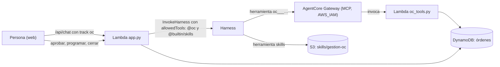
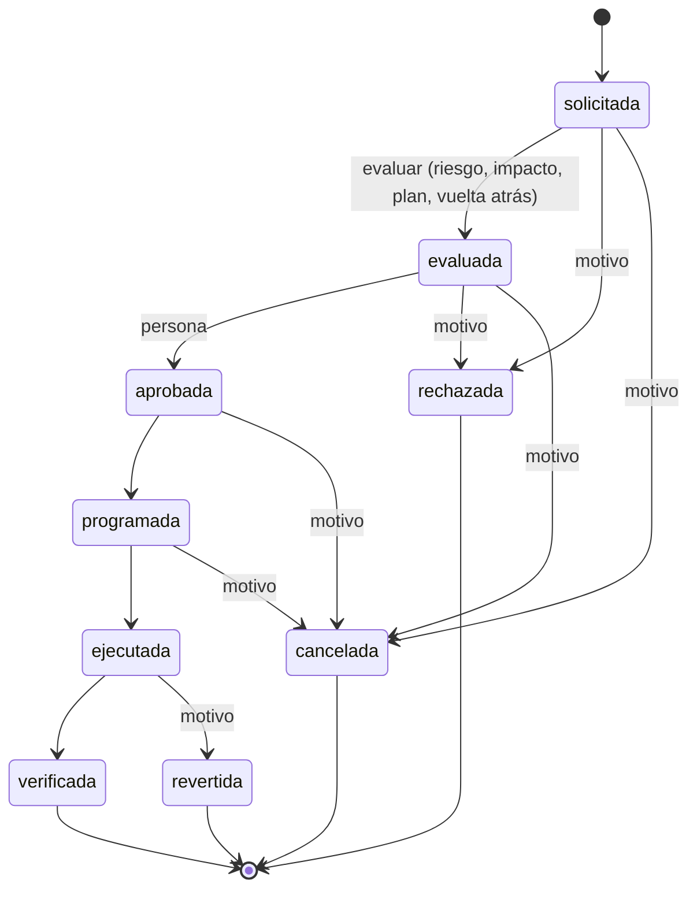

# 12 · Órdenes de cambio (OC): herramientas serverless, Gateway y habilidades

Segundo flujo del sistema, **independiente** de las incidencias: seguimiento de **órdenes de cambio** (pedir cambiar un valor
de un servicio de AWS o solicitar un recurso). Fuentes `GW*`/`SK*` en [11](11-glosario-referencias.md#agentcore-gateway-y-habilidades);
⚠️ = no verificado.

> **Alcance.** El sistema **solo hace seguimiento**: no modifica ningún recurso de AWS. La orden recorre un flujo con control
> humano; el cambio real lo ejecuta una persona fuera de aquí. El agente ayuda a registrar, evaluar y anotar, pero **no puede
> aprobar, programar ni cerrar**.

## 1. Qué se añadió y qué servicios de AgentCore se usan ahora

| Pieza | Servicio / tecnología | Para qué |
|-------|-----------------------|----------|
| Herramientas del agente | **AgentCore Gateway** (protocolo MCP, entrada `AWS_IAM`) con un **destino Lambda** | Exponer `listar_oc`, `consultar_oc`, `registrar_oc`, `evaluar_oc`, `agregar_nota_oc` como herramientas MCP [GW1] |
| Lógica de las herramientas | **Lambda** `oc_tools.handler` (serverless) | Valida y escribe en DynamoDB |
| Datos | **DynamoDB** `ChangeOrdersTable` (bajo demanda, PITR) | Órdenes e historial |
| Conocimiento de procedimiento | **Habilidad** `gestion-oc` (formato AgentSkills) en **S3** | Cómo registrar, evaluar y qué no hacer [SK1][SK2] |
| Web | Pestaña «Órdenes de cambio» | Lista, línea de pasos, evaluación, aprobación humana, historial |

Con esto el sistema usa de AgentCore: **Harness** (núcleo), **Runtime** (por debajo del harness), **Memory** (gestionada, sin
pedirla), **Gateway** (nuevo) y las **habilidades** del harness (nuevo). Siguen **sin usarse**: Identity, Browser, Code
Interpreter y Policy.

## 2. El flujo de una orden

Reglas (en `src/oc.py`, probadas en `tests/test_oc.py`):

- **No se salta ningún paso**: sin evaluar no se aprueba; una orden cerrada no se reabre.
- **Evaluar exige cuatro datos** (riesgo `baja|media|alta`, impacto, plan y vuelta atrás); sin ellos nadie puede aprobar.
- **Rechazar, cancelar y revertir exigen motivo.**
- **Escritura condicional** (`estado = :de`): si dos personas actúan a la vez, la segunda falla con un mensaje claro en vez de pisar
  a la primera [D2].
- **Historial** de cada cambio (quién, de qué estado a cuál, nota). Nada se borra: ni el rol de la web ni el de las herramientas
  tienen `DeleteItem`.

## 3. Quién puede hacer qué

| Acción | Persona (web) | Agente (Gateway) |
|--------|:-------------:|:----------------:|
| Crear una orden | ✅ | ✅ (queda como solicitante «agente») |
| Evaluar | ✅ | ✅ |
| Anotar | ✅ | ✅ |
| Aprobar / rechazar | ✅ | ❌ no existe la herramienta |
| Programar / ejecutar / verificar | ✅ | ❌ |
| Cancelar / revertir | ✅ | ❌ |

Es la mitigación de **agencia excesiva** (OWASP LLM06 [O2]): lo que el agente no puede hacer no depende de que el modelo
obedezca, sino de que **la herramienta no existe**. Comprobado en vivo: al pedirle «aprueba la orden» o «márcala como
ejecutada y ciérrala», responde que no puede y que lo hace una persona desde la web.

## 4. AgentCore Gateway con destino Lambda (lo verificado)

- Recursos de CloudFormation: `AWS::BedrockAgentCore::Gateway` (`AuthorizerType: AWS_IAM`, `ProtocolType: MCP`, rol propio) y
  `AWS::BedrockAgentCore::GatewayTarget` con `Mcp.Lambda` (`LambdaArn` + `ToolSchema.InlinePayload`) [GW3][GW4].
- **Esquema de herramientas** (`SchemaDefinition`): admite `string|number|object|array|boolean|integer`, **sin `enum`** [GW4]. Por
  eso `tipo`, `estado` y `riesgo` se describen en texto y se **validan en el servidor**.
- **La Lambda recibe** los argumentos como `event` y el nombre de la herramienta en
  `context.client_context.custom["bedrockAgentCoreToolName"]` con el formato `<destino>___<herramienta>`; hay que quitar el
  prefijo [GW1]. Aquí: `oc___listar_oc` → `listar_oc` (`oc_tools.py`, probado con otros nombres de destino).
- **El harness ejecuta las herramientas del Gateway por su cuenta**: no se devuelven a la aplicación como las funciones en línea.
  En una sola respuesta se observó la secuencia `stopReason: tool_use` → `tool_result` → `end_turn` (verificado). Por eso la app
  solo *registra* qué herramientas usó (`seen` en `invoke`) para mostrarlas, y no las ejecuta.
- Permisos: el rol del harness necesita `bedrock-agentcore:InvokeGateway` sobre el ARN del gateway [GW2]; el rol del gateway,
  `lambda:InvokeFunction` sobre la Lambda de herramientas.
- En el harness se añade como `{"type": "agentcore_gateway", "name": "oc", "config": {"agentCoreGateway": {"gatewayArn": …,
  "outboundAuth": {"awsIam": {}}}}}` [GW2] (`scripts/harness.py`, porque el harness sigue fuera de CloudFormation).

## 5. Habilidades (skills)

- Formato AgentSkills [SK2]: carpeta con `SKILL.md` (frontmatter `name` = nombre de la carpeta, `description` ≤ 1024) y
  `references/` opcional. **Divulgación progresiva**: solo `name` + `description` (~100 tokens) van al prompt; el contenido se
  carga bajo demanda con una herramienta [SK1].
- Fuente usada: **S3** (`s3://<bucket-de-código>/skills/gestion-oc/`). El workflow `deploy` hace `aws s3 sync skills/` antes de
  actualizar el harness; el rol del harness solo puede leer el prefijo `skills/` (`s3:GetObject` + `s3:ListBucket` con
  condición de prefijo) [SK1].
- Contenido de `gestion-oc`: el flujo, la tabla «qué haces tú / qué hace una persona», los pasos para registrar y evaluar, el
  criterio de riesgo y ejemplos (`skills/gestion-oc/`).

### Hallazgo verificado: hay que permitir la herramienta `skills`

La herramienta que carga la habilidad se llama **`skills`** y **`allowedTools` también la filtra**. Con `["@oc"]` el agente
**no podía cargar la habilidad** (inventaba criterios de riesgo); con `["@oc", "@builtin/skills"]` (también valen `@skills` y
`skill*`) la carga y cita el criterio exacto, y **sigue sin shell** (se le pidió `ls` y lo rechazó). Por eso
`OC_ALLOWED_TOOLS="@oc,@builtin/skills"`.

⚠️ **Límite observado:** el modelo (Nemotron Nano 9B) **no siempre carga la habilidad por iniciativa propia**; cuando la pregunta
no la menciona, a veces responde sin ella. Las reglas críticas (no aprobar, validaciones, orden del flujo) **no dependen de la
habilidad**: están en las herramientas y en el servidor. La habilidad mejora la calidad de la evaluación, no la seguridad.

## 6. Cómo se separa de las incidencias

- **Datos**: tabla propia; `/api/oc/*` y `oc.py` no tocan `IncidentsTable`.
- **Agente**: `POST /api/chat` con `track: "oc"` usa **solo** `allowedTools=["@oc","@builtin/skills"]` (ni las funciones en línea de
  incidencias ni el shell) y un prefijo de contexto con las órdenes abiertas; sin `track`, el agente de incidencias **no** tiene
  acceso al Gateway. Sesión (`oc_sid`) e hilo (`oc_thread`) propios en el navegador.
- **Interfaz**: otro bloque (`#oc-view`) tras un selector de módulo en la cabecera; no se modificó el de incidencias (las 103
  pruebas anteriores siguen pasando sin cambios de comportamiento).
- **Sin Gateway configurado** (`OC_ALLOWED_TOOLS` vacío), el módulo web funciona igual y el chat del módulo cae al agente de
  incidencias (`track` ignorado).

## 7. Interfaz

Pestaña «Órdenes de cambio» (`src/index.html`): línea de pasos de 6 etapas con `aria-current="step"`, riesgo con las mismas
etiquetas de color que la severidad, la línea `parámetro: actual → propuesto` en monoespaciada, **solo las acciones válidas para
el estado actual** (menos opciones, [U2]), evaluación en formulario en línea (riesgo con valor por defecto «media»), **motivo
obligatorio** al rechazar/cancelar/revertir, historial plegable, en móvil una columna sin desbordes y sin el botón flotante.

## 8. Pruebas

| Suite | Nº | Qué cubre |
|-------|---:|-----------|
| `tests/test_oc.py` | 22 | Flujo completo, saltos prohibidos, evaluación completa, motivo obligatorio, escritura condicional, herramientas del agente (**no puede aprobar ni cerrar**), prefijo del Gateway, `allowedTools` por módulo, aislamiento de incidencias |
| `tests/e2e/test_web.py` | +5 | Módulo separado, camino feliz completo en Chromium, rechazo con motivo, agente con herramientas del Gateway y conversación propia, móvil |
| `scripts/smoke_live.py` | +7 | Contra AWS real: 401 sin sesión, alta con correo del solicitante, no aprobar sin evaluar, agente usa el Gateway, cancelar con motivo, limpieza |

Total: **130 pruebas automáticas** y **26 comprobaciones en vivo** (última ejecución 3 oct 2026: todas correctas).

## 9. Límites y hoja de ruta

- **El solicitante de una orden creada por el agente es «agente»**, no la persona: el modelo podría pasar un nombre, pero no sería
  fiable. Mejora posible: que la app añada la identidad autenticada en un campo que el modelo no controla (p. ej. cabeceras del
  Gateway, `MetadataConfiguration` [GW4]) ⚠️ sin probar.
- **No hay separación de funciones**: quien pide puede aprobar su propia orden (hoy hay un solo grupo de usuarios). Para producción
  convendría exigir un aprobador distinto o grupos de Cognito.
- **No hay aprobación por varios niveles, ventanas de cambio ni notificaciones.**
- **«Valor actual» lo escribe una persona o el agente**: no se consulta en AWS. Una herramienta de **solo lectura** (p. ej.
  `Lambda:GetFunctionConfiguration` sobre una lista de recursos permitidos) permitiría verificar valor actual y valor final; no se
  implementó para no ampliar los permisos del agente sin una decisión explícita.
- **Gateway y destino siguen la plantilla**; el harness no (deuda ya anotada en [09](09-decisiones-lecciones.md)).
- Coste: Gateway, Lambda y DynamoDB son de pago por uso (⚠️ no se midió el coste del Gateway por invocación; ver
  [AgentCore pricing](https://aws.amazon.com/bedrock/agentcore/pricing/) [AP1]). Medido: **8 089 tokens de entrada** en la primera
  llamada de una consulta simple del módulo (la invocación mínima de incidencias, con otras herramientas, fue de 7 622): no se
  desglosó cuánto aportan el Gateway y la habilidad.
