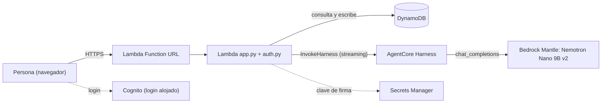

# Documentación técnica — Sistema de incidencias con agente de AgentCore

Esta carpeta recoge **todo el marco teórico y técnico** del proyecto: qué se construyó, con qué tecnologías, por qué
se tomó cada decisión, cómo funciona cada pieza por dentro y qué se aprendió por el camino. Está escrita para que
una persona que no estuvo en el desarrollo pueda entender, operar y evolucionar el sistema.

> **Convenciones.** Español. Horas en UTC salvo que se diga lo contrario. Las rutas son relativas a la raíz del repo.
> Las afirmaciones se apoyan en el código o en pruebas hechas contra la cuenta real de AWS (us-east-2). Cuando algo
> **no se ha verificado** se marca con ⚠️ para que no se confunda con un hecho comprobado.

## Qué es el sistema, en un párrafo

Una web de registro y seguimiento de **incidencias de TI** cuyo corazón es un **agente de IA real** (un *harness* de
**Amazon Bedrock AgentCore**) que no solo responde: **decide y actúa**. Dispone de herramientas (crear, listar,
clasificar y cambiar de estado una incidencia) que la aplicación ejecuta contra **DynamoDB**, y puede registrar
incidencias conversando. La web se sirve desde una **función Lambda con Function URL**, se protege con **Amazon
Cognito** (OIDC con código + PKCE) y se despliega como infraestructura como código con **CloudFormation**. Todo es
**de pago por uso**: sin tráfico, el coste es prácticamente nulo.

## Mapa de documentos

| # | Documento | Contenido | Léelo si quieres… |
|---|-----------|-----------|-------------------|
| 00 | [Marco teórico general](00-marco-teorico.md) | Qué es cada concepto y para qué se usa en general (nube, IaC, HTTP, OIDC, NoSQL, LLM/agentes/herramientas, IAM, observabilidad, CI/CD, pruebas, UX) y dónde se aplica aquí | …entender los fundamentos antes del detalle |
| 01 | [Visión y arquitectura](01-vision-arquitectura.md) | Objetivos, requisitos, componentes, flujos de extremo a extremo, modelo de datos, mapa del código | …entender el sistema completo de un vistazo |
| 02 | [Agente: AgentCore Harness](02-agentcore-harness.md) | Teoría de agentes, anatomía del harness, herramientas, memoria, modelo, prompts, fiabilidad | …entender o modificar el agente |
| 03 | [Servicios de AWS](03-servicios-aws.md) | Cada servicio usado: qué es, por qué, configuración exacta, límites, alternativas descartadas | …saber qué hay desplegado y por qué |
| 04 | [Autenticación y seguridad](04-autenticacion-seguridad.md) | OAuth 2.0/OIDC, PKCE, cookies, CSRF, modelo de amenazas, seguridad del agente, riesgos residuales | …auditar o endurecer la seguridad |
| 05 | [Backend y API](05-backend-api.md) | Contrato HTTP, validación, bucle del agente, herramientas, concurrencia, límites | …integrar, probar o ampliar la API |
| 06 | [Frontend y experiencia de uso](06-frontend-ux.md) | Sistema de diseño, principios de UX, layout responsive, accesibilidad, estado en el cliente | …cambiar la interfaz sin romper su lógica |
| 07 | [Pruebas y calidad](07-pruebas-calidad.md) | Estrategia, dobles de prueba, suites, lint, qué no cubren | …añadir pruebas o entender su alcance |
| 08 | [CI/CD y despliegue](08-cicd-despliegue.md) | uv, empaquetado, GitHub Actions, federación OIDC con AWS, despliegue y reversión | …desplegar o tocar el pipeline |
| 09 | [Decisiones y lecciones](09-decisiones-lecciones.md) | Registro de decisiones (ADR) y catálogo de problemas encontrados con su solución | …saber *por qué* es así y qué errores evitar |
| 10 | [Operación y costes](10-operacion-costes.md) | Runbooks, observabilidad, cuotas, modelo de costes, limitaciones y hoja de ruta | …operar el sistema en el día a día |
| 11 | [Glosario y referencias](11-glosario-referencias.md) | Términos, estándares (RFC, OWASP, WCAG) y fuentes | …aclarar un término o ir a la fuente |
| 12 | [Órdenes de cambio](12-ordenes-de-cambio.md) | Segundo flujo: herramientas serverless tras AgentCore Gateway (MCP), habilidad `gestion-oc`, flujo con aprobación humana, qué puede y qué no puede el agente | …entender o ampliar el módulo de órdenes de cambio |

## Estado de validación (resumen honesto)

| Qué | Estado |
|-----|--------|
| Despliegue de la pila en AWS y funcionamiento del agente real con herramientas | ✅ Validado contra la cuenta real |
| Login con Cognito (código + PKCE), sesión, salida, registro con control de correo | ✅ Validado con usuarios temporales reales |
| Despliegue desde GitHub Actions con rol OIDC | ✅ Validado (ejecución manual `deploy`, en verde) |
| Suite automática: 130 pruebas (API, auth, registro, órdenes de cambio, navegador) + lint | ✅ Pasa en Python 3.12 (CI) y 3.14 (local) |
| Pruebas automáticas contra Bedrock/Cognito **reales** | ❌ No existen: las pruebas usan dobles; lo real se validó a mano |
| MFA, WAF, límites de uso por usuario, cabeceras de seguridad (CSP/HSTS) | ❌ No implementados (ver [riesgos](04-autenticacion-seguridad.md#8-riesgos-residuales-y-hoja-de-ruta)) |
| Calidad del modelo (Nemotron Nano 9B) | ⚠️ Modelo pequeño y no determinista; comportamiento mejorado con prompts/herramientas, no garantizado |

## Cómo se organizó el trabajo

El sistema creció por iteraciones guiadas por pruebas reales contra AWS. Cada hallazgo no trivial (formatos de la API
de AgentCore, permisos, cookies, identificadores OIDC, rutas de Windows…) quedó registrado en
[09-decisiones-lecciones.md](09-decisiones-lecciones.md) para no redescubrirlo.

## Cómo se elaboró y verificó esta documentación

Principio: **no suponer nada**; lo que no se sabía se investigó y lo que no se pudo comprobar se marca con ⚠️.

| Control | Resultado |
|---------|-----------|
| Fuentes primarias (documentación de AWS, RFC, OIDC, OWASP, W3C, GitHub, NN/g) consultadas el 3 oct 2026 | Listadas con enlace en [11](11-glosario-referencias.md) |
| **Enlaces**: petición real a cada URL | 87 de 87 enlaces reales responden `200` (los otros 5 textos son marcadores como `<región>` o `127.0.0.1`) |
| **Diagramas**: 33 bloques Mermaid renderizados con el CLI oficial (`@mermaid-js/mermaid-cli`) | 33 de 33 renderizan; **2 estaban rotos** (un `;` en un mensaje de diagrama de secuencia) y se corrigieron |
| **Hechos del sistema** | Verificados contra la cuenta real (marcados «verificado»), con `scripts/smoke_live.py` (26 comprobaciones) y las 130 pruebas |
| **Cálculos** (contraste WCAG, costes) | Hechos con script o fórmula explícita; los de coste declaran sus supuestos y se corrigieron dos errores propios al revisarlos |

### Lo que la investigación cambió en el código

Leer la documentación oficial **después** de que todo funcionara destapó defectos que ninguna prueba cubría; todos están
corregidos, probados y desplegados:

1. `session_id` de 101–128 caracteres: la app lo aceptaba y `InvokeHarness` lo rechaza (contrato 33–100).
2. `Scan` de DynamoDB sin paginar (truncado silencioso) y con lecturas eventualmente consistentes.
3. `hmac.compare_digest` con `str` solo admite ASCII: un `state` con `ñ` rompía el callback (500).
4. CSRF: faltaba **Fetch Metadata** (`Sec-Fetch-Site`) y `/auth/logout` era un **GET** que cambiaba estado (ahora POST).
5. Faltaban las **cabeceras de seguridad** recomendadas por OWASP.
6. `InvokeHarness`/`InvokeAgentRuntime` estaban concedidos sobre `*`; ahora solo sobre el ARN del harness.
7. `inputSchema` de las funciones en línea iba envuelto en `{"json": …}`; ahora es JSON Schema directo.
8. Contraste insuficiente (WCAG 1.4.3) del texto pequeño de la cabecera; ahora se **mide** en una prueba.

### Cosas que la investigación descubrió y **no** se han cambiado (decisión pendiente)

Existe el recurso de CloudFormation del harness; el modelo tiene fecha de retirada «no antes de» ya superada; la memoria del
harness tiene coste y puede contaminar respuestas; `bedrock-runtime` es el endpoint recomendado frente a Mantle; falta activar
*Transaction Search*; los grupos de logs no caducan. Ver [10 §8](10-operacion-costes.md#8-hoja-de-ruta-propuesta).

*Última revisión: 3 oct 2026 (UTC).*
